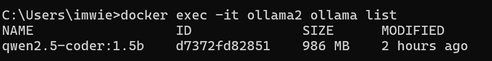
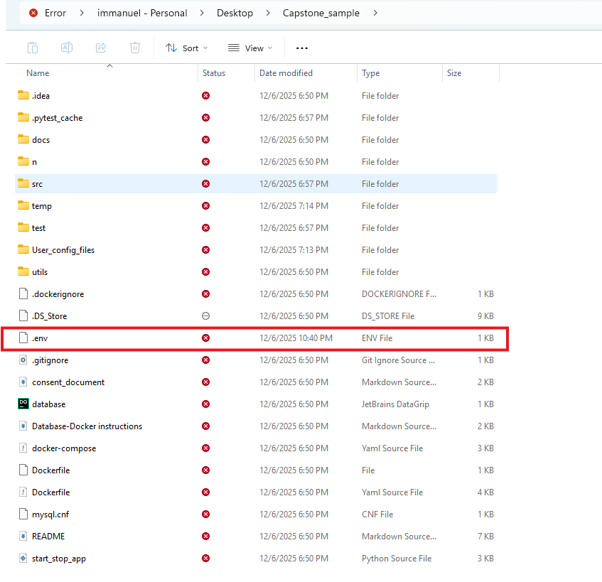

# 🧠 Capstone Project — Team 2

> *A capstone software project for COSC 499 (Winter 2025), designed and implemented by Team 2 at UBC Okanagan.*

---

## 📚 Table of Contents

1. [Project Overview](#-project-overview)
2. [Features](#-features)
3. [Video Demo](#-video-demo)
4. [System Architecture](#-system-architecture)
5. [Project Setup](#project-setup)
   - [Cloning the Repository](#cloning-the-repository)
   - [Docker Setup](#docker-setup)
   - [Python Setup](#python-setup)
6. [Environment Setup](#set-up-environment-variables)
   - [Google Gemini API Key Setup](#-google-gemini-api-key-setup)
   - [GitHub Token Setup](#-github-token-setup)
7. [DFD Level 1](#dfd-level-1)
8. [Work Breakdown Structure](#-work-breakdown-structure)
9. [Team Contract](#team-contract)


---

## 📝 Project Overview


This project is being developed as part of **COSC 499: Capstone Project** at UBCO.  
The project, titled **Mining Digital Work Artifacts**, is a tool designed to help individuals analyze and reflect on their digital creative and professional output. The main focus is on extracting and analyzing artifacts generated during the course of everyday work activities, including **Programming code**, **Repositories**, **documents**, **notes**, **design sketches** and **media files**. Through the collection of the users data and associated metadata, the system will provide insight into the user's contribution, creative direction, and project evolution. This will allow the user/individual to gain better insight into their work habits, showcase their contributions, and highlight their personal growth.


The platforms target users are **graduating students** and **early career professionals** who want to improve their **personal portfolio**


### 👥 Team Members

- Immanuel Wiessler
- Sam Smith
- Puneet Maan
- Samantha Manranda
- Cameron Gillespie
- Mahi Gangal


## ✨ Features

- 🏗️ **Modular Architecture** — Scalable backend and frontend design
- 🎨 **User Interface** — Streamlined UI with intuitive navigation
- 📄 **Documentation** — Comprehensive WBS, DFDs, and architecture diagrams
- 🔄 **CI/CD Pipelines** — Automated deployment workflows
- 🗄️ **Database** — MySQL integration with Docker containerization
- 🤖 **AI Integration** — Ollama (local LLM) and Google Gemini for code analysis
- 🔍 **Local Analysis** — Offline code analysis without AI dependencies
- 📝 **Resume Generator** — PDF resume and portfolio generation (AI-powered or offline)


## 🎬 Video Demo

<a href="https://youtu.be/zAoHiW9vn-U">
  
</a>

> *A complete walkthrough demonstrating project setup, features, and usage.*


## 🔧 System Architecture

This system architecture illustrates the structural design of the application, showing how the frontend, backend, database, and external services interact. It emphasizes modularity, scalability, and maintainability through a three-layered design.


## Project Setup


### Cloning the Repository

**Main branch:**
```bash
git clone https://github.com/COSC-499-W2025/capstone-project-team-2.git
```

**Development branch:**
```bash
git clone -b development https://github.com/COSC-499-W2025/capstone-project-team-2.git
```

**Clone to a specific directory:**
```bash
git clone -b development https://github.com/COSC-499-W2025/capstone-project-team-2.git your-folder-name
```

Please look at our [video](https://youtu.be/zAoHiW9vn-U) demo otherwise follow the steps below:


### Docker Setup

#### Step-by-Step Instructions

1. **Remove previous containers and volumes:**
   ```bash
   docker-compose down -v
   ```

2. **Build the Docker containers:**
   ```bash
   docker-compose build --no-cache
   ```

3. **Start the Ollama container:**
   ```bash
   docker-compose up -d ollama2
   ```

4. **Pull the LLM model:**
   ```bash
   docker exec -it ollama2 ollama pull qwen2.5-coder:1.5b
   ```

5. **Verify the model is installed:**
   ```bash
   docker exec -it ollama2 ollama list
   ```
   You should see `qwen2.5-coder:1.5b` in the list:
   
   

6. **Start the database container:**
   ```bash
   docker-compose up -d app_database
   ```

7. **Verify all containers are running:**
   ```bash
   docker ps
   ```
   Expected output:
   ```
   CONTAINER ID   IMAGE                  COMMAND                  CREATED          STATUS                    PORTS                               NAMES
   42a2e9017194   ollama/ollama:latest   "/bin/ollama serve"      17 minutes ago   Up 17 minutes             0.0.0.0:11434->11434/tcp            ollama2
   9c42d7048399   mysql:8.0.44           "docker-entrypoint.s…"   17 minutes ago   Up 17 minutes (healthy)   33060/tcp, 0.0.0.0:3308->3306/tcp   app_database
   ```

---


#### Quick Setup (Single Command) Docker Setup

Alternatively, run everything in one command:

**CMD / macOS / Linux:**
```bash
docker-compose down -v && docker-compose build --no-cache && docker-compose up -d ollama2 && sleep 5 && docker exec -it ollama2 ollama pull qwen2.5-coder:1.5b && docker-compose up -d app_database
```

**Windows PowerShell:**
```powershell
docker-compose down -v; docker-compose build --no-cache; docker-compose up -d ollama2; Start-Sleep 5; docker exec -it ollama2 ollama pull qwen2.5-coder:1.5b; docker-compose up -d app_database
```


---

### Set up Environment Variables
   
   Create a `.env` file in the project root folder with the following:
   
   
   
   ```env
   GOOGLE_API_KEY=your_google_api_key_here
   GITHUB_TOKEN=your_github_token_here
   ```

   > ⚠️ **Important:** Replace the placeholder values with your actual API keys.
   
   | Variable | Purpose | Setup Guide |
   |----------|---------|-------------|
   | `GOOGLE_API_KEY` | Required for AI-Powered Resume | [PR #188](https://github.com/COSC-499-W2025/capstone-project-team-2/pull/188) |
   | `GITHUB_TOKEN` | Required for GitHub contributor analysis | [PR #161](https://github.com/COSC-499-W2025/capstone-project-team-2/pull/161) |

   
#### 🔑 Google Gemini API Key Setup
 <video src="https://github.com/user-attachments/assets/656b3a90-1439-4965-b62a-c0abe32bbd29" controls width="100%"></video>


   1. Go to [Google AI Studio](https://aistudio.google.com/apikey)
   2. Sign in with your Google account
   3. Click **"Create API Key"**
   4. Select an existing Google Cloud project or create a new one
   5. Copy the generated API key
   6. Paste it into your `.env` file as `GOOGLE_API_KEY=your_key_here`

   > 💡 **Tip:** The free tier includes generous usage limits for development and testing.

---


#### 🐙 GitHub Token Setup
  
https://github.com/user-attachments/assets/d529d9b5-9867-4dee-961d-02bfbdd1f371

   1. Go to [GitHub Settings → Developer Settings → Personal Access Tokens → Fine-grained tokens](https://github.com/settings/tokens?type=beta)
   2. Click **"Generate new token"**, making sure that you are on a fine-grained token tab
   3. Give your token a descriptive name (e.g., `capstone-project-analysis`)
   4. Set an expiration date
   5. Under **Repository access**, select the repositories you want to analyze (or "All repositories")
   

   6. Under **Permissions**, expand **"Repository permissions"** and set:
      - `Contents` → **Read and Write**
      - `Metadata` → **Read-only** (usually enabled by default)
      - `Administration` → **Read and Write**
   7. Click **"Generate token"**
   8. Copy the token immediately (you won't be able to see it again!)
   9. Paste it into your `.env` file as `GITHUB_TOKEN=your_token_here`

   > ⚠️ **Security Note:** Never commit your `.env` file to version control. Make sure `.env` is listed in your `.gitignore`.


### Python Setup

1. **Install dependencies:**
```bash
   pip install -r src/requirements.txt
```

 2. **Run the application:**
   
   Make sure you're in the project directory, then run:
```bash
   cd capstone-project-team-2
   python src/main.py
```
   Or alternatively:
```bash
   python -m src.main
```

   > 📝 **Note:** If you cloned to a custom directory, replace `capstone-project-team-2` with your chosen folder name.

  

**Key Components:**

- **Frontend (Presentation Layer)**: Built using **Streamlit** or **FreeSimpleGUI**, offering an intuitive menu-driven interface for users to navigate and interact with the application. Key features include:
  - **Interactive menus**: For project analysis, viewing saved projects, portfolio generation, and configuration management.
  - **User consent workflow**: Guides users through the process of providing consent and configuring permissions for external services permissions
  - **Portfolio generation**: Enables users to generate a portfolio-ready resume or portfolio 


- **Backend (Application Layer)**: The backend powers the core analysis engine, leveraging multiple technologies for comprehensive project insights
  - **File Processing**: Handles ZIP extraction, directory traversal, and metadata collection achieved using `os`, `shutil`, `zipfile`, and `pathlib`.
  - **Multi-language OOP Analysis**: Analyzes Python source files via the `ast` module and for Java source files via the `javalang` module. Returning unified metrics on **inheritance**, **encapsulation**, **polymorphism**, and **code complexity**
  - **AI-Powered Analysis**: Integrates with **Ollama**(Via LangChain library) for local LLM-based code review and **Google Gemini** for improved code review and for generating prototype-ready project summaries
  - **Contributor Detection**: Identifies project collaborators through git history (via **GitPython** and **PyGithub**) or file metadata analysis for non-git projects
  - **Stack Detection**: Automatically identifies programming languages, frameworks, and skills through scanning dependency files(`requirements.txt`, `package.json`, `composer.json`) and source file extensions, 

**Database (Storage Layer)**: 
  - The application uses **MySQL** as its primary database for persistent storage and data management.
  - **Project Data Storage**: Stores analyzed project metadata, JSON analysis reports, and file blobs for later retrieval.
  - **Containerized Deployment**: MySQL runs within a Docker container (`app_database`), with connection details dynamically set and found in the `DockerFinder` utility.
 
 - **External Services Integration**:
   - **GitHub API**: Enables commit history analysis and contributor statistics for Git-based projects via **PyGithub**

   - **Google Gemini API**: Powers AI-generated resume summaries and project descriptions (requires `GOOGLE_API_KEY`)

  
**Design Principles**

- **Loose coupling** – Components interact through well-defined interfaces
- **Scalability through modularity** – Each module can be developed and tested independently
- **Reusability and maintainability** – Code organization supports easy updates and debugging

---

## DFD Level 1

The Level 1 **Data Flow Diagram (DFD)** depicts the main system components and the flow of data between **external entities**, **core processes**, and **internal data stores**.


### External Entities

| Entity              | Description |
|---------------------|-------------|
| **Project Owner**   | Grants consent, uploads zipped folders, provides filters, and retrieves résumé or portfolio-ready outputs. *(Milestone 1–3)* |
| **Maintainer/Admin**| Performs administrative actions like backups and deletions. *(Milestone 2–3)* |
| **Local File System** | Supplies input folders/files and stores output artifacts like reports, dashboards, and backups. *(Milestone 1–3)* |
| **External Service** | Services such as LLMs used to enhance insights, with user consent. *(Milestone 1)* |

### Core Processes

| ID    | Process Name             | Description | Milestone |
|-------|--------------------------|-------------|-----------|
| **1.0** | Consent & Config         | Captures user/admin consent, configuration policies, and settings for analysis and privacy. | 1 |
| **2.0** | Ingest & Validate        | Validates, scans, and indexes artifacts from zipped folders. Handles file errors, duplicates, and metadata. | 1 |
| **3.0** | Analyze Projects         | Computes project metrics, contribution roles, timelines, languages, and skills from indexed data. Can interact with external services if consented. | 1–2 |
| **4.0** | Rank & Summarize         | Ranks projects based on user contributions, skill relevance, and recency. Generates summaries, timelines, and portfolio highlights. | 2 |
| **5.0** | Customize & Retrieve     | Lets users retrieve, edit, export, or delete items. Supports portfolio customization and the generation of resume-ready output. | 2–3 |

### Internal Data Stores

| ID     | Data Store               | Description | Milestone |
|--------|--------------------------|-------------|-----------|
| **D1** | Configs & Consents       | Stores consent records, configuration settings, and admin policies. | 1 |
| **D2** | Artifacts & Metadata     | Indexed files, metadata, authorship, and timestamps used for analysis. | 1 |
| **D3** | Insights & Rankings      | Aggregated metrics, skills, rankings, and project timelines. | 2 |
| **D4** | Custom Items & Media     | User-edited descriptions, thumbnails, resume versions, and custom portfolio texts. | 2–3 |
| **D5** | Audit Logs               | Ingestion logs, analysis logs, external service interaction logs, and admin actions. | 2 |

### Milestone Overview

| Milestone | Focus | Key Additions |
|-----------|-------|----------------|
| **Milestone 1** | Core ingestion,analysis, and External Services  | Processes 1–3, Data Stores D1–D2 |
| **Milestone 2** | Personalization & logic | Processes 4–5, Data Stores D3–D5, |
| **Milestone 3** | Frontend & outputs | UX/UI for portfolio and resume customization, deeper use of P5 and D4 |

---

## 🧰 Work Breakdown Structure

Below is the **high-level WBS** outlining the major phases of the project:

[📊 View the Google Sheet](https://docs.google.com/spreadsheets/d/1zsUdvJTiAwR4KajjdB9kgwPiE1tOSrDV0mg0tFfgSF8/edit?usp=sharing)


## Team Contract

[👥 Team Contract](https://docs.google.com/document/d/1HScKLEO0oEPisBcpuQHtHZIDCtyFP3HM8qWiATx-VXg/edit?tab=t.0)
