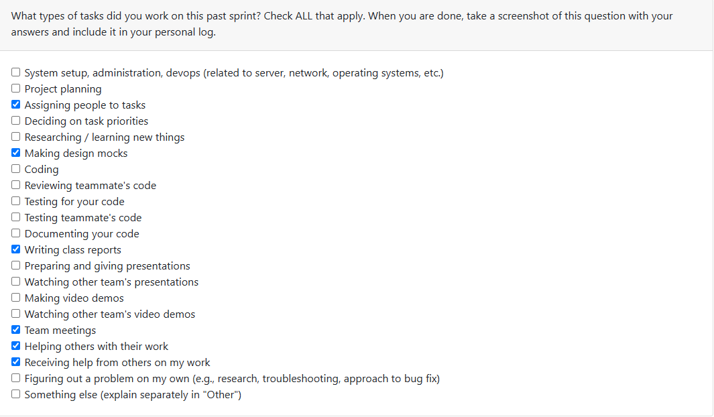
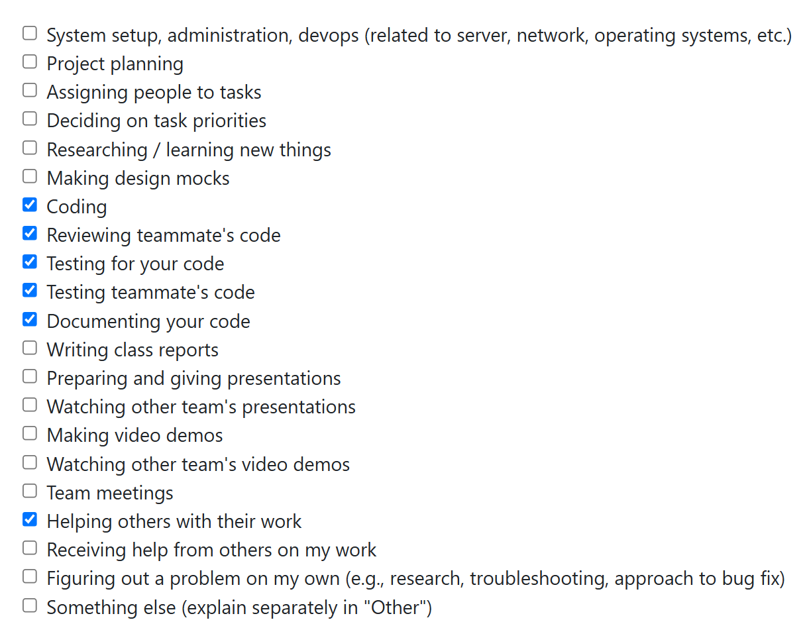
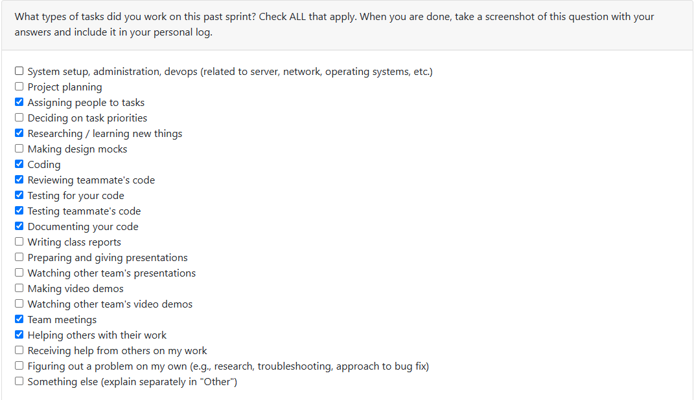
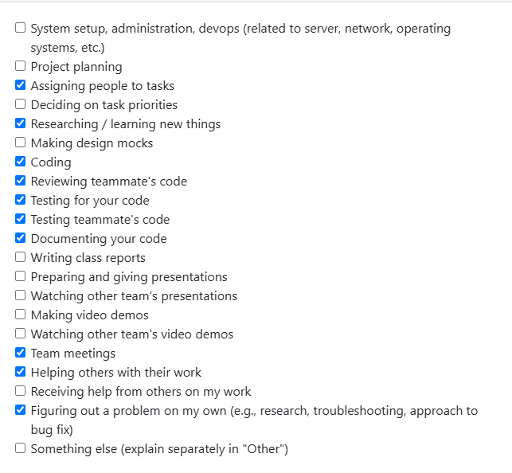
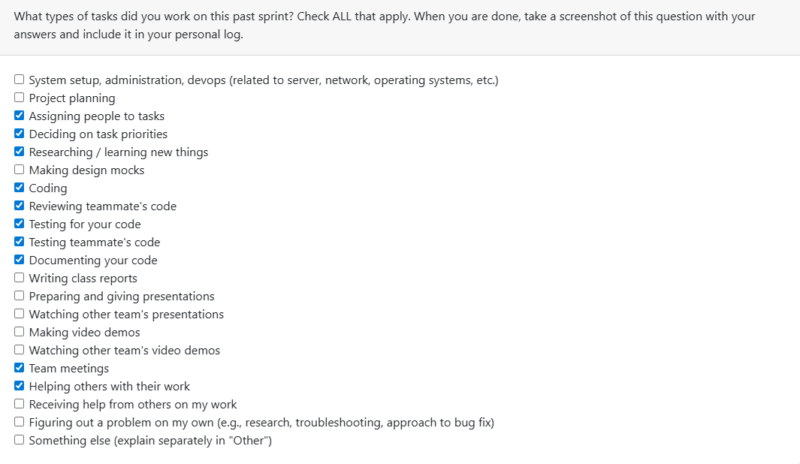
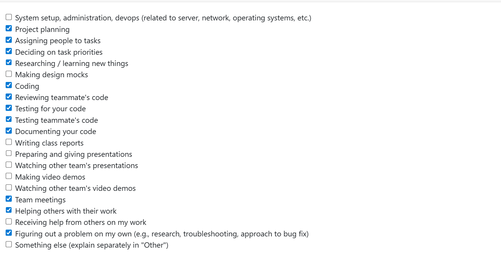

## Dates of Sprint: (09/15/2025 – 09/21/2025)

### Peer Eval Screenshot:


---

### Features Worked on this Milestone (Provide sufficient detail)
  * #1 Requirements Document Creation & Refinement
  * #2 Worked on proposal doc and finalizing   
  * #3 Deciding on the development stack

---

## Associated Tasks from Project Board:
- N/A (Project board not yet populated)
test
---

### Progress Update (since 09/15/2025)

<table>
    <tr>
        <td><strong>TASK/ISSUE #</strong></td>
        <td><strong>STATUS</strong></td>
    </tr>
    <tr>
        <td>Completion of Project requirments <span style=" font-weight:bold">(draft & refine)</span> </td>
        <td><span style= "color:green"; font-weight:bold>Complete</span></td >
    </tr>
    <tr>
        <td>github established</td>
        <td><span style= "color:green"; font-weight:bold>Complete</span></td >
    </tr>
</table>


---

### Extra Details:
<details>
    <summary>Click to expand</summary>
    The main focus for this week was setting up the GitHub repository and 
    collaborating with other team members to discuss and refine our project 
    requirements <span style="font-weight:bold">(functional and non-functional)</span>. Additionally, no issues have been added to the project board yet.
</details>


## Dates of Sprint: (09/22/2025 – 09/28/2025) week 4


### Peer Eval Screenshot:


---

### Features Worked on this Milestone   
  * #1 Created and finalized the system design graph
  * #2 Worked on proposal doc and finalizing 
  * #3 Deciding on the development stack

---

## Associated Tasks from Project Board:
- N/A (Project board not yet populated)

---

### Progress Update (since 09/22/2025)

<table>
    <tr>
        <td><strong>TASK/ISSUE #</strong></td>
        <td><strong>STATUS</strong></td>
    </tr>
    <tr>
        <td>Completion of Project Propsoal <strong>(draft & refine)</strong> </td>
        <td></td>
    </tr>
    <tr>
     <td>Completion of System desgin mockup</td>
     <td></td>
    </tr>
    
</table>


---
## Next week goals
The goals for the Week 5 is as follows:
- Work on creating our <span style='font-weight:bold'> Data flow diagram (DFD) </span> for our system

---

### Extra Details:
<details>
  <summary><b>Click to expand</b></summary>
  This week's focus was on various aspects of the project proposal, with me working on the <strong>Project Scope and Usage Scenario</strong> of the project proposal document.
  additionally i worked on the inital design of architectures layout of our system 


</details>


# 📝 Personal Log – Week 5 (09/29/2025 – 10/05/2025)

---

## 📊 Peer Evaluation  



---

## 🚀 Features Worked On  
-  Collaborated with teammates on the **DFD Graph** (Level 0 and Level 1)  
-  Completed the **team log** for Week 5  

---

## 📌 Associated Tasks from Project Board  
- N/A (Project board not yet populated)  

---

## 📈 Progress Update (since 10/02/2025)  

| Task/Issue | Status |
|------------|--------|
| **DFD Design (Level 0 & Level 1)** |  |
| **Team Log – Week 5** |  |

---

## 🎯 Next Week’s Goals  
- Review finalized **project requirements** 
- Finalize **system design** for new project requirements
- Create a  new **DFD Desgin** for these new project requirements  
- Revise Docker

---

## 🧠 Reflection on Current Cycle (Week 5)  
This week we demonstrated effective teamwork in the development of the **DFD design** based on our project requirements which we submitted in week 4 making sure to include the necessary requiremnets for both **level 0** and **level 1**, which included the external actors and the way in which the data flowed from our backend to the frontend **(UI)** and at the same time, One thing I noticed is that now we have finally settle into assumed roles. To conclude this weeks reflection one thing I noticed is that we had one small issue in terms of communication task this week which was that one of the team members created both level 0 and level 1 without informing the other teams members that they had finished the graphs, Moving forward we are going to introucde a system in dicord server to ensure that everyone knows who is currently working on what task, to prevent duplicate task or code.

---

## 🧠 Reflection on Past Cycle (Week 4)  
Looking back at **Week 4**, our team developed a better understanding of each member’s working style, which helped us stay more consistent with the assignment of tasks. This improved coordination allowed us to finalize our **project requirements** in a timely manner. In my view, Week 4 marked a turning point where the team really began to **“click”**, laying the groundwork for smoother collaboration in the following weeks for this project

---


# 📝 Personal Log – Week 6 (10/06/2025 – 10/09/2025)

## 📊 Peer Evaluation  





---

## 🚀 Features Worked On  
-  Created the **python requriements.txt** file
-  Began coding work on the extraction of files strored in a zip file
- adding newly defined issues to our kanban

---

## 📌 Associated Tasks from Project Board  
- [Extract files from zip folder provided #34](https://github.com/COSC-499-W2025/capstone-project-team-2/issues/34)
- [Create requirements file #27](https://github.com/COSC-499-W2025/capstone-project-team-2/issues/27)

---

## 📈 Progress Update (since 10/06/2025)  

| Task/Issue | Status |
|------------|--------|
| **Creation of python requirements.txt** |  |
| **Created a class function for file extraction(zip file)** |  |
|**Created pytest file for testing the extraction method**||

---

## 🎯 Next Week’s Goals  
- Beginning work on the newly created issues in our kanban project/ continue working on current issue assigned to me

---

## 🧠 Reflection on Current Cycle (Week 6)
This week, we began updating both our **DFD graph** and our **System Architecture Design** to incorporate the newly introduced project requirements for Milestone 1. We began populating our GitHub Kanban board with the associated issues in Milestone 1. Additionally, this week marks the actual start of the project, because we began coding some of the problems. For example, in my case, I worked on the initial development of the **file extraction system**, where I focused on extracting components (taking a zip file and extracting its contents). At the same time, I worked on creating the **pytest file** to test the functionality of my extraction file. In addition, I made the **requirements.txt** file consisting of the possible Python libraries that we can use in our project, where we discuss these libraries and
Additionally, considering that my overall team's Python skill level is minimal, I need to ensure that the chosen libraries are easy to pick up.


Overall, this week we did not encounter any significant issues with each other, and we also introduced the proposed system to help prevent miscommunication, specifically duplicate code and tasks.


---

## 🧠 Reflection on Past Cycle (Week 5)
For week 5, I began to notice that our team structure has become more organized, unlike last week, which was unorganized, but overall week 5 has nothing to report in terms of team structure and general stuff

---


# 📝 Personal Log – Week 7 (10/12/2025 – 10/18/2025)

## 📊 Peer Evaluation  



---

## 🚀 Features Worked On  
-  Worked on the testing function for the saving of the users configuration(`Test_userConfig_store.py`)

---

## 📌 Associated Tasks from Project Board  
- [Tests for storing user configuration #61](https://github.com/COSC-499-W2025/capstone-project-team-2/issues/61)
- 
## 🧠 Reflection on Past Cycle (Week 5)  
For week 5, I began to notice that our team structure has become more organized, unlike last week, which was unorganized, but overall week 5 has nothing to report in terms of team structure and general sstuff

---

## 📈 Progress Update (since 10/12/2025)  

| Task/Issue | Status |
|------------|--------|
| **Creation of test pyton file for the saving of user configuration** |  |
|                      |

## 🎯 Next Week’s Goals  
- To contiune working on the [storing user configuration ](https://github.com/COSC-499-W2025/capstone-project-team-2/issues/36) intergating the actual coding part of this issue 

---

## 🧠 Reflection on Current Cycle (Week 7)
For **week 7**, I began working on the storing of user's configuration more specfically created the tests for the user's storage where I work on creating the actual system in the following. From week 6 I was able to intergate my gained knolwedge on **pytest unittest framework** into this test called `test_userConfig_store.py`. Overall this week was a vaildation week because I am now after grafting/learning about pytest I was able to easily intergate my new found knowlege into the test case that I have created for this sprint


---

## 🧠 Reflection on Past Cycle (Week 6)  
For **week 6**, I was working on the issue that I assigned myself for that week, which was the extraction of a zip file and exporting its contents to a temporary directory for file mapping, while creating tests at the same time. This week was rough because this is my first time trying to create a test using Python **unittest framework** in Python, which I have not done before, which was a challenge but also interesting. In addition, it was our first time reviewing each other's code and having meaningful conversations about what we should add, and in my case, more edge cases. Overall, week 6 was interesting in terms of learning the **unittest python framework** and reviewing other team members' code and providing improvement/suggestions. 

---


# 📝 Personal Log – Week 8 (10/20/2025 – 10/26/2025)

## 📊 Peer Evaluation  



---

## 🚀 Features Worked On  
- Worked on the actual implemation of storing and refienment of user configuration
- Created an interactive CLI for modifying users configuration

---

## 📌 Associated Tasks from Project Board  
- [Create CLI interface for saving user configuration](https://github.com/COSC-499-W2025/capstone-project-team-2/issues/82)
- [Store a user configuration file](https://github.com/orgs/COSC-499-W2025/projects/11/views/2?pane=issue&itemId=132426853&issue=COSC-499-W2025%7Ccapstone-project-team-2%7C36)
- [Infinite loop when selecting ‘n’ in CLI confirm_modification ](https://github.com/COSC-499-W2025/capstone-project-team-2/issues/84)

---

## 📈 Progress Update (since 10/22/2025)  

| Task/Issue | Status |
|------------|--------|
|**Creation of actual implementation for saving of user configuration and refinement** |  |
|**Creation of user Coniguration CLI**||
| **Applying fix/patch to infinte loop issue in CLI** | |


## 🎯 Next Week’s Goals
- [Work on Constent doc for users to agreed when prograrm starts](https://github.com/COSC-499-W2025/capstone-project-team-2/issues/32)
- Continue working implemented our Code into a CLI for end of term showcase(**Milestone 1 showcase**)


---

## 🧠 Reflection on Current Cycle (Week 8)

**Week 8** was an interesting week for me because I began working on the actual implementation of **[saving the user configuration](https://github.com/orgs/COSC-499-W2025/projects/11/views/2?pane=issue&itemId=132426853&issue=COSC-499-W2025%7Ccapstone-project-team-2%7C36)** to the local system.

During this process, I discovered a new JSON library called **[orjson](https://pypi.org/project/orjson/)**, which claims to process JSON files **much faster** than Python’s built-in `json` library. After testing it, I integrated `orjson` into my newly implemented user configuration system — which turned out to be very easy to do.

Next, I began working on the [**CLI interface**](https://github.com/COSC-499-W2025/capstone-project-team-2/issues/82), which allows users to update their configuration through the terminal.

I also added **error checking** to prevent users from modifying certain fields, such as **ID**. If they attempt to do so, a **custom exception** is raised to display the message:

> “You cannot modify this — please choose something else.”

Additionally, I implemented an **exit system** that allows users to quit and return to the main application cleanly.

> “Returning you back to main page”

After completing the feature, I focused on **testing**. I used Python’s built-in `unittest` framework,specifically **mock inputs**, **patching**, and **mock print** — to simulate real user interaction with the CLI system and also tracking print statements that are returned by the CLI configuration class so that the test can vaildate the right print statements are being returned .

Lastly, I want to thank **Puneet** for identifying an error in `test_configuration_CLI.py` that caused an **infinite loop**, which I quickly found, and depolyed a fix for within the hour.

---

### 🧪 Example Test from `test_configuration_CLI.py`

```python
import unittest
from unittest.mock import patch, call

class TestConfigurationCLI(unittest.TestCase):

    @patch('builtins.input', side_effect=["2", "fdfd", "n"])
    @patch('builtins.print')
    def test_invalid_input(self, mock_print, mock_input):
        """
        Test that when the user enters an invalid input (not 'y' or 'n'),
        an appropriate error message is printed and the method returns False.
        """
        chosen_setting = self.instance.get_setting_choice()
        self.instance.validate_modifiable_field(chosen_setting)
        result = self.instance.modify_settings(chosen_setting)

        mock_print.assert_any_call("ERROR: Please choose(y/n):")
        self.assertFalse(result)
```

## 🧠 Reflection on Past Cycle (Week 7)  

**week 7** was a bit challenging week because in addition to writing my tests for the storing the user configuration, we encouter a massive issue where I did not notice a glaring issues in one of teams members had in their coding contributions was test were not passing and also that the code iteslf was not propely defined in a class strcuture, which when I was reiewing did not catch and approved it, which might have lead to bigger issues if **samantha** did not see this and brought to our attention. From now on, I will ensure that all test runs succeed and carefully analyze the code to confirm that the agreed-upon structure is implemented in the coming weeks.


---


# 📝 Personal Log – Week 9 (10/27/2025 – 10/30/2025)

## 📊 Peer Evaluation  



---

## 🚀 Features Worked On  
- Worked updating the user configuration so that it now stores the user costent to the use of data in the system which includes **External** or **Internal**
- Refactored my `Configuration.py` to reflect the changes I made to the internal stucture of the system, which includes introduction a new folder(**UserConfigs**) to store both the template and also strored the user actual configs when they use the system.In addition I added `__init__` to my `configuration.py` so that I can get the the correct file path to my new folder with any system

---

## 📌 Associated Tasks from Project Board  
- [Save consent status](https://github.com/COSC-499-W2025/capstone-project-team-2/pull/119)
---

## 📈 Progress Update (since 10/22/2025)  

| Task/Issue | Status |
|------------|--------|
|**Creation a system to save the user costent to data** |  |
|**Refactored configuration to reflected changes made to internal system**||


## 🎯 Next Week’s Goals

- Begin working on the file analysis aspect of the system. 


---

## 🧠 Reflection on Current Cycle (Week 9)

**Week 9**
This week was very uneventful, because this week I decided to take on **lighter workload**, due to the fact I had a  prepare and  study  with midterms so I took the task of modifying my current `configuration.py` adding a new function called `save_with_consent` which has the job of bringing the current json and adding a new **key, value pair** based on the return values in the `user_cosent.py`. I also introduced a new folder for storing user configs, which required me to make further changes to my configuration class to reflect these changes. In other words, I had to introduce a new file pathing system to retrieve the location of the folder so that my system could save the JSON files in the right folder—an example of this approach is shown below.

```python
 def __init__(self,jsonfile,loc_to_save='User_config_files'):
        """
        Initializes the Configuration class instance

        This constructor sets up the user configuration file, determines the
        root directory of the project, and defines the path where configuration file("UserConfigs.json")
        will be stored

        :param jsonfile: User Configuration **json file**
        """
        self.jsonfile = jsonfile
        self.project_Root = pa.Path(__file__).parent.parent #Here I am assigning the project root to variable called project Root
        self.loc_to_save=pa.Path(os.path.join(self.project_Root,loc_to_save,"UserConfigs.json"))# Here I am creating the location path by combing the project root, the classes loc_save and file name itself


def save_config(self):

        """
           Saves the JSON configuration file to the user's system.

           :return:
               bool: True if the file was saved successfully, False otherwise.
           """


        with open(self.loc_to_save, "wb") as f: #Reading the json_file
            print("HIT")
            f.write(orjson.dumps(self.jsonfile,option=orjson.OPT_INDENT_2)) #dumping the data it to be saved using the orjson library

        return os.path.exists(self.loc_to_save)
        #Returns bool state to see if the actually file exists and created successfully

```

After making these modifications I moved towards making the test to check to see if the user configuration  gets updated correctly with the correct user constent data. In addition I manually tested the code to see if the data does get updated when using `user_cosent.py` interface, which to my joy it sucessfully does. One last thing to mention me and Puneet Maan worked on fixing an issue that was discovered by me and Cameron on Mahi code, which was fixed by Puneet and tested by me to ensure that the test run sucessfully with no issues at all.
Overall this is what I did for this current spirnt.


# 📝 Personal Log – Week 10 (11/3/2025 – 11/7/2025)

## 📊 Peer Evaluation  



---

## 🚀 Features Worked On  
- Worked on implementing on file extraction CLI interface
- Added 3 new test to `configuration.py` to test if the CLI that I have implemented have no issue

---

## 📌 Associated Tasks from Project Board  
- [Zip file extraction CLI](https://github.com/COSC-499-W2025/capstone-project-team-2/issues/)
---

## 📈 Progress Update (since 10/22/2025)  

| Task/Issue | Status |
|------------|--------|
|**Creation of CLI interface for zip extraction** |  |
|**Added new 3 pytest test to `test_extraction.py`**||


## 🎯 Next Week’s Goals

- Add some of the optional features as per my to do list in `CLI_interface_for_file_extraction.py`
- Work on stuff on the backlog of our kanban board
- begin to work on intergating an LLM into our system either using **Ollama** or **ChatGPT**
---

## 🧠 Reflection on Current Cycle (Week 10)
For **week 10** I began working on implementing a CLI interface for zip extraction, allowing user to input a **filepath** into the system and upload the data to the system to be used in the file anaylsis system, where I used the pervious implemented class
`extraction.py` to be used in CLI itself for actually unzipping and extraction of the uploaded zip file. Additonally I also added the ability for user if by mistake enter this cli to exit any time they want through typing q, which was really fun to create, Additonally thanks to samathan pervuious implemented a builtin verfication process with assocaoted return errors for the zip file it made it really easy to implemented into my CLI interface so that if user for example loads problematic zip file the class will return the associated error message, which in this case is `Zip file is bad` something like this, additonally I also added a parameter called `max_retries` which after a set amount of failed attempts it will return the user to the main screen, also this parameter can be future adjusted, but the default currently set at 3.


The thing I was very proud of this week was introducing a full mocking test in my tests which you can see down below.


The thing I was very proud about this week was introducing a full mocking test in my tests which you can see down below

```python
   @patch('src.CLI_interface_for_file_extraction.extractInfo')
    @patch('src.CLI_interface_for_file_extraction.input')
    @patch('builtins.print')
    def test_valid_zip_file_extraction_cli(self,mock_print, mock_input, mock_extract_Info):
        """
        Here we are simulating the user interaction with the extraction cli
        when the user uploads a valid zip file, returning a success message
        """
        test_file_name=Path(self.test_zip_file_path).name
        mock_input.return_value = self.test_zip_file_path
        mock_instance=MagicMock()
        mock_extract_Info.return_value = mock_instance

        cli=zipExtractionCLI()
        #Here I am instantiating the zipExtreactionCLI class
        cli.run_cli()
        mock_extract_Info.assert_called_once_with(self.test_zip_file_path)
        mock_instance.runExtraction.assert_called_once()
        mock_print.assert_any_call(f"{test_file_name} has been extracted successfully")
```
This is a very huge achievement for me because now I am able to take the knowledge gained from previous mock tests and, through my own research, create a full-on mock test which, in the three tests, simulates the user interaction with the system like typing the file path to their zip file, exiting the system when the user types q.

One last thing to mention is that thanks to sam smith for identifying a key error where the pervious implenation had a bug where even after the user pressing q that the extraction would still run, which was quickly solved be encapsualted the extraction method/class into an if statement while keeping the user input display outside as means to prevent the system from running when the user types q to exit the program.

My goal for the following weeks is to add some optional features to the CLI, which include an idle feature and the option to upload multiple files. Another goal is to start creating the actual LLM integration to pull data from the code files.


