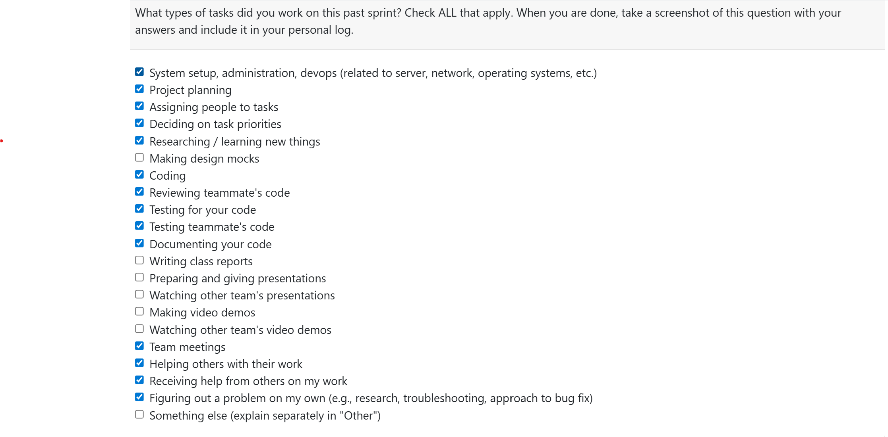
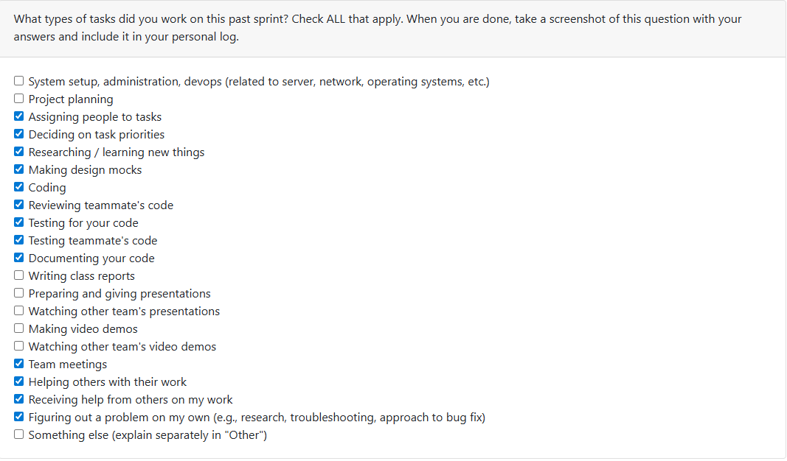
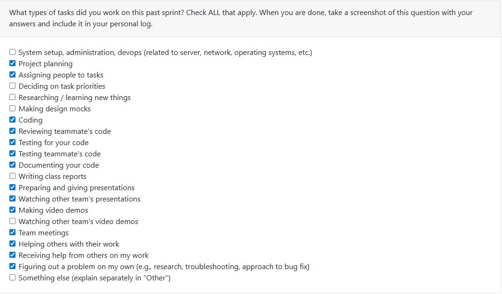
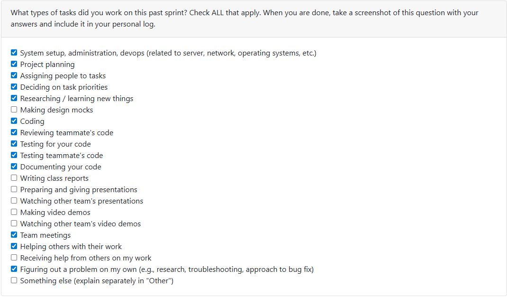
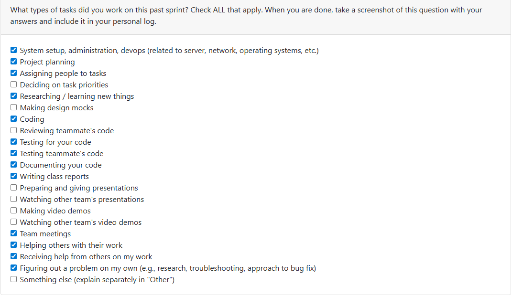

# Immanuel Wiessler - Personal Log

---

## Quick Navigation
### Term 2
- [Week 26 (03/23/2026 – 03/29/2026)](#-personal-log--week-26-03232026--03292026)
- [Week 25 (03/16/2026 – 03/22/2026)](#-personal-log--week-25-03162026--03222026)
- [Week 24 (03/09/2026 – 03/15/2026)](#-personal-log--week-24-03092026--03152026)
- [Week 23 (03/02/2026 – 03/08/2026)](#-personal-log--week-23-03022026--03082026)
- [Week 22 (02/23/2026 – 03/01/2026)](#-personal-log--week-22-02232026--03012026)
- [Week 21 - Bonus Week (02/16/2026 – 02/22/2026)](#-personal-log--week-21---bonus-week-02162026--02222026)
- [Week 20 (02/09/2026 – 02/15/2026)](#-personal-log--week-20-02092026--02152026)
- [Week 19 (02/02/2026 – 02/08/2026)](#-personal-log--week-19-02022026--02082026)
- [Week 18 (01/26/2026 – 02/01/2026)](#-personal-log--week-18-01262026--02012026)
- [Week 17 (01/19/2026 – 01/25/2026)](#-personal-log--week-17-01192026--01252026)
- [Week 16 (01/12/2026 – 01/18/2026)](#-personal-log--week-16-01122026--01182026)
- [Week 15 (01/05/2026 – 01/11/2026)](#-personal-log--week-15-01052026--01112026)

### Term 1

- [Week 14 (12/01/2025 – 12/07/2025)](#-personal-log--week-14-12012025--12072025)
- [Week 13 (11/24/2025 – 11/28/2025)](#-personal-log--week-13-11242025--11282025)
- [Week 11-12 (11/10/2025 – 11/27/2025)](#-personal-log--week-11-12-11102025--11272025)
- [Week 10 (11/03/2025 – 11/07/2025)](#-personal-log--week-10-11032025--11072025)
- [Week 9 (10/27/2025 – 10/30/2025)](#-personal-log--week-9-10272025--10302025)
- [Week 8 (10/20/2025 – 10/26/2025)](#-personal-log--week-8-10202025--10262025)
- [Week 7 (10/12/2025 – 10/18/2025)](#-personal-log--week-7-10122025--10182025)
- [Week 6 (10/06/2025 – 10/09/2025)](#-personal-log--week-6-10062025--10092025)
- [Week 5 (09/29/2025 – 10/05/2025)](#-personal-log--week-5-09292025--10052025)
- [Week 4 (09/22/2025 – 09/28/2025)](#-personal-log--week-4-09222025--09282025)
- [Week 3 (09/15/2025 – 09/21/2025)](#-personal-log--week-3-09152025--09212025)

---

# 📝 Personal Log – Week 3 (09/15/2025 – 09/21/2025)

## 📊 Peer Evaluation


---

## 🔗 Connection to Previous Week

This is the first week of the project, marking the beginning of the capstone journey.

---

## 🚀 Work Completed

### Coding Tasks
- N/A (Project setup phase)

### Testing/Debugging Tasks
- N/A (Project setup phase)

### Reviewing/Collaboration Tasks
- Collaborated with team members to discuss and refine project requirements (functional and non-functional)
- Participated in finalizing the proposal document
- Contributed to deciding on the development stack

---

## 📌 Associated Tasks from Project Board
- N/A (Project board not yet populated)

---

## 📈 Progress Update

| Task/Issue | Status |
|------------|--------|
| Completion of Project requirements (draft & refine) |  |
| GitHub repository established |  |

---

## ⚠️ Issues/Blockers
- No issues encountered this week

---

## 🎯 Next Week's Goals
- Continue refining project requirements
- Begin working on system design documentation


# 📝 Personal Log – Week 4 (09/22/2025 – 09/28/2025)

## 📊 Peer Evaluation
*(Screenshot not available for this week)*

---

## 🔗 Connection to Previous Week

Building on Week 3's requirements gathering and proposal work, this week focused on translating those requirements into system design documentation.

---

## 🚀 Work Completed

### Coding Tasks
- N/A (Design phase)

### Testing/Debugging Tasks
- N/A (Design phase)

### Reviewing/Collaboration Tasks
- Created and finalized the system design graph
- Worked on the **Project Scope and Usage Scenario** sections of the project proposal document
- Contributed to finalizing the development stack decisions
- Worked on the initial design of the system architecture layout

---

## 📌 Associated Tasks from Project Board
- N/A (Project board not yet populated)

---

## 📈 Progress Update

| Task/Issue | Status |
|------------|--------|
| Completion of Project Proposal (draft & refine) |  |
| Completion of System design mockup |  |

---

## ⚠️ Issues/Blockers
- No significant issues this week

---

## 🎯 Next Week's Goals
- Work on creating our **Data Flow Diagram (DFD)** for our system

---

## 🧠 Reflection on Past Cycle (Week 3)

Looking back at Week 3, our team developed a better understanding of each member's working style, which helped us stay more consistent with the assignment of tasks. This improved coordination allowed us to finalize our project requirements in a timely manner. Week 4 marked a turning point where the team really began to "click", laying the groundwork for smoother collaboration in the following weeks.


# 📝 Personal Log – Week 5 (09/29/2025 – 10/05/2025)

## 📊 Peer Evaluation


---

## 🔗 Connection to Previous Week

Following Week 4's system design work, this week focused on creating the Data Flow Diagrams (DFD) as planned, translating the architecture into detailed data flow documentation.

---

## 🚀 Work Completed

### Coding Tasks
- N/A (Design documentation phase)

### Testing/Debugging Tasks
- N/A (Design documentation phase)

### Reviewing/Collaboration Tasks
- Collaborated with teammates on the **DFD Graph** (Level 0 and Level 1)
- Completed the **team log** for Week 5

---

## 📌 Associated Tasks from Project Board
- N/A (Project board not yet populated)

---

## 📈 Progress Update

| Task/Issue | Status |
|------------|--------|
| **DFD Design (Level 0 & Level 1)** |  |
| **Team Log – Week 5** |  |

---

## ⚠️ Issues/Blockers

- **Communication issue**: One team member created both Level 0 and Level 1 DFD without informing others, leading to potential duplicate work
- **Resolution**: Introduced a new system in Discord server to ensure everyone knows who is currently working on what task, preventing duplicate tasks or code

---

## 🎯 Next Week's Goals
- Review finalized **project requirements**
- Finalize **system design** for new project requirements
- Create a new **DFD Design** for these new project requirements
- Revise Docker

---

## 🧠 Reflection on Current Cycle (Week 5)

This week we demonstrated effective teamwork in the development of the **DFD design** based on our project requirements which we submitted in Week 4, making sure to include the necessary requirements for both **Level 0** and **Level 1**. This included the external actors and the way in which the data flowed from our backend to the frontend **(UI)**. One thing I noticed is that we have finally settled into assumed roles.

---

## 🧠 Reflection on Past Cycle (Week 4)

Looking back at **Week 4**, our team developed a better understanding of each member's working style, which helped us stay more consistent with the assignment of tasks. This improved coordination allowed us to finalize our **project requirements** in a timely manner. In my view, Week 4 marked a turning point where the team really began to **"click"**, laying the groundwork for smoother collaboration in the following weeks.

---


# 📝 Personal Log – Week 6 (10/06/2025 – 10/09/2025)

## 📊 Peer Evaluation


---

## 🔗 Connection to Previous Week

Following Week 5's DFD design work and the new communication system introduced in Discord, this week marked the transition from design to actual coding. The project requirements were finalized and we began implementing the core functionality.

---

## 🚀 Work Completed

### Coding Tasks
- Created the **Python requirements.txt** file with libraries accessible for team members with varying Python skill levels
- Developed initial **file extraction system** (`extraction.py`) for extracting contents from zip files

### Testing/Debugging Tasks
- Created **pytest file** to test the functionality of the extraction method

### Reviewing/Collaboration Tasks
- Added newly defined issues to our Kanban board
- Updated **DFD graph** and **System Architecture Design** to incorporate new Milestone 1 requirements

---

## 📌 Associated Tasks from Project Board
- [Extract files from zip folder provided #34](https://github.com/COSC-499-W2025/capstone-project-team-2/issues/34)
- [Create requirements file #27](https://github.com/COSC-499-W2025/capstone-project-team-2/issues/27)

---

## 📈 Progress Update

| Task/Issue | Status |
|------------|--------|
| **Creation of Python requirements.txt** |  |
| **Created a class function for file extraction (zip file)** |  |
| **Created pytest file for testing the extraction method** |  |

---

## ⚠️ Issues/Blockers
- **Team skill consideration**: Needed to ensure chosen Python libraries were easy to pick up given the team's minimal Python experience
- **Resolution**: Selected beginner-friendly libraries and discussed them with the team

---

## 🎯 Next Week's Goals
- Begin work on the newly created issues in our Kanban project
- Continue working on current issues assigned to me

---

## 🧠 Reflection on Current Cycle (Week 6)

This week marks the actual start of the project coding phase. I worked on the initial development of the **file extraction system**, focusing on extracting components from zip files. At the same time, I worked on creating the **pytest file** to test the functionality. I also made the **requirements.txt** file with Python libraries appropriate for our team's skill level.

Overall, this week we did not encounter any significant issues with each other, and the communication system introduced in Week 5 helped prevent duplicate work.

---

## 🧠 Reflection on Past Cycle (Week 5)

For Week 5, I noticed that our team structure became more organized. The DFD design work went well and we successfully established clearer communication channels.

---


# 📝 Personal Log – Week 7 (10/12/2025 – 10/18/2025)

## 📊 Peer Evaluation


---

## 🔗 Connection to Previous Week

Building on the pytest knowledge gained from Week 6's file extraction testing work, this week I applied that experience to create tests for a new feature: user configuration storage.

---

## 🚀 Work Completed

### Coding Tasks
- N/A (Focus was on test development this week)

### Testing/Debugging Tasks
- Created `test_userConfig_store.py` - testing function for saving user configurations
- Applied knowledge gained from Week 6's pytest learning to this new test suite

### Reviewing/Collaboration Tasks
- Participated in code reviews with team members

---

## 📌 Associated Tasks from Project Board
- [Tests for storing user configuration #61](https://github.com/COSC-499-W2025/capstone-project-team-2/issues/61)

---

## 📈 Progress Update

| Task/Issue | Status |
|------------|--------|
| **Creation of test Python file for saving user configuration** |  |

---

## ⚠️ Issues/Blockers
- No significant blockers this week
- Successfully applied previous pytest learning to new test development

---

## 🎯 Next Week's Goals
- Continue working on [storing user configuration #36](https://github.com/COSC-499-W2025/capstone-project-team-2/issues/36), integrating the actual coding implementation

---

## 🧠 Reflection on Current Cycle (Week 7)

For **Week 7**, I began working on the storing of user's configuration, specifically creating the tests for user storage. This week was a validation week because after learning about pytest in Week 6, I was able to easily integrate my newfound knowledge into the test cases (`test_userConfig_store.py`) for this sprint.

---

## 🧠 Reflection on Past Cycle (Week 6)

For **Week 6**, I worked on the extraction of a zip file and exporting its contents to a temporary directory for file mapping, while creating tests simultaneously. This week was challenging because it was my first time creating tests using Python's **unittest framework**. It was also our first time reviewing each other's code and having meaningful conversations about improvements—in my case, adding more edge cases. Overall, Week 6 was valuable for learning the **unittest Python framework** and reviewing other team members' code.

---


# 📝 Personal Log – Week 8 (10/20/2025 – 10/26/2025)

## 📊 Peer Evaluation


---

## 🔗 Connection to Previous Week

Following Week 7's test development for user configuration storage, this week I implemented the actual configuration storage system and built a CLI interface to allow users to interact with it.

---

## 🚀 Work Completed

### Coding Tasks
- Implemented actual user configuration storage system using **[orjson](https://pypi.org/project/orjson/)** library for faster JSON processing
- Created interactive CLI interface for modifying user configurations
- Added error checking to prevent modification of protected fields (e.g., ID)
- Implemented exit system for clean return to main application

### Testing/Debugging Tasks
- Created comprehensive tests using **mock inputs**, **patching**, and **mock print** to simulate user interaction
- Fixed infinite loop bug in CLI identified by Puneet

### Reviewing/Collaboration Tasks
- Collaborated with Puneet on identifying and fixing the CLI infinite loop issue

---

## 📌 Associated Tasks from Project Board
- [Create CLI interface for saving user configuration #82](https://github.com/COSC-499-W2025/capstone-project-team-2/issues/82)
- [Store a user configuration file #36](https://github.com/orgs/COSC-499-W2025/projects/11/views/2?pane=issue&itemId=132426853&issue=COSC-499-W2025%7Ccapstone-project-team-2%7C36)
- [Infinite loop when selecting 'n' in CLI confirm_modification #84](https://github.com/COSC-499-W2025/capstone-project-team-2/issues/84)

---

## 📈 Progress Update

| Task/Issue | Status |
|------------|--------|
| **Creation of actual implementation for saving user configuration** |  |
| **Creation of user Configuration CLI** |  |
| **Applying fix/patch to infinite loop issue in CLI** |  |

---

## ⚠️ Issues/Blockers

- **Infinite loop bug**: Puneet identified an error in `test_configuration_CLI.py` that caused an infinite loop
- **Resolution**: Quickly identified the root cause and deployed a fix within the hour

---

## 🎯 Next Week's Goals
- [Work on consent doc for users to agree when program starts #32](https://github.com/COSC-499-W2025/capstone-project-team-2/issues/32)
- Continue implementing our code into a CLI for end of term showcase (**Milestone 1 showcase**)

---

## 🧠 Reflection on Current Cycle (Week 8)

**Week 8** was an interesting week. I implemented the [user configuration storage](https://github.com/orgs/COSC-499-W2025/projects/11/views/2?pane=issue&itemId=132426853&issue=COSC-499-W2025%7Ccapstone-project-team-2%7C36) system and discovered **orjson**, which processes JSON files much faster than Python's built-in `json` library.

I then built the [CLI interface](https://github.com/COSC-499-W2025/capstone-project-team-2/issues/82) for users to update their configuration through the terminal, including error checking for protected fields and a clean exit system.

### 🧪 Example Test from `test_configuration_CLI.py`

```python
import unittest
from unittest.mock import patch, call

class TestConfigurationCLI(unittest.TestCase):

    @patch('builtins.input', side_effect=["2", "fdfd", "n"])
    @patch('builtins.print')
    def test_invalid_input(self, mock_print, mock_input):
        """
        Test that when the user enters an invalid input (not 'y' or 'n'),
        an appropriate error message is printed and the method returns False.
        """
        chosen_setting = self.instance.get_setting_choice()
        self.instance.validate_modifiable_field(chosen_setting)
        result = self.instance.modify_settings(chosen_setting)

        mock_print.assert_any_call("ERROR: Please choose(y/n):")
        self.assertFalse(result)
```

---

## 🧠 Reflection on Past Cycle (Week 7)

**Week 7** was challenging because we encountered an issue where a team member's code contribution had failing tests and wasn't properly structured as a class. I didn't catch this during review and approved it, which could have led to bigger issues if **Samantha** hadn't noticed and brought it to our attention. Going forward, I will ensure that all tests pass and carefully verify the agreed-upon structure is implemented.

---


# 📝 Personal Log – Week 9 (10/27/2025 – 10/30/2025)

## 📊 Peer Evaluation


---

## 🔗 Connection to Previous Week

Following Week 8's CLI implementation for user configuration, this week I extended the configuration system to include user consent storage and restructured the file organization.

---

## 🚀 Work Completed

### Coding Tasks
- Updated user configuration to store user consent status (**External** or **Internal**)
- Added `save_with_consent` function to `configuration.py`
- Introduced new **UserConfigs** folder for storing templates and user configs
- Implemented dynamic file pathing system in `__init__` method

### Testing/Debugging Tasks
- Created tests to verify user configuration updates correctly with consent data
- Manually tested the `user_consent.py` interface integration
- Tested Puneet's fix for Mahi's code issue

### Reviewing/Collaboration Tasks
- Worked with Puneet Maan on fixing an issue discovered by Cameron and myself in Mahi's code

---

## 📌 Associated Tasks from Project Board
- [Save consent status PR #119](https://github.com/COSC-499-W2025/capstone-project-team-2/pull/119)

---

## 📈 Progress Update

| Task/Issue | Status |
|------------|--------|
| **Creation of system to save user consent data** |  |
| **Refactored configuration to reflect internal system changes** |  |

---

## ⚠️ Issues/Blockers

- **Midterms**: Took on a lighter workload this week due to midterm preparation
- **Code issue in teammate's work**: Discovered an issue in Mahi's code with Cameron; resolved by Puneet

---

## 🎯 Next Week's Goals
- Begin working on the file analysis aspect of the system

---

## 🧠 Reflection on Current Cycle (Week 9)

**Week 9** was lighter due to midterm preparation. I focused on modifying `configuration.py` to add the `save_with_consent` function and introduced a new folder structure for user configs. This required implementing a dynamic file pathing system:

```python
def __init__(self, jsonfile, loc_to_save='User_config_files'):
    """
    Initializes the Configuration class instance
    """
    self.jsonfile = jsonfile
    self.project_Root = pa.Path(__file__).parent.parent
    self.loc_to_save = pa.Path(os.path.join(self.project_Root, loc_to_save, "UserConfigs.json"))

def save_config(self):
    """Saves the JSON configuration file to the user's system."""
    with open(self.loc_to_save, "wb") as f:
        f.write(orjson.dumps(self.jsonfile, option=orjson.OPT_INDENT_2))
    return os.path.exists(self.loc_to_save)
```

I also collaborated with Puneet Maan on fixing an issue discovered by Cameron and myself in Mahi's code.

---


# 📝 Personal Log – Week 10 (11/03/2025 – 11/07/2025)

## 📊 Peer Evaluation


---

## 🔗 Connection to Previous Week

Building on Week 9's configuration improvements, this week I created a CLI interface for the file extraction system, integrating the previously implemented `extraction.py` class.

---

## 🚀 Work Completed

### Coding Tasks
- Implemented CLI interface for zip extraction (`CLI_interface_for_file_extraction.py`)
- Added 'q' exit functionality for users to quit at any time
- Implemented `max_retries` parameter (default: 3) for failed upload attempts
- Integrated Samantha's built-in verification process for zip file error handling

### Testing/Debugging Tasks
- Added 3 new pytest tests to `test_extraction.py`
- Created full mocking tests simulating user interaction with the CLI
- Fixed bug where extraction ran even after user pressed 'q' to exit

### Reviewing/Collaboration Tasks
- Pair programmed with Sam and Cameron to fix bug in Sam's code
- Refactored Cameron's `test_data_extraction` tests to run smoothly

---

## 📌 Associated Tasks from Project Board
- [Zip file extraction CLI](https://github.com/COSC-499-W2025/capstone-project-team-2/issues/)

---

## 📈 Progress Update

| Task/Issue | Status |
|------------|--------|
| **Creation of CLI interface for zip extraction** |  |
| **Added 3 new pytest tests to `test_extraction.py`** |  |

---

## ⚠️ Issues/Blockers

- **Exit bug**: Sam Smith identified that extraction still ran after user pressed 'q'
- **Resolution**: Encapsulated extraction method in an if statement while keeping user input display outside

---

## 🎯 Next Week's Goals
- Add optional features to CLI (idle feature, multiple file upload)
- Work on Kanban backlog items
- Begin integrating an LLM into the system using **Ollama** or **ChatGPT**

---

## 🧠 Reflection on Current Cycle (Week 10)

For **Week 10**, I implemented a CLI interface for zip extraction, allowing users to input a filepath and upload data to the file analysis system. I was particularly proud of creating full mocking tests this week:

```python
@patch('src.CLI_interface_for_file_extraction.extractInfo')
@patch('src.CLI_interface_for_file_extraction.input')
@patch('builtins.print')
def test_valid_zip_file_extraction_cli(self, mock_print, mock_input, mock_extract_Info):
    """
    Simulating user interaction with the extraction CLI
    when uploading a valid zip file, returning a success message
    """
    test_file_name = Path(self.test_zip_file_path).name
    mock_input.return_value = self.test_zip_file_path
    mock_instance = MagicMock()
    mock_extract_Info.return_value = mock_instance

    cli = zipExtractionCLI()
    cli.run_cli()
    mock_extract_Info.assert_called_once_with(self.test_zip_file_path)
    mock_instance.runExtraction.assert_called_once()
    mock_print.assert_any_call(f"{test_file_name} has been extracted successfully")
```

This was a significant achievement—applying knowledge from previous mock tests to create comprehensive user interaction simulations.

--- 


# 📝 Personal Log – Week 11-12 (11/10/2025 – 11/27/2025)

## 📊 Peer Evaluation


---

## 🔗 Connection to Previous Week

Following Week 10's CLI development and goal to integrate LLM capabilities, this two-week sprint focused on AI integration using Ollama and resolving Docker connectivity issues discovered during development.

---

## 🚀 Work Completed

### Coding Tasks

**Week 11 (Bonus Week):**
- Added timeout feature to zip extraction CLI using **async** library
- Implemented contributor percentage calculation for git repos using **[PyGithub](https://pypi.org/project/PyGithub/)**
- Added detection for collaborative vs solo projects

**Week 12:**
- Integrated **[Ollama](https://ollama.com/)** and **[LangChain](https://www.langchain.com/)** for AI code analysis
- Selected **[qwen2.5-coder:1.5b](https://ollama.com/library/qwen2.5-coder)** model for accessibility on varying hardware
- Created `_clean_model_output()` function to parse JSON from model responses
- Developed automatic Docker connection file using **[docker](https://pypi.org/project/docker/)** Python API

### Testing/Debugging Tasks
- Created test suite for AI analysis system
- Implemented `setUpClass` pattern to optimize test performance
- Created tests for automatic Docker setup

### Reviewing/Collaboration Tasks
- Investigated and fixed MySQL connection configuration issue discovered by team member

---

## 📌 Associated Tasks from Project Board
- [Docker patch/fix (automatic configuration) #166](https://github.com/COSC-499-W2025/capstone-project-team-2/pull/168)
- [AI integration #164](https://github.com/COSC-499-W2025/capstone-project-team-2/pull/167)

---

## 📈 Progress Update

| Task/Issue | Status |
|------------|--------|
| **Creation of automatic Docker connection file** |  |
| **AI integration into the system** |  |

---

## ⚠️ Issues/Blockers

- **MySQL connection issue**: Team needed to manually configure MySQL connection in main.py
- **Resolution**: Created automatic Docker connection using Python docker API with try/catch for inside/outside container scenarios

---

## 🎯 Next Week's Goals
- Begin integrating everything for demo
- Work on video demo
- Create Team contract
- Review Milestone 1 checklist

---

## 🧠 Reflection on Current Cycle (Week 12)

For **Week 12**, I integrated the AI element into our file analysis system using **Ollama** and **LangChain**. I used prompt engineering to ensure the model understood its function and selected **qwen2.5-coder:1.5b** for accessibility across different hardware.

The model output needed cleaning to extract valid JSON:

```python
def _clean_model_output(self, text: str) -> str:

"""
 Cleans the output of the model by removing any code block fences and
 returning any JSON found in the output.

 Args:
 text (str): The output of the model

 Returns:
 str: The cleaned output of the model
 """
 if not text:
  return text
 cleaned = text.strip()
 fence_pattern = re.compile(r"```(?:json|python)?\s*([\s\S]*?)```", re.IGNORECASE)
 match = fence_pattern.search(cleaned)
        if match:
 cleaned = match.group(1).strip()
        else:
            if cleaned.startswith("```") and cleaned.endswith("```"):
 cleaned = cleaned[3:-3].strip()
 json_match = re.search(r"\{[\s\S]*\}", cleaned)
        if json_match:
 cleaned = json_match.group(0).strip()

        return cleaned


```

One issue discovered by a team member was that we needed to manually configure the main.py MySQL connection file, as shown below.

```py
conn = mysql.connector.connect(
        host="app_database",        
        port=3306,
        database="appdb",
        user="appuser",
        password="apppassword"
 )

```
Therefore after the discover of this issue, I decided to fix this issue so that in the further that we don't have this problem and more, the way that I tackled this problem was making use of the python [docker](https://pypi.org/project/docker/) API libary where I develop two outcome one 1. we connect to the database via the python file  2. from inside of the container, the way this was handle was doing a `try and catch block` where I would try to get the enviorment variables from docker app running if it return an error I would sent the host_name and port number to the one used inside of the container, otherwise it would find the port number and check to see if there was an host_ip and if it return 0.0.0.0 then I would set it to **localhost** or **127.0.0.1** the full implemenation can be seen down below
```py
def get_mysql_host_information(self):

        try:
 con=None
            for container in self.client.containers.list():

                if "database" in container.name:
 con=self.client.containers.get(container.name)
            for key,value in con.ports.items():
                if value is not None:
                    self.port_number=value[0]['HostPort']
                    self.host_ip=value[0]['HostIp']

            if self.host_ip =="0.0.0.0":
                self.host_ip="127.0.0.1" or "localhost"

        except AttributeError:
            self.host_ip="app_database"
            self.port_number="3306"
            pass


``` 
After creating these files I began working on the test suite for both the AI anlysis and automtically Docker setup which was  tested to see if the test run successfully with no issues at all, but I want to mention is that I discover that the `def setup(self):` in python's unittest libaray is ran each time for each test case, therefore for the AI system test I decided to make it only run once to prevent the testing from taking too long, where I used a new system which I found 

```py
   @classmethod
    def setUpClass(cls):
 root_folder = Path(__file__).resolve().parent
        cls.folder = root_folder / "tiny_scripts"
        cls.instance = codeAnalysisAI(cls.folder)
        cls.result = cls.instance.run_analysis()
```


## 🧠 Reflection on pervious Cycle bonus week (Week 11)

For the bonus week, I developed two things, which were adding a timeout feature to my zip_extraction CLI to allow for the system to return to the main menu if the user takes too long to upload a zip file, which was implemented using the **async** library
and also adding a system to calculate the contributor percentage if the uploaded zip is a git repo, which was implemented using the **[PyGithub](https://pypi.org/project/PyGithub/)**, and also identify if the project is a collab or solo, and if it is a collab, then it will return the percentage of the commits from each member. 


# 📝 Personal Log – Week 13 (11/24/2025 – 11/28/2025)

## 📊 Peer Evaluation


---

## 🔗 Connection to Previous Week

Building on Week 12's AI integration work with Ollama, this week focused on extending AI capabilities to generate resume-styled outputs and enhancing Docker connectivity for the Ollama system.

---

## 🚀 Work Completed

### Coding Tasks
- Created AI resume generation system using Google Gemini
- Implemented file type detection (code, docs, PDF) for building context
- Used **LangChain chains** concept for streamlined LLM pipeline
- Stored results in dataclass objects (`OOPPrinciple`, `ResumeItem`) for convenient access

### Testing/Debugging Tasks
- Created tests for AI resume generation and Docker connection

### Reviewing/Collaboration Tasks
- Enhanced Docker connection file for Ollama system connectivity

---

## 📌 Associated Tasks from Project Board
- [Docker patch for Ollama connection #191](https://github.com/COSC-499-W2025/capstone-project-team-2/pull/191)
- [AI generate resume #188](https://github.com/COSC-499-W2025/capstone-project-team-2/pull/188)

---

## 📈 Progress Update

| Task/Issue | Status |
|------------|--------|
| **Creation of automatic Docker connection file for Ollama** |  |
| **AI generated resume system** |  |

---

## ⚠️ Issues/Blockers

- **Milestone deadline pressure**: Stressful week due to looming deadlines for presentation and Milestone 1 submission
- **Resolution**: Prioritized tasks and focused on completing essential features

---

## 🎯 Next Week's Goals
- Work on video demo
- Create Team contract
- Begin finalizing Milestone 1 deliverables

---

## 🧠 Reflection on Current Cycle (Week 13)

For **Week 13**, I worked on more AI implementation including the resume generation system and an enhancement to the Docker connection file for Ollama connectivity. This week was stressful due to the looming Milestone 1 deadline for both our presentation and submission.

Key accomplishments:
- Discovered that **LangChain** had a library for cleaner JSON formatting
- Built a more defined prompt for Google Gemini to generate resumes
- Implemented file type detection to recursively identify code, docs, or PDF files and build context
- Used **LangChain chains** to streamline the LLM pipeline:

```python
self.chain = self.langChain_prompt | self.llm | self.parser
```

- Stored results in dataclass objects for convenient access:

```python
@dataclass()
class OOPPrinciple:
    present: bool
    description: str
    code_snippets: List[Dict[str, str]]

@dataclass()
class ResumeItem:
    project_title: str
    one_sentence_summary: str
    detailed_summary: str
    key_responsibilities: List[str]
    key_skills_used: List[str]
    tech_stack: str
    impact: str
    oop_principles_detected: Dict[str, OOPPrinciple]
```

I learned a lot about dataclasses from this implementation. I also enhanced the Docker automation script to auto-connect to the Ollama container and created tests to ensure everything worked correctly.

---


# 📝 Personal Log – Week 14 (12/01/2025 – 12/07/2025)

## 📊 Peer Evaluation


---

## 🔗 Connection to Previous Week

Following Week 13's AI resume generation work, this final sprint before Milestone 1 focused on integrating Gemini AI for PDF portfolio generation, updating documentation, and fixing critical bugs.

---

## 🚀 Work Completed

### Coding Tasks
- Integrated Gemini AI to create formatted PDF portfolio and resume using **reportLab**
- Created non-AI generated resume line option
- Performed hotfix on AI integration code (removed offending lines with Samantha M.)
- Performed hotfix for consent status change mid-session bug discovered during video demo

### Testing/Debugging Tasks
- Tested consent status change functionality
- Verified AI integration hotfix

### Reviewing/Collaboration Tasks
- Updated README.md to highlight key project parts and installation instructions
- Collaborated with Samantha M. on AI integration bugfix

---

## 📌 Associated Tasks from Project Board
- [PDF Generator + Integration #218](https://github.com/COSC-499-W2025/capstone-project-team-2/issues/218)
- [Improved readme file #229](https://github.com/COSC-499-W2025/capstone-project-team-2/pull/229)
- [When program is run AI_analysis on script is run #232](https://github.com/COSC-499-W2025/capstone-project-team-2/issues/232)
- [Consent bug issue #245](https://github.com/COSC-499-W2025/capstone-project-team-2/issues/245)
- [Non AI-external resume line generator #241](https://github.com/COSC-499-W2025/capstone-project-team-2/issues/241)

---

## 📈 Progress Update

| Task/Issue | Status |
|------------|--------|
| **Integrated Gemini AI for PDF portfolio/resume** |  |
| **Updated README.md** |  |
| **Consent status mid-session hotfix** |  |
| **Non-AI resume line generator** |  |

---

## ⚠️ Issues/Blockers

- **AI integration bug**: Discovered with Samantha M. - offending lines ran the class unnecessarily
- **Consent change bug**: Users couldn't change consent status mid-session (discovered during video demo)
- **Resolution**: Both bugs were quickly hotfixed

---

## 🎯 Next Week's Goals
- Relax and prepare for finals

---

## 🧠 Reflection on Current Cycle (Week 14)

**Week 14** was very stressful as the final sprint for M1 milestones. I focused on:
- Creating PDF versions of portfolio content using **reportLab** framework
- Integrating with Gemini AI for formatted PDF resume generation (dataclass integration made this easier)
- Updating the README with installation instructions
- Performing hotfixes for AI integration and consent status bugs

Following TA advice, I attempted to keep new coding contributions under 500 lines, though some complex systems and documentation requirements made this challenging.

---

## 🧠 Reflection on Previous Cycle (Week 13)

Week 13 was stressful due to Milestone 1 deadlines. I successfully implemented the AI resume generation system using Google Gemini and LangChain, and enhanced Docker connectivity for Ollama.

---


# 📝 Personal Log – Week 15 (01/05/2026 – 01/11/2026)

## 📊 Peer Evaluation


---

## 🚀 Features Worked On  
- Integrated with gemini AI to create a formated PDF protfolio and resume
- Updated the Readme.md to match our current progress
- Performed a hotfix on the AI Intergation code
- Pefromed a hotfix so that users can change consent status mid program
---

## 📌 Associated Tasks from Project Board  
- [PDF- Generator + Integration](https://github.com/COSC-499-W2025/capstone-project-team-2/issues/218)
- [Improved readme file](https://github.com/COSC-499-W2025/capstone-project-team-2/pull/229)
- [when program is run AI_anlysis on script is run](https://github.com/COSC-499-W2025/capstone-project-team-2/issues/232)
- [Consent bug issue](https://github.com/COSC-499-W2025/capstone-project-team-2/issues/245)
- [Non AI-external resume line generator ](https://github.com/COSC-499-W2025/capstone-project-team-2/issues/241)
---

## 📈 Progress Update (since 12/6/2025)  

| Task/Issue | Status |
|------------|--------|
|**Intergrated with gemini AI to create a formated PDF protfolio and resume** |  |
|**Updated the Readme.md to match our current progress**|
|**performed hotfix so that user can change their constent status mid-session** | 
| **Non AI-external resume line generator** |


## 🎯 Next Week’s Goals

- Relax and prepare for finals
---

## 🧠 Reflection on Current Cycle (Week 14)
 **Week 14** was very stressful because it was the final sprint for M1 milestones. I could feel the pressure of the looming deadline, the work that I focused on for this week was added a new feature to create PDF version of the protofilo content and then integrated with the gemini AI to create a formated PDF resume, which was a very fun and exciting experience to work on, to pull this I used a framework called `reportLab` for adding the content to pdf to generate the PDF, Where thanks to me intergrating **dataclass** into the ```ResumeItem``` class this make the process of access the elements of the returned dictonary more convenient to making the PDF easier and fasts. I also worked on the README file to clearly highlight the key parts of our project and added installation instructions. Lastly, I encountered a bug in the AI integration code with Samantha M. I performed a hotfix, which was very simple: I removed some offending lines of code that ran the actual class that wasn't needed inside the script it was created in. One additonal task that I did this week was created our video demo and during our video demo recording I noticed a bug that does not allow user to change their user constent mid-session in other words if they enable external tools and wanted to disabled them they cannot so quickly made a hotfix to solve this issue, additoanlly I also quickly added a non-AI Generated Resume line to our system.

Lastly, after taking some advice from the TA, I decided to make new coding contributions a bit smaller, less than 500 lines of code change, but for some of the code I was unable to do the complex nature of the system as well, and also the amount of documentation that was needed to explain certian aspects of the code itself.


## 📊 Peer Evaluation


---

## 🚀 Features Worked On  
- Resume/Portfolio Generator Refactor — Rebuilt the resume creation module using RenderCV libary to generate professional, fully-featured resumes instead of basic output snippets. Users can now produce complete, presentation-ready CVs/resume suitable for real-world job applications.
---

## 📌 Associated Tasks from Project Board  
- [Resume Generation Improvement using rendercv](https://github.com/COSC-499-W2025/capstone-project-team-2/issues/261)

---

## 📈 Progress Update (since 12/6/2025)  

| Task/Issue | Status |
|------------|--------|
|**resume Generation Improvement using rendercv** | 

**Week 15** marked continued progress in the second half of the capstone. My primary focus was refactoring and recreating the resume generator module from Milestone 1, which previously produced output insufficient for professional use. The goal was to create a fully-featured resume suitable for real-world settings to showcase users to potential employers.

I achieved this by integrating [RenderCV](https://github.com/rendercv/rendercv), a CLI-based resume generation library, into our system. This involved developing a comprehensive `Generate_RenderCV_Resume.py` module that serves as the backbone for resume creation and management. Key features include:

- **5 Dataclasses** (`Experience`, `Skills`, `Education`, `Connections`, `Project`) to cleanly structure CV/resume data
- **Full CRUD Operations** for each section of the resume/CV
- **AI Integration** through the `add_project_from_ai` method, which leverages `GenerateProjectResume` to automatically populate project descriptions from the analyzed project

The code was intentionally designed with modularity in mind for seamless integration into the Streamlit UI interface planned for Milestone 3. By following the single-responsibility principle, future UI binding should be straightforward.

The main challenge I encountered this week was maintaining the PR size limit of 500 lines despite multiple refactoring attempts. This didn't prove easy due to:

1. **Self-contained module requirement** — The RenderCV Generator requires all components (builder class, dataclasses, AI integration, YAML generation, and rendering logic) to function together as a cohesive unit
2. **Comprehensive test coverage** — 13 test classes were necessary to ensure reliability across all CRUD operations
3. **Documentation needs** — Extensive docstrings and comments were required to explain the code's functionality for reviewers

Breaking this into smaller PRs would have created incomplete functionality and increased integration complexity, so I included a justification in the PR description explaining why the size was necessary. 

For the next sprint, I plan to add the missing features required for Milestone 2. Additionally, I worked on fixing and improving a colleague's code to ensure that the refactoring allows the modified tests to pass without problems, and also added missing documentation for certian code and test 

# 📝 Personal Log – Week 16 (01/12/2026 – 01/18/2026)

## 📊 Peer Evaluation


-----

## 🔗 Connection to Previous Week

Building on the Resume Generator class (`Generate_RenderCV_Resume.py`) completed previously, this week I extended it to create a dedicated Portfolio generator (`Generate_AI_RenderCV_portfolio.py`) with enhanced functionality and cleaner code patterns.

-----

## 🚀 Work Completed

### Coding Tasks

- **Portfolio Generator:** Created a new feature to generate a portfolio using the RenderCV library to produce professional, fully-featured resumes instead of basic output snippets. Users can now produce complete, presentation-ready CVs/resumes suitable for real-world job applications with full CRUD operations.
- Refactored contact update methods from individual setters into a unified `update_portfolio_contact()` function with input validation
- Implemented `next()` generator expressions for cleaner, more Pythonic collection lookups

### Testing/Debugging Tasks

- Added comprehensive test coverage for `Generate_AI_RenderCV_portfolio.py` called `test_Generate_AI_RenderCV_portfolio.py` with detailed docstrings explaining purpose, parameters, return values, and edge cases

### Reviewing/Collaboration Tasks

- Conducted peer review on [RenderCV Integration for Portfolio Generation PR #290](https://github.com/COSC-499-W2025/capstone-project-team-2/pull/290) and provided feedback and fixes that must be made

-----

## 📌 Associated Tasks from Project Board

- [Added missing functionality to Generate_AI_RenderCV_portfolio.py](https://github.com/COSC-499-W2025/capstone-project-team-2/pull/288)
- [Portfolio RenderCV Builder](https://github.com/COSC-499-W2025/capstone-project-team-2/pull/286)

-----

## 📈 Progress Update (since 01/12/2026)

|Task/Issue         |Status                                                  |
|-------------------|--------------------------------------------------------|
|Portfolio Generator||

-----

## ⚠️ Issues/Blockers

- No issue for this week

-----

## 🎯 Next Week’s Goals

- Work on requirements for peer testing happening the following week
- Work on integrating the CRUD operations portfolio generator into our terminal UI

-----

## 🧠 Reflection on Current Cycle (Week 16)
This week, I focused on creating the Portfolio Generator using the RenderCV library. The goal was to create a fully-featured portfolio suitable for real-world settings to showcase users to potential employers.

Following last week's work, I modified my Resume Generator class (`Generate_RenderCV_Resume.py`) by creating a new class (`Generate_AI_RenderCV_portfolio.py`) to generate professional portfolios. This was done by modifying the starter YAML file to use a portfolio-focused structure, removing resume-specific sections (like work experience and education) and keeping only portfolio-relevant fields:


```yaml
'cv': {
    'name': self.name.replace('_', ' '),
    'location': 'City, State',
    'email': 'your.email@example.com',
    'phone': '+1 234 567 9801',
    'website': 'https://yourwebsite.com',
    'social_networks': [
        {'network': 'LinkedIn', 'username': ''},
        {'network': 'GitHub', 'username': ''}
    ],
    'sections': {
        'projects': [
            {
                'name': 'Project Name',
                'start_date': '2023-01',
                'end_date': '2024-05',
                'summary': 'Brief description of the project',
                'highlights': [
                    'Key feature or accomplishment 1',
                    'Key feature or accomplishment 2'
                ]
            }
        ]
    }
},
'design': {
    'theme': self.chosen_theme
},
'locale': {
    'language': 'english'
}
```

In addition to peer reviews, I also added enhancements that were not present in my first version of the Generator. This included a clearer way of updating contact information, which went from individual setter methods:

```python
def update_email(self, email: str):
    self.data['cv']['email'] = email
    self._auto_save_if_enabled()

def update_phone(self, phone: str):
    self.data['cv']['phone'] = phone
    self._auto_save_if_enabled()

def update_location(self, location: str):
    self.data['cv']['location'] = location
    self._auto_save_if_enabled()

# ... repeated for each field
```

To a single unified method with input validation:

```python
def update_portfolio_contact(self, email: str = None, phone: str = None, 
                              location: str = None, website: str = None, 
                              name: str = None):
    contact_section = self.data['cv']
    updated_fields = []
    fields = {
        'email': email, 'phone': phone, 'website': website,
        'location': location, 'name': name
    }
    for field_name, value in fields.items():
        if value is None:
            continue
        if isinstance(value, str) and not value.strip():
            continue
        contact_section[field_name] = value
        updated_fields.append(field_name)
    self._auto_save_if_enabled()
    return f"Successfully updated: {', '.join(updated_fields)}" if updated_fields else "No fields updated"
```

I also added enhancements to the **CRUD** operations by using Python’s `next()` function with a generator expression for cleaner, more efficient lookups. An example of this can be seen below:

```python
def modify_portfolio_connection(self, network_name: str, new_username: str):
    if self.current_connections is None or not self.current_connections:
        return "No connections to modify"
    
    connection = next((c for c in self.current_connections if c.get('network') == network_name), None)
    
    if connection is None:
        return f"Connection '{network_name}' not found"
    
    connection['username'] = new_username
    self._auto_save_if_enabled()
    return f"Successfully updated: {network_name}"
```

This approach replaces traditional `for` loops with index tracking, providing a more Pythonic and readable way to find and modify specific items in a collection. The `next()` function with a default value of `None` elegantly handles the case where no matching connection is found.

**Note on Line Count:** The reason my PR reached close to 591 lines is largely due to comprehensive documentation—every function and test includes detailed docstrings explaining purpose, parameters, return values, and edge cases. While this added to the line count, thorough documentation is essential for code maintainability and helps teammates understand the codebase during future development.


# 📝 Personal Log – Week 17 (01/19/2026 – 01/25/2026)

## 📊 Peer Evaluation


---

## 🔗 Connection to Previous Week

- Building on Week 16's Portfolio Generator work using RenderCV, this week focused on consolidating the separate resume and portfolio generation systems into a unified `RenderCVDocument` class. 
Additionally, I implemented full CRUD operations into the CLI to allow users to interactively manage their portfolios and resumes for the upcoming demo.

---

## 🚀 Work Completed

### Coding Tasks

**[PR #317](https://github.com/COSC-499-W2025/capstone-project-team-2/pull/317) - Implement CRUD Operations into CLI for Demo**
- Consolidated Resume and Portfolio generation into a unified `RenderCVDocument` class
- Fixed multiple self-made bugs:
  - Typo "Expereince" → "Experience"
  - "ConnectionInfo" → "Connection" naming
  - `self.name` assignment issue in generate() method
  - `self.sections` storing dict instead of list
  - "project" → "projects" in section validation
- Implemented full CRUD operations for managing portfolios and resumes through CLI
- Created `document_generator_menu.py` with 17+ menu options for document management
- Added helper methods for YAML file loading
- Refactored `portfolio_rendercv_service.py` and `Generate_AI_RenderCV_Portfolio_and_Resume.py`

### Testing/Debugging Tasks

**[PR #317](https://github.com/COSC-499-W2025/capstone-project-team-2/pull/317)**

**Test Consolidation (84% Reduction)**
- Consolidated test file from 82 tests down to 13 focused tests
- Unified portfolio and resume test suite using shared `RenderCVDocument` class
- Modified test files: `test_Generate_AI_RenderCV_portfolio.py`, `test_Generate_Render_CV_Resume.py`
- All 23 tests passing across both test files

**CLI CRUD Operations Testing**
Created comprehensive test suite (`test_document_generator_menu.py`) covering four key areas:

1. **Connection validation and CRUD operations**
2. **Theme modification functionality**
3. **Project addition with highlights** (from saved analysis, AI analysis, and manual entry)
4. **Education and skill management**

### Reviewing/Collaboration Tasks
-[added API endpoint for POST /privacy-consent and GET /skills](https://github.com/COSC-499-W2025/capstone-project-team-2/pull/322)
-[C# analysis](https://github.com/COSC-499-W2025/capstone-project-team-2/pull/327)

---

## 📌 Associated Tasks from Project Board
- [Implement CRUD Operations into CLI for Demo](https://github.com/COSC-499-W2025/capstone-project-team-2/issues/316)

---

## 📈 Progress Update

| Task/Issue                                        | Status |
|---------------------------------------------------|--------|
| Refactoring document generation                   ||
| Integration of CRUD operations into CLI for Demo  ||

---

## ⚠️ Issues/Blockers
I encountered a massive issue which is that I didn't check to see if the other test that were associated with the CLI
and spent some time fixing the test to make sure that they pass with the no issue which slowed down my development time

---

## 🎯 Next Week's Goals
- Get ready for peer heuristics that is happening in class
- Continue to keep working on improve and fixing critical bugs in our system

---

## 🧠 Reflection on Current Cycle (Week 17)
Week 17 was focused on refactoring and enhancing 
the document generation system in preparation for the upcoming demo.

The first major task was consolidating the separate resume and portfolio generation 
system into a unified `RenderCVDocument` class ([PR #317](https://github.com/COSC-499-W2025/capstone-project-team-2/pull/317)). 
This refactoring effort eliminated duplicate coding and created a cleaner, more maintainable architecture.

```python
class RenderCVDocument:
    """Unified class for generating both resumes and portfolios using RenderCV."""
    def __init__(self, name: str, document_type: str = "resume"):
        self.name = name
        self.document_type = document_type
        self.sections = {}  # Fixed: was incorrectly storing as list
```

During this process, I discovered and fixed several self-made bugs:
- Typo fix: `'Expereince'` → `'Experience'`
- Naming convention: `ConnectionInfo` → `Connection`
- Data structure: `self.sections = []` → `self.sections = {}`

The second major task was implementing full CRUD operations into the CLI for the demo. 
This was achieved through the creation of `document_generator_menu.py` 
with comprehensive menu options. Note: PR #317 and PR #316 were combined together 
for this implementation.

**Document Edit Menu with Dynamic Options:**

This menu presents different options based on 
document type (**resume** vs **portfolio**). 
Resume documents have additional sections for education, skills, 
and summary that are not available for portfolios.

```python
def _document_edit_menu(doc: RenderCVDocument) -> None:
    """Display and handle the edit menu for a loaded RenderCV document."""
    doc_type_label = "Resume" if doc.doc_type == 'resume' else "Portfolio"

    print("\n-- Projects --")
    print("  1) Add from saved analysis")
    print("  2) Add from AI analysis")
    print("  3) Add manually")
    print("  4) Modify/Delete")
    print("\n-- Contact & Social --")
    print("  5) Edit contact info")
    print("  6) Manage social networks")
    # Resume has additional options: Education, Skills, Summary
```

**Adding Projects from Saved Analysis:**

This function lists all saved project analyses 
from the default save directory and allows the user to select one. 
The selected analysis is converted to a resume item 
using `GenerateLocalResume` and added to the document.

```python
def _add_project_from_analysis(doc: RenderCVDocument) -> None:
    """Add a project to the document from a saved local analysis."""
    folder = Path(runtimeAppContext.default_save_dir).resolve()
    items = list_saved_projects(folder)

    if not items:
        print("[INFO] No saved projects found.")
        return

    # User selects a project from the list...
    data = json.loads(chosen_path.read_text(encoding="utf-8"))
    resume_item = GenerateLocalResume(data, project_name).generate()

    project = Project(
        name=resume_item.project_title,
        summary=resume_item.one_sentence_summary,
        highlights=resume_item.key_responsibilities or []
    )
    doc.add_project(project)
```

**Adding Projects from AI Analysis:**

This function requires external consent to be enabled. 
It lists saved project 
analyses and uses `GenerateProjectResume` 
to create an AI-generated resume item 
from the project root path stored in the analysis.

```python
def _add_project_from_ai(doc: RenderCVDocument) -> None:
    """Add a project using AI-powered analysis (requires external consent)."""
    if not runtimeAppContext.external_consent:
        print("[INFO] External services disabled. Enable in Settings.")
        return

    ai_resume = GenerateProjectResume(project_root).generate(saveToJson=False)
    project = Project(
        name=ai_resume.project_title,
        summary=ai_resume.one_sentence_summary,
        highlights=ai_resume.key_responsibilities or []
    )
    doc.add_project(project)
```

**Manual Project Addition:**

This function prompts the user to enter project details including name, dates, summary, and highlights. 
It then creates a Project object and adds it to the document.

```python
def _add_project_manually(doc: RenderCVDocument) -> None:
    """Manually add a project through user input."""
    name = input("Project name: ").strip()
    summary = input("Brief summary: ").strip()
    # Collect highlights in a loop...

    project = Project(name=name, summary=summary, highlights=highlights)
    doc.add_project(project)
```

**Module Architecture:**

The `document_generator_menu.py` module serves as the CLI interface layer that delegates to the underlying `RenderCVDocument` service, ensuring separation of concerns between UI and business logic.

Looking ahead to next week, I plan to prepare for peer heuristics testing and continue addressing any critical bugs discovered during the demo preparation. I will also be planning/creating meeting agendas to help us stay focused and on track. 

To end this Reflection, I also worked on two PR reviews, one being [C# analysis #327](https://github.com/COSC-499-W2025/capstone-project-team-2/pull/327) and [Added API endpoint for POST /privacy-consent and GET /skills #322](https://github.com/COSC-499-W2025/capstone-project-team-2/pull/322), and added recommendations.


# 📝 Personal Log – Week 18 (01/26/2026 – 02/01/2026)

## 📊 Peer Evaluation


---

## 🔗 Connection to Previous Week

Following Week 17's preparation for peer heuristics testing, 
this week focused on fixing bugs discovered during peer testing, 
including RenderCV PDF creation inconsistency 
and a consent display issue in the CLI.

---

## 🚀 Work Completed

### Coding Tasks
- Fixed RenderCV PDF creation inconsistency by changing subprocess call to use `sys.executable -m rendercv` instead of direct rendercv invocation ([PR #344](https://github.com/COSC-499-W2025/capstone-project-team-2/pull/344))
- Corrected `save()` method bug where the filename parameter was being ignored
- Simplified `get_summary()` method from 7 lines to 4 lines
- Modified `_get_template()` to include summary and skill sections for portfolio templates
- Added getter and utility methods for better data access across both resume and portfolio documents
- Fixed `show_consent_file()` file path bug — adjusted directory traversal to go up 3 levels from `src/config/user_consent.py` to correctly locate `consent_document.md` ([PR #345](https://github.com/COSC-499-W2025/capstone-project-team-2/pull/345))

### Testing/Debugging Tasks
- Added comprehensive CRUD test coverage for summary functionality
- Consolidated portfolio tests from 44 tests down to 8 focused tests
- All 24 tests passing (8 portfolio + 16 resume) covering connections, projects, skills, summary, contact info, and theme
- Verified consent fix with 45 passing tests across consent API tests, user consent tests, and user consent update tests
- Manual testing completed on Windows 10 and Linux

### Reviewing/Collaboration Tasks
- [Print statements converted to error raising for API add on in analysis_service.py ](https://github.com/COSC-499-W2025/capstone-project-team-2/pull/348)
- Worked together with other members to ensure that the renderCV document generation works on all platforms 
[Skills endpoint Error Handling](https://github.com/COSC-499-W2025/capstone-project-team-2/pull/349)

---

## 📌 Associated Tasks from Project Board
- [RenderCV issue #343](https://github.com/COSC-499-W2025/capstone-project-team-2/issues/343)
- [View consent not showing #341](https://github.com/COSC-499-W2025/capstone-project-team-2/issues/341)

---

## 📈 Progress Update

| Task/Issue | Status |
|------------|--------|
| **Fixed RenderCV PDF creation inconsistency** |  |
| **Fixed consent document not displaying** |  |

---

## ⚠️ Issues/Blockers

- **RenderCV PDF inconsistency**: PDF creation was not producing consistent results due to direct rendercv subprocess invocation
- **Resolution**: Changed to use `sys.executable -m rendercv` for reliable cross-platform execution
- **Consent display bug**: `show_consent_file()` returned `Constent_md` not showing because the file path traversal was incorrect
- **Resolution**: Adjusted path navigation to go up 3 directory levels to reach the project root

---

## 🎯 Next Week's Goals
- Continuing keep working on milestone 2 requirements


---

## 🧠 Reflection on Current Cycle (Week 18)
**Week 18** was centered around addressing some of the issues and bugs that were 
shown during peer testing this week and improving my documentation generation system, which proved valuable in uncovering issues 
that were not caught during internal development and manual testing of our 
current system

The first bug that I tackled was the RenderCV PDF creation issue, where the generation 
of the **resumes** and **Portfolio** was not consistent/reliable across different platforms. 
([#343](https://github.com/COSC-499-W2025/capstone-project-team-2/issues/343))
In other words, some systems were unable to produce a PDF and received error messages as a result.
After some digging, I discovered that the root issue turned out to be a simple problem, which was
that the way in which that subprocess was invoking rendercv directly, which would behave differently
across different platforms, the hotfix/fix that was made was switching to `sys. executable -m rendercv.`
which solved and ensured that the correct Python environment was always used. At the same time I also
took the opportunity  to clean up the codebase, correcting a bug in my `save()` method 
where the filename parameter was being ignored, I simplified the `get_summary()` and added some 
getter and utility methods for better data access. In addition, after consulting the professor about my current
layout, I decided to improve the Portfolio template to include a summary and skill section now.

The second bug was the consent display issue, which was that when typing
`view consent` in the CLI would not show our `Constent_md` and this was a straightforward bug to fix, which was in `show_consent_file()`, the function was not
traversing enough directory levels to reach the project root from `src/config/user_consent.py` to fix this, I just needed to adjust the path to go up  3 levels, and through manual testing, I confirmed this fix solved the issue.

Overall, this week was interesting because it reinforced the importance
of peer-testing, where the issues that were raised in my eyes would have actually
impacted the end users, and having fresh eyes on the system helped identify quickly,
As we advance, I want to keep working on the milestone requirements that are still
missing from the system so that I can relax when the midterm break comes around.

---


# 📝 Personal Log – Week 19 (02/02/2026 – 02/08/2026)

## 📊 Peer Evaluation


---

## 🔗 Connection to Previous Week

Following Week 18's bug fixes discovered during peer testing (RenderCV PDF creation and consent display issues), 
this week focused on converting the Portfolio and Resume generation modules from CLI-based systems into FastAPI-based 
REST APIs ([PR #374](https://github.com/COSC-499-W2025/capstone-project-team-2/pull/374), [PR #375](https://github.com/COSC-499-W2025/capstone-project-team-2/pull/375)), 
transitioning the document generation functionality 
to support the web-based frontend planned for Milestone 3.

---

## 🚀 Work Completed

### Coding Tasks
- Converted Portfolio generation module into a FastAPI-based REST API with 6 endpoints: `POST /portfolio/generate`, `GET /portfolio/{id}`, `POST /portfolio/{id}/render`, `POST /portfolio/{id}/edit`, `POST /portfolio/{id}/add/project/{project_id}`, and `DELETE /portfolio/{id}` ([PR #374](https://github.com/COSC-499-W2025/capstone-project-team-2/pull/374))
- Converted Resume generation module into a FastAPI-based REST API with 6 endpoints: `POST /resume/generate`, `GET /resume/{id}`, `POST /resume/{id}/render`, `POST /resume/{id}/edit`, `POST /resume/{id}/add/project/{project_id}`, and `DELETE /resume/{id}` ([PR #375](https://github.com/COSC-499-W2025/capstone-project-team-2/pull/375))
- Added Pydantic validation models (`GeneratePortfolioRequest`, `GenerateResumeRequest`, `EditProjectRequest`, `ProjectRequest`, `editItem`) for request payload validation
- Separated portfolio/resume creation from PDF rendering — creation now returns JSON metadata, allowing users to edit before final rendering
- Implemented UUID-backed document identification (8-character suffix) for resume and portfolio tracking
- Added background task cleanup for temporary PDF directories

### Testing/Debugging Tasks
- Created 18 comprehensive tests for Portfolio API (`test_portfolio_generator_API.py`) across 6 test classes covering success paths, error handling (404, 409, 500), database integration, render failure handling, and OS-level deletion errors
- Created 6 focused tests for Resume API (`test_resume_generator_API.py`) covering resume generation with UUID tracking, data retrieval and JSON formatting, PDF rendering verification, field modification with batch operations, database project integration, and file deletion validation
- All tests passing in both local pytest and Docker environments

### Reviewing/Collaboration Tasks
- Reviewed [User prompts added for Portfolio view PR #376](https://github.com/COSC-499-W2025/capstone-project-team-2/pull/376)
  - confirmed all tests pass locally and in Docker and did manually tested as well to ensure that the fix was correctly done
- Reviewed [Database updates #388](https://github.com/COSC-499-W2025/capstone-project-team-2/pull/388)
  - Suggested a change to fix the problem with local pytesting not working and confirmed that through docker that the test pass with no issue
---

## 📌 Associated Tasks from Project Board
- [Convert Resume generation into fastAPI format](https://github.com/COSC-499-W2025/capstone-project-team-2/issues/296)
- [Convert Portfolio Generation into fastAPI Format ](https://github.com/COSC-499-W2025/capstone-project-team-2/issues/295)
---

## 📈 Progress Update

| Task/Issue                        | Status                                                           |
|-----------------------------------|------------------------------------------------------------------|
| Portfolio Generation into fastAPI |   |
| Resume Generation into fastAPI    |   |

---

## ⚠️ Issues/Blockers
- There have been no Issues or blockers this week 

---

## 🎯 Next Week's Goals
- My goal next week is keep working on issues that need to be dealt with before milestone 2 submission

---

## 🧠 Reflection on Current Cycle (Week 19)

**Week 19** was focused on a significant architectural shift — 
converting the Portfolio and Resume generation modules from 
CLI-based systems into **[FastAPI](https://fastapi.tiangolo.com/)**-based REST APIs. This was a necessary step to transition away from the terminal-based interface and prepare our document generation functionality for the web-based frontend planned for Milestone 3.

The first major task was converting the Portfolio generation module into a REST API ([PR #374](https://github.com/COSC-499-W2025/capstone-project-team-2/pull/374)). 
I created 6 endpoints to handle the full lifecycle of a portfolio document: **creation**, **retrieval**, **editing**, **rendering to PDF**, **adding projects from the database**, and **deletion**. 
One key design decision was separating document creation from PDF rendering, 
which allows users to make edits to their portfolio before committing to the final PDF output.

To ensure each document could be uniquely identified, I implemented **UUID-backed** 
id system,achieved through appending the uniquely generated 8-character UUID suffix to the 
user provided name during the creation of the YAML file for both **Resume** and **Portfolio**.
which you can see down below in the code snippet 
```python
@portfolioRouter.post("/portfolio/generate")
def generate_portfolio(payload: GeneratePortfolioRequest):
    doc = RenderCVDocument(doc_type='portfolio')
    portfolio_id = str(uuid.uuid4())[:8]
    full_name = f"{payload.name}_{portfolio_id}"
```

For request validation, I leveraged **Pydantic** models to define clear payload schemas for each endpoint, which was a new learning experience for me:

```python
class GeneratePortfolioRequest(BaseModel):
    """Request payload for creating a new portfolio document."""
    name: str
    theme: Optional[str] = 'sb2nov'
    overwrite: bool = False

class EditProjectRequest(BaseModel):
    """Request payload containing a list of edit operations to apply."""
    edits: list[editItem]

class ProjectRequest(BaseModel):
    """Optional overrides for project fields when adding a project."""
    name: Optional[str] = None
    start_date: Optional[str] = None
    end_date: Optional[str] = None
    location: Optional[str] = None
    summary: Optional[str] = None
    highlights: Optional[list[str]] = None
```

Another interesting pattern I implemented was using FastAPI's `BackgroundTasks` to clean up temporary PDF directories after the file response is sent back to the client, preventing premature file deletion:

```python
@portfolioRouter.post("/portfolio/{portfolio_id}/render")
def render_portfolio(portfolio_id: str, background_tasks: BackgroundTasks):
    doc = _load_portfolio(portfolio_id)
    status, pdf_path = doc.render()

    output_dir = pdf_path.parent
    background_tasks.add_task(shutil.rmtree, output_dir, True)
    return FileResponse(str(pdf_path), media_type='application/pdf')
```

The second major task was converting the Resume generation module into a REST API ([PR #375](https://github.com/COSC-499-W2025/capstone-project-team-2/pull/375)),
following a similar architectural structure used in the Portfolio API.
which included the same 6 endpoint structure with resume-specific functionality, additionally  both created API system support batch
field modifications through their respective edit endpoints, allowing multiple fields to be updated in a single request. 
An example of how batch editing is done can be seen below:

```python
resp = self._post_edit([
    {"section": "skills", "item_name": "Python", "field": "", "new_value": "Python 3.12"},
    {"section": "summary", "item_name": "", "field": "", "new_value": "New text"},
    {"section": "contact", "item_name": "", "field": "email", "new_value": "a@b.com"},
    {"section": "theme", "item_name": "", "field": "", "new_value": "classic"},
])
```

Each edit operation in the list specifies a `section` to target, an optional `item_name` for list-based sections (like skills), a `field` for nested updates (like contact info), and the `new_value` to apply. This design allows the client to send one request that updates skills, summary, contact info, and theme all at once, rather than making four separate API calls.

```python
@resumeRouter.post("/resume/{id}/render")
def render_resume(id: str, background_tasks: BackgroundTasks):
    doc = _load_resume(id)
    status, pdf_path = doc.render()

    output_dir = pdf_path.parent
    background_tasks.add_task(shutil.rmtree, output_dir, True)

    return FileResponse(
        str(pdf_path),
        media_type="application/pdf",
        filename=f"resume_{id}.pdf",
        headers={"X-Resume-ID": id},
    )
```

For testing, I created comprehensive test suites for both APIs — 18 tests for the Portfolio API across 6 test classes and 6 focused tests for the Resume API — covering success paths, error handling (404, 409, 500), database integration, render failure handling, and OS-level deletion errors. All tests pass in both local pytest and Docker environments.

I also reviewed [PR #376](https://github.com/COSC-499-W2025/capstone-project-team-2/pull/376) where a teammate fixed a bug in the portfolio view that forced users through PDF generation prompts regardless of their intent. The fix replaced hardcoded logic with actual user input validation, which was a clean and effective solution.

Additionally, I reviewed [PR #388](https://github.com/COSC-499-W2025/capstone-project-team-2/pull/388) (Database updates) where I suggested a change to fix an issue with local pytest not working. I confirmed through Docker that the tests pass with no issues after the fix.

Overall, this week was a productive one where I learned a lot about building REST APIs with FastAPI, particularly around Pydantic validation, background task management, and structuring endpoints for CRUD operations. The transition from CLI to API architecture sets a solid foundation for the frontend integration work ahead.

---


# 📝 Personal Log – Week 20 (02/09/2026 – 02/15/2026)

## 📊 Peer Evaluation


---

## 🔗 Connection to Previous Week

Following Week 19's conversion of the Portfolio and Resume generation modules into FastAPI-based REST APIs, 
this week focused on fixing critical bugs in the project upload system (re-analysis, versioning, and duplicate detection), 
resolving the default save config issue caused by gitignore, 
and refactoring the AI resume generation to use database-stored insights instead of scanning the filesystem.

---

## 🚀 Work Completed

### Coding Tasks
- Fixed project re-analysis, versioning, and duplicate detection — resolved a critical bug where file uploads triggered deletion of entire project folders, which cascaded into failures for displaying saved projects and version tracking ([PR #400](https://github.com/COSC-499-W2025/capstone-project-team-2/pull/400))
- Addressed default save config issue — the default configuration was not showing on program start because the file was located in a gitignored directory; relocated the default config file to a separate location ([#401](https://github.com/COSC-499-W2025/capstone-project-team-2/issues/401))
- Refactored AI resume generation to use database-stored Project Insights as the authoritative source instead of scanning the filesystem, 
   eliminating filesystem dependencies and ensuring deterministic outputs ([#373](https://github.com/COSC-499-W2025/capstone-project-team-2/issues/373))

### Testing/Debugging Tasks
- Verified that project folders are preserved during uploads and that duplicate detection correctly maintains a single copy of each project
- Tested default config file loading from the new location
- Confirmed AI resume generation retrieves insights only from the database without scanning the project folder

### Reviewing/Collaboration Tasks
- Reviewed PR (1st reviewer): [Timestamp primary key #408](https://github.com/COSC-499-W2025/capstone-project-team-2/pull/408)
- Reviewed PR (1st reviewer): [Incorporate a key role of the user in a given project #413](https://github.com/COSC-499-W2025/capstone-project-team-2/pull/413)
- Reviewed PR (2nd reviewer): [Clarity on the factors mentioned in the document analysis #409](https://github.com/COSC-499-W2025/capstone-project-team-2/pull/409)

---

## 📌 Associated Tasks from Project Board
- [Project re-analysis, versioning, and duplicate detection #404](https://github.com/COSC-499-W2025/capstone-project-team-2/issues/404)
- [Default save config issue #401](https://github.com/COSC-499-W2025/capstone-project-team-2/issues/401)
- [Generate AI resume needs Fixing #373](https://github.com/COSC-499-W2025/capstone-project-team-2/issues/373)

---

## 📈 Progress Update

| Task/Issue | Status |
|------------|--------|
| **Fixed project re-analysis, versioning, and duplicate detection** |  |
| **Default save config issue** |  |
| **Refactored AI resume generation to use database insights** |  |

---

## ⚠️ Issues/Blockers

- **Project folder deletion bug**: File uploads were triggering deletion of entire project folders, cascading into failures for saved project display and version tracking
- **Resolution**: Fixed the upload system to preserve project folders and implemented duplicate detection to maintain a single copy of each project
- **Default config in gitignore**: The default save configuration file was not being included in the repository due to gitignore rules
- **Resolution**: Relocating the default config file to a separate, non-ignored location

---

## 🎯 Next Week's Goals
- Continue working on outstanding Milestone 2 requirements
- Get ready for milestone 2 presentation and Video Demo after the reading break

---

## 🧠 Reflection on Current Cycle (Week 20)

**Week 20** was focused on addressing critical bugs and improving the reliability of our system.
The most impactful fix was fixing the system that occured last sunday, which was a critical bug that caused file uploads to trigger deletion of entire project folders, while at the same time adding some additional robustness to the project upload system such as that the project is both deleted from the database and the filesystem upon the deletion of the corresponding project, and additonally overwriting the contents if the stuff was adding to a previous existing project in the database. This cascading failure was particularly severe because it impacted related features like displaying saved projects and caused version tracking to fail when identical files were re-uploaded. The fix ([PR #400](https://github.com/COSC-499-W2025/capstone-project-team-2/pull/400)) ensures that project folders are now preserved during uploads, duplicate detection correctly maintains a single copy of each project rather than creating duplicates, and the deletion flow properly cleans up both the database records and filesystem artifacts in sync.

The second task was addressing the default save config issue ([#401](https://github.com/COSC-499-W2025/capstone-project-team-2/issues/401)). When starting the program, the default configuration was not loading because the config file was placed in a gitignored directory. The solution was to relocate the default config file to a separate location that is tracked by version control, ensuring that new users and fresh clones of the repository always have the correct default configuration available on startup.

The third task was a significant refactor of the AI resume generation system ([#373](https://github.com/COSC-499-W2025/capstone-project-team-2/issues/373)). The previous implementation scanned the filesystem to gather project data for generating resume lines, which was fragile — project files or derived data could be deleted, moved, or renamed, leading to errors and inconsistent AI outputs. The refactored version now uses database-stored Project Insights as the authoritative data source, achieving deterministic outputs, eliminating filesystem dependencies, and providing clear separation between data persistence and AI generation logic.

Overall, this week reinforced the importance of robust data management — both in how we handle file uploads and how we source data for AI features. By grounding our systems in database-stored state rather than filesystem assumptions, we've made the application more reliable and maintainable going forward.

---


# 📝 Personal Log – Week 21 - Bonus Week (02/16/2026 – 02/22/2026)

## 📊 Peer Evaluation


---
---

## 🔗 Connection to Previous Week

Following Week 20's bug fixes and refactoring work, this bonus week focused on adding some additonally endpoints the Resume and portofilo api system and intergration 

---

## 🚀 Work Completed

### Coding Tasks
- Integrated updated AI resume generation (Ver2) into the document generator pipeline, replacing the older Ver1 with GenerateResumeAI_Ver2 to enable AI-powered resume entry generation from database-stored project data ([PR #419](https://github.com/COSC-499-W2025/capstone-project-team-2/pull/419))
- Added multi-format rendering support (PDF, HTML, Markdown) to the Resume and Portfolio APIs, including new export endpoints for saving rendered files to default or user-specified locations ([PR #415](https://github.com/COSC-499-W2025/capstone-project-team-2/pull/415))

### Testing/Debugging Tasks
- Wrote 9 unit tests for the AI resume generation Ver2 integration, covering project addition and modification workflows with optional date entry and preservation of existing project data; all tests passed locally and in Docker ([PR #419](https://github.com/COSC-499-W2025/capstone-project-team-2/pull/419))
- Wrote 37 tests and 6 subtests for the multi-format rendering endpoints (PDF, HTML, Markdown), covering success paths, export to default and custom locations, and error scenarios for both Resume and Portfolio APIs; all tests passed locally and in Docker ([PR #415](https://github.com/COSC-499-W2025/capstone-project-team-2/pull/415))

### Reviewing/Collaboration Tasks
- Reviewed PR (2nd reviewer): [Added error handling for save_config method #427](https://github.com/COSC-499-W2025/capstone-project-team-2/pull/427)
- Reviewed PR (1st reviewer): [Incremental Uploads with Snapshot Aware Insights #422](https://github.com/COSC-499-W2025/capstone-project-team-2/pull/422)
- Reviewed PR (2nd reviewer): [Fixed error handling in load method to raise appropriate errors to the API #429](https://github.com/COSC-499-W2025/capstone-project-team-2/pull/429)
- Reviewed PR (1st reviewer): [Add endpoint reference and required endpoint test coverage #435](https://github.com/COSC-499-W2025/capstone-project-team-2/pull/435)

---

## 📌 Associated Tasks from Project Board
- [Feature Request: Support Multiple Generation Types in APIs (Resume & Portfolio) #414](https://github.com/COSC-499-W2025/capstone-project-team-2/issues/414)

---

## 📈 Progress Update

| Task/Issue | Status |
|------------|--------|
| **AI resume generation Ver2 integration** |  |
| **Multi-format rendering support for Resume and Portfolio APIs** |  |

---

## ⚠️ Issues/Blockers

- **PR #419 - Changes requested by mahigangal**: The code was using `version_count` from the database query, but the database actually returns `total_versions`, causing incorrect version numbers to display in the CLI (usually showing 1). Fixed by updating the code and tests to use `total_versions` — mahigangal approved after the fix.
- **PR #415 - Changes requested by Puneet-Maan**: The resume endpoint needed to attempt fetching both the raw project name and the `.json` suffixed version to prevent 404 errors for stored projects using the `.json` suffix. Updated the endpoint logic accordingly.
- **PR #415 - Changes requested by mahigangal**: Legacy compatibility routes needed to be added for the old `/resume/{id}/render` and `/portfolio/{portfolio_id}/render` endpoints (without the `{format}` parameter) so that older clients calling those paths would not receive 404 errors. Added the legacy routes and both reviewers approved.

---

## 🎯 Next Week's Goals
- Made sure that stuff is ready for milestone 2 submission
- begin to working/start on frontend intergreation
- add missing endpoints(delete endpoints for education, experiece, and projects)

---

## 🧠 Reflection on Current Cycle (Week 21 - Bonus Week/Reading Break)

**Week 21 - Bonus Week** was focused on extending the Resume and Portfolio API system with new capabilities and improving overall code quality ahead of the Milestone 2 submission.

The first major task was integrating the updated AI resume generation (Ver2) into the document generator pipeline ([PR #419](https://github.com/COSC-499-W2025/capstone-project-team-2/pull/419)). The previous Ver1 implementation was replaced with GenerateResumeAI_Ver2, which pulls project data directly from the database rather than relying on filesystem scanning. This makes resume generation more reliable and consistent. The update also added support for optional date entry and ensures that existing project information is preserved when modifying entries. 9 unit tests were written to verify the new workflows, all of which passed locally and in Docker.

The second task was adding multi-format rendering support to both the Resume and Portfolio APIs ([PR #415](https://github.com/COSC-499-W2025/capstone-project-team-2/pull/415)). Previously, the APIs only supported PDF output. This PR extended the render endpoints with a `{format}` path parameter to support PDF, HTML, and Markdown output. New export endpoints were also introduced, allowing users to save rendered files to either a default project directory or a custom location. Shared helper functions were added to reduce code duplication across the two APIs, and a missing import in the Portfolio Generator was fixed along the way. Test coverage for this PR was comprehensive — 37 tests and 6 subtests covering all three formats, export paths, and error scenarios.

Beyond coding, this week also involved reviewing 4 PRs across the team, covering error handling improvements for the save_config and load methods, snapshot-aware incremental uploads, and API documentation and endpoint test coverage.

Both of my PRs this week also went through change request cycles. PR #415 received requests from two reviewers — Puneet-Maan flagged a 404 issue with the `.json` suffix on project names, and mahigangal requested legacy compatibility routes be added for older clients. PR #419 had a field naming mismatch (`version_count` vs `total_versions`) caught by mahigangal. Addressing these change requests reinforced the value of thorough code review in catching edge cases that aren't always obvious during development.

Overall, this bonus week made meaningful progress in advancing the API layer toward frontend integration readiness for milestone 2 submission.

---

# 📝 Personal Log – Week 22 (02/23/2026 – 03/01/2026)

## 📊 Peer Evaluation



---
---

## 🔗 Connection to Previous Week

Following Week 21's work on multi-format rendering and AI resume generation integration, this week focused on filling in the remaining CRUD endpoint gaps in the Resume and Portfolio APIs to bring the backend closer to frontend integration readiness.

---

## 🚀 Work Completed

### Coding Tasks
- Added missing CRUD endpoints to both the Resume and Portfolio APIs, including POST endpoints for creating new education and experience entries and DELETE endpoints for removing education, experience, and project records. Also added default render and export endpoints for the Portfolio API ([PR #440](https://github.com/COSC-499-W2025/capstone-project-team-2/pull/440))

### Testing/Debugging Tasks
- Wrote 16 new consolidated test methods (11 for Resume API, 5 for Portfolio API) covering success/failure scenarios for removal endpoints, payload override validation, format defaulting to PDF, and error handling (404, 409, 500 responses); all 53 tests pass ([PR #440](https://github.com/COSC-499-W2025/capstone-project-team-2/pull/440))

### Reviewing/Collaboration Tasks
- Reviewed PR (1st reviewer): [Multi project upload and completion #448](https://github.com/COSC-499-W2025/capstone-project-team-2/pull/448)
- Reviewed PR (1st reviewer): [Optimize dedup pipeline with metadata precheck and hash cache #437](https://github.com/COSC-499-W2025/capstone-project-team-2/pull/437)
- Reviewed PR (1st reviewer): [Expose dedup cleanup toggle in GET /analyze and document behavior #439](https://github.com/COSC-499-W2025/capstone-project-team-2/pull/439)

---

## 📌 Associated Tasks from Project Board
- [Missing Resume and Portfolio API endpoints #441](https://github.com/COSC-499-W2025/capstone-project-team-2/issues/441)

---

## 📈 Progress Update

| Task/Issue | Status |
|------------|--------|
| **Missing Resume and Portfolio API endpoints (PR #440)** |   |
| **Reviewed PR #448 - Multi project upload and completion** |  |
| **Reviewed PR #437 - Dedup pipeline optimization** |  |
| **Reviewed PR #439 - Dedup cleanup toggle** |  |

---

## ⚠️ Issues/Blockers

- **PR #440 - Changes requested by Puneet-Maan**: Two edge cases in the Resume API's delete endpoints were flagged where empty lists were returning HTTP 200 instead of 404 — specifically when `remove_education()` returns "No education to delete" and when `remove_experience()` returns "No experience to delete". Two additional test cases were also requested to cover these scenarios. Fixed the status codes and added the tests; Puneet-Maan approved after the changes.

---

## 🎯 Next Week's Goals
- Begin to start working on milestone 3 requirements(**Frontend**)
- Work on the resume and portfilolo frontend 
- Setting up Frontend systems(**Streamlit frontend Setup**)

---

## 🧠 Reflection on Current Cycle (Week 22)

For **Week 22**, my primary focus was completing the CRUD endpoint coverage for the Resume and Portfolio API system ([PR #440](https://github.com/COSC-499-W2025/capstone-project-team-2/pull/440)). During this work, I identified several missing endpoints across both APIs: POST endpoints for creating education and experience entries, and DELETE endpoints for removing education, experience, and project records. I also updated the Portfolio API to include the default render and export endpoints already established in the Resume API. To address these gaps, the PR introduces 573 lines of new code across 4 files, along with 16 new test methods. These tests ensure comprehensive coverage for the new endpoints, validating success paths, error handling, and edge cases. All 53 tests passed locally, and the PR has been successfully merged into the development branch with no further issues


On the review side, I reviwed three PRs for my teammates and this
included the following PRs where I as acted as the first reviwer
- [PR #448](https://github.com/COSC-499-W2025/capstone-project-team-2/pull/448) added multi-project upload and completion support — I initially requested changes before approving, reflecting a thorough review rather than a 
- rubber-stamp. [PR #437](https://github.com/COSC-499-W2025/capstone-project-team-2/pull/437) optimized the dedup pipeline by introducing a metadata precheck and hash cache to avoid redundant SHA-256 computations during incremental uploads.
- [PR #439](https://github.com/COSC-499-W2025/capstone-project-team-2/pull/439) exposed a `remove_duplicates` query parameter on the `/analyze` endpoint, giving callers control over whether deduplication performs cleanup or detection only.

---

# 📝 Personal Log – Week 23 (03/02/2026 – 03/08/2026)

## 📊 Peer Evaluation



---

## 🔗 Connection to Previous Week

Following Week 22's work on completing the CRUD endpoint coverage for the Resume and Portfolio APIs, this week focused on adding skill management endpoints and building the Streamlit frontend for resume and portfolio generation.

---

## 🚀 Work Completed

### Coding Tasks
- Added complete CRUD endpoints for skill management (add, append, remove) and a manual project entry endpoint to both the Resume and Portfolio Generator APIs, including new Pydantic request models ([PR #465](https://github.com/COSC-499-W2025/capstone-project-team-2/pull/465))
- Built a Streamlit frontend for resume and portfolio generation with full CRUD functionality, including interactive UI components for document creation, editing, rendering, and downloading. Also fixed UUID leak in contact name and corrected render output path handling in the backend ([PR #466](https://github.com/COSC-499-W2025/capstone-project-team-2/pull/466))
- Updated API endpoint documentation to cover all newly added routes including insights, manual project entry, and skill management endpoints ([PR #472](https://github.com/COSC-499-W2025/capstone-project-team-2/pull/472))

### Testing/Debugging Tasks
- Wrote 24 new test cases across both Resume and Portfolio API test files covering success scenarios, validation errors, and edge cases for skill and manual project endpoints; all tests pass locally and in Docker ([PR #465](https://github.com/COSC-499-W2025/capstone-project-team-2/pull/465))
- Performed manual testing of the Streamlit frontend across desktop and mobile interfaces to verify all CRUD operations, preview rendering, and document download functionality ([PR #466](https://github.com/COSC-499-W2025/capstone-project-team-2/pull/466))

### Reviewing/Collaboration Tasks
- Reviewed PR (1st reviewer): [Removing Ollama #474](https://github.com/COSC-499-W2025/capstone-project-team-2/pull/474)
- Reviewed PR (1st reviewer): [MySQL to SQLite #478](https://github.com/COSC-499-W2025/capstone-project-team-2/pull/478)

---

## 📌 Associated Tasks from Project Board
- [Add last two missing endpoints to resume and portfolio CRUD operation for skills #463](https://github.com/COSC-499-W2025/capstone-project-team-2/issues/463)
- [Streamlit starter code resume and portfolio UI #464](https://github.com/COSC-499-W2025/capstone-project-team-2/issues/464)
- [Update API_ENDPOINTS.md in regards to new API added in PR #463](https://github.com/COSC-499-W2025/capstone-project-team-2/pull/472)

---

## 📈 Progress Update

| Task/Issue | Status |
|------------|--------|
| **Skill CRUD & Manual Project Endpoints (PR #465)** |  |
| **Streamlit Resume and Portfolio UI Part 1 (PR #466)** |  |
| **API Endpoint Documentation Update (PR #472)** |  |
| **Reviewed Remove Ollama PR (PR #474)** |  |
| **Reviewed MySQL to SQLite Migration PR (PR #478)** |  |

---

## ⚠️ Issues/Blockers

- [PR #472](https://github.com/COSC-499-W2025/capstone-project-team-2/pull/472) received a change request and needs revisions before merging.

---

## 🎯 Next Week's Goals
- Continue building out the Streamlit frontend for resume and portfolio management
- Integrate remaining API endpoints with the frontend UI
- Working on improvement the Frontend

---

## 🧠 Reflection on Current Cycle (Week 23)


For **Week 23**, I focused on two aspects: frontend and backend development. On the backend, my first task was adding the missing API CRUD operations
[PR #465](https://github.com/COSC-499-W2025/capstone-project-team-2/pull/465) for which was a skill magement system across both Resume and Portfolio APIs
ensure that users can add, delete, and modify the skill sections of the resume or portfilolo, another API CRUD operation I added was the ability to manually add new projects to the system if the user so desire, The APIs were desgined in a way to maintained consistent. Finally, I also added 24 new test cases covering success, validation, and error scenarios.

On the frontend side being my second task , [PR #466](https://github.com/COSC-499-W2025/capstone-project-team-2/pull/466) introduced the general setup for our frontend system, which uses Streamlit, and the first frontend component, the **Resume and Portfolio UI**, which consists of separate tabs for Resume and Portfolio management. In addition, I introduced a separate file of reusable helper modules containingcontaining form layouts, API call wrappers, and Preview functionality. In summary, the Resume and Portfolio UI supports the For CRUD operations(Creating, loading, editing, and deleting), as well as downloading render outputs in the available formats(PDF, HTML, Markdown)


---

# 📝 Personal Log – Week 24 (03/09/2026 – 03/15/2026)

## 📊 Peer Evaluation



---

## 🔗 Connection to Previous Week

Following Week 23's work on skill management endpoints and the initial Streamlit frontend setup, this week focused on intergrating our new tech stack into the backend and frontend to make the system more robust and user-friendly.

---

## 🚀 Work Completed

### Coding Tasks
- Opened PR: [Add frontend API helpers and expand backend API test suite #524](https://github.com/COSC-499-W2025/capstone-project-team-2/pull/524)
- Opened PR: [Revamp workspace DocumentStudio and restore saved document selection (#498) #522](https://github.com/COSC-499-W2025/capstone-project-team-2/pull/522)
- Opened PR: [Add dark theme styles for alerts and selects #517](https://github.com/COSC-499-W2025/capstone-project-team-2/pull/517)

### Testing/Debugging Tasks
- Expanded backend API test suite with ~350 lines of new pytest coverage across `test_resume_generator_API.py` and `test_portfolio_generator_API.py` (PR #524) — covering GET/POST endpoints, `.json` suffix normalization, duplicate experience 409 errors, and export validations
- Validated dark mode alert variants (.error, .success, .warning) and form select dropdowns render correctly after styling changes (PR #517)
- Tested saved document list refresh after removal, education/experience workflows, SkillsEditor operations, AI project addition button states, and PDF preview functionality in the revamped DocumentStudio (PR #522)

### Reviewing/Collaboration Tasks
- Reviewed PR (1st reviewer): [Migrate Frontend from Streamlit to Next.js and Standardize Shared UI #495](https://github.com/COSC-499-W2025/capstone-project-team-2/pull/495)
- Reviewed PR (2nd reviewer): [Revert 'Overhaul of Streamlit Frontend Styles and Mode Controls' #497](https://github.com/COSC-499-W2025/capstone-project-team-2/pull/497)
- Reviewed PR (1st reviewer): [Remove modes #502](https://github.com/COSC-499-W2025/capstone-project-team-2/pull/502)
- Reviewed PR (1st Reviewer): [Add Portfolio Showcase Role Override UI #529](https://github.com/COSC-499-W2025/capstone-project-team-2/pull/529)
- Reviewed PR (1st Reviewer): [Failing test correction #534](https://github.com/COSC-499-W2025/capstone-project-team-2/pull/534)

---

## 📌 Associated Tasks from Project Board
- [Restore discoverable saved document selection in workspace page resume portfolio #498](https://github.com/COSC-499-W2025/capstone-project-team-2/issues/498)
- [Add Portfolio Showcase Role Override UI #514](https://github.com/COSC-499-W2025/capstone-project-team-2/issues/514)
- [Failing tests #533](https://github.com/COSC-499-W2025/capstone-project-team-2/issues/533)

---

## 📈 Progress Update

| Task/Issue | Status |
|------------|--------|
| **Reviewed Migrate Frontend to Next.js PR (PR #495)** |  |
| **Reviewed Revert Streamlit Overhaul PR (PR #497)** |  |
| **Add dark theme styles for alerts and selects (PR #517)** |  |
| **Add frontend API helpers and expand backend API test suite (PR #524)** |  |
| **Revamp workspace DocumentStudio and restore saved document selection (PR #522)** |  |
| **Reviewed Add Portfolio Showcase Role Override UI (PR #529)** |  |
| **Reviewed Failing test correction (PR #534)** |  |

---

## ⚠️ Issues/Blockers

- There was one minor issue in regards to making sure that the resume and portfoilo intergration were working as intended

---

## 🎯 Next Week's Goals
- Work on [Add Portfolio Showcase Role Override UI #514](https://github.com/COSC-499-W2025/capstone-project-team-2/issues/514) — build a frontend UI component for setting and retrieving project roles via the `/portfolio-showcase/{project_name}/role` endpoint
- Address bugs and improvements revealed during peer testing

---

## 🧠 Reflection on Current Cycle (Week 24)

**Week 24** was centered around frontend polish, backend test coverage, and a significant architectural review for the team's frontend direction.

The first task was adding **dark theme styles for alerts and form select dropdowns** ([PR #517](https://github.com/COSC-499-W2025/capstone-project-team-2/pull/517)). Without this fix, the `.error`, `.success`, and `.warning` alert variants and `<select>` elements were rendering with light backgrounds in dark mode, creating a poor visual experience. The fix involved targeting the specific Streamlit-generated CSS classes and overriding their background, border, and text color properties so they render consistently with the rest of the dark theme. I validated all four alert variants and the select dropdowns manually after the change.

The second task was the **DocumentStudio revamp** ([PR #522](https://github.com/COSC-499-W2025/capstone-project-team-2/pull/522)), which addressed issue [#498](https://github.com/COSC-499-W2025/capstone-project-team-2/issues/498) — the workspace page had lost the ability for users to discover and reload previously saved resume and portfolio documents. The revamp restored the saved document selection panel so users can see and load their existing documents without having to regenerate them from scratch. I also fixed the saved document list so it refreshes automatically after a document is removed, preventing stale entries from appearing. Testing covered education/experience workflows, SkillsEditor operations, AI project addition button states, and PDF preview functionality throughout the revamped component.

The third task was expanding the **backend API test suite** ([PR #524](https://github.com/COSC-499-W2025/capstone-project-team-2/pull/524)) with approximately 350 lines of new pytest coverage across `test_resume_generator_API.py` and `test_portfolio_generator_API.py`. The new tests fill gaps in GET/POST endpoint coverage, verify that `.json` suffix normalization works correctly when fetching stored projects, confirm that duplicate experience entries return a proper 409 conflict response, and validate export endpoint behavior. This brings the API test suite into a more complete state ahead of the final milestone.

On the review side, the most significant review this week was [PR #495](https://github.com/COSC-499-W2025/capstone-project-team-2/pull/495) — a proposed migration of the entire frontend from Streamlit to Next.js. This was a large architectural change and required careful evaluation of the trade-offs involved given our project timeline. I reviewed the implementation and provided feedback as the first reviewer. I also reviewed [PR #497](https://github.com/COSC-499-W2025/capstone-project-team-2/pull/497), which reverted a previous Streamlit style overhaul, and [PR #502](https://github.com/COSC-499-W2025/capstone-project-team-2/pull/502), which removed the light/dark mode toggle controls from the frontend. Additionally, I reviewed [PR #529](https://github.com/COSC-499-W2025/capstone-project-team-2/pull/529), which added a Portfolio Showcase Role Override UI for setting and retrieving project roles, and [PR #534](https://github.com/COSC-499-W2025/capstone-project-team-2/pull/534), which corrected failing tests in the test suite.

Overall, this week was a mix of targeted frontend improvements, backend test hardening, and active participation in shaping the team's frontend direction through code review, with the added benefit of having to focus on doing coding Prs and preparing for midterms as well.

---

# 📝 Personal Log – Week 25 (03/16/2026 – 03/22/2026)

## 📊 Peer Evaluation


---

## 🔗 Connection to Previous Week

Following Week 24's work on dark theme styling, the DocumentStudio revamp, and backend API test expansion, this week shifted focus to fixing a critical RenderCV rendering bug, extending the resume data model with an awards section, and continuing a high volume of code reviews as the team approaches the milestone 3 deadline.

---

## 🚀 Work Completed

### Coding Tasks
- Opened PR: [Fixed the issue with renderCV + data persistence + some minor UI fix #554](https://github.com/COSC-499-W2025/capstone-project-team-2/pull/554)
- Opened PR: [Add awards section to resume data model and UI API #556](https://github.com/COSC-499-W2025/capstone-project-team-2/pull/556)

### Testing/Debugging Tasks
- Debugged and fixed a RenderCV validation error caused by `created_at` being written as a top-level YAML field, and resolved data persistence issues by deriving timestamps from the filesystem instead (PR #554)
- Validated that generated YAML files no longer contain the `created_at` field, rendering completes without validation errors, and GET `/resume/list` returns correct ISO 8601 timestamps (PR #554)
- Added 7 new pytest cases for the awards section covering award creation, duplicate 409 responses, empty name 400 validation, award deletion, 404 handling, response field verification, and award field modification (PR #556)

### Reviewing/Collaboration Tasks
- Reviewed PR (1st Reviewer): [Added thumbnail upload to frontend on project management page #561](https://github.com/COSC-499-W2025/capstone-project-team-2/pull/561)
- Reviewed PR (1st Reviewer): [Fix representation empty state API response and harden frontend save/refresh behavior #550](https://github.com/COSC-499-W2025/capstone-project-team-2/pull/550)
- Reviewed PR (1st Reviewer): [Updated preview button to say view template #562](https://github.com/COSC-499-W2025/capstone-project-team-2/pull/562)
- Reviewed PR (1st Reviewer): [Frontend UI unification: single light theme, shared styles, consistency and performance improvements #565](https://github.com/COSC-499-W2025/capstone-project-team-2/pull/565)
- Reviewed PR (2nd Reviewer): [Remove Streamlit UI/runtime dependency and align docs/tests for Next.js frontend #569](https://github.com/COSC-499-W2025/capstone-project-team-2/pull/569)
- Reviewed PR (2nd Reviewer): [thumbnail bug fix #574](https://github.com/COSC-499-W2025/capstone-project-team-2/pull/574)

---

## 📌 Associated Tasks from Project Board
- [Resume and portfolio date Creation Persistence #555](https://github.com/COSC-499-W2025/capstone-project-team-2/issues/555)
- [RenderCV Issue #553](https://github.com/COSC-499-W2025/capstone-project-team-2/issues/553)
- [award API for CRUD operations and stuff #570](https://github.com/COSC-499-W2025/capstone-project-team-2/issues/570)

---

## 📈 Progress Update

| Task/Issue | Status |
|------------|--------|
| **Fixed the issue with renderCV + data persistence + some minor UI fix (PR #554)** |  |
| **Add awards section to resume data model and UI API (PR #570)** |  |
| **Debugged and fixed RenderCV validation error + validated YAML output and timestamps (PR #554)** |  |
| **Reviewed Added thumbnail upload to frontend on project management page (PR #561)** |  |
| **Reviewed Fix representation empty state API response and harden frontend save/refresh behavior (PR #550)** |  |
| **Reviewed Updated preview button to say view template (PR #562)** |  |
| **Reviewed Frontend UI unification: single light theme, shared styles, consistency and performance improvements (PR #565)** |  |
| **Reviewed Remove Streamlit UI/runtime dependency and align docs/tests for Next.js frontend (PR #569)** |  |
| **Reviewed thumbnail bug fix (PR #574)** |  |

---

## ⚠️ Issues/Blockers

- The `created_at` field being written as a top-level YAML key caused RenderCV validation to fail silently during resume generation — required tracing through the full write path to identify the root cause
- Coordinating the awards section PR (#556) alongside the RenderCV fix PR (#554) required careful sequencing to avoid merge conflicts in shared resume model files
- High review volume (5 PRs) this week competed with coding time, making it challenging to balance feature delivery with thorough reviews ahead of the milestone 3 deadline
- PR #556 (Awards section) received a request for changes during review, requiring revisions to the API implementation before it could be merged

---

## 🎯 Next Week's Goals
- implement the final UI element
- Prepare for the milestone 3  submission 

---

## 🧠 Reflection on Current Cycle (Week 25)

**Week 25** was focused on resolving a critical rendering bug, extending the resume data model, and maintaining a high volume of code reviews as the team pushes toward the milestone 3 submission.

The most impactful task was fixing the **RenderCV validation error** ([PR #554](https://github.com/COSC-499-W2025/capstone-project-team-2/pull/554)). The root cause was that the `created_at` field was being written as a top-level key in the generated YAML files, which RenderCV's schema validation rejected. Rather than simply stripping the field before rendering, I chose to derive timestamps from the filesystem metadata instead, eliminating the need to persist `created_at` in the YAML altogether. This also resolved the broader data persistence issue reported in [#555](https://github.com/COSC-499-W2025/capstone-project-team-2/issues/555), since the GET `/resume/list` endpoint now returns correct ISO 8601 timestamps without relying on an in-file field. A few minor UI fixes were bundled into the same PR to keep the changeset cohesive.

The second coding task was adding the **awards section** to the resume data model and UI API ([PR #556](https://github.com/COSC-499-W2025/capstone-project-team-2/pull/556)). This involved wiring up a new CRUD surface for awards — creation, modification, deletion — and backing it with 7 new pytest cases that cover the expected success paths as well as edge cases like duplicate 409 responses, empty name 400 validation, and 404 handling on missing awards and also in prepreation for the creation  of the UI implemenation in the final week of the capstone project.

On the review side, this was one of the heavier review weeks. I served as 1st reviewer on four PRs — thumbnail upload on the project management page ([#561](https://github.com/COSC-499-W2025/capstone-project-team-2/pull/561)), the representation empty state fix ([#550](https://github.com/COSC-499-W2025/capstone-project-team-2/pull/550)), the preview-to-view-template button rename ([#562](https://github.com/COSC-499-W2025/capstone-project-team-2/pull/562)), and the frontend UI unification PR ([#565](https://github.com/COSC-499-W2025/capstone-project-team-2/pull/565)) which consolidated the app onto a single light theme with shared styles. I also reviewed [PR #569](https://github.com/COSC-499-W2025/capstone-project-team-2/pull/569) as 2nd reviewer, which removed the Streamlit UI/runtime dependency and aligned docs and tests for the Next.js frontend — a significant cleanup step in the ongoing frontend migration. Additionally, I served as 2nd reviewer on [PR #574](https://github.com/COSC-499-W2025/capstone-project-team-2/pull/574), which fixed thumbnail placeholders and delete buttons not rendering correctly after the theme changes, and increased thumbnail sizes for better visibility.

Overall, this week struck a good balance between shipping my own features and supporting the team through reviews. With the milestone 3 deadline approaching, the focus next week will shift toward finalizing the last UI elements and preparing the submission.

---

## 🧠 Reflection on Previous Cycle (Week 25)

Week 25 was focused on resolving a critical RenderCV rendering bug caused by the `created_at` field polluting generated YAML files, and extending the resume data model with an awards section backed by 7 new pytest cases. On the review side, it was one of the heavier weeks — I reviewed six PRs spanning thumbnail uploads, empty state fixes, button renaming, frontend UI unification, the Streamlit-to-Next.js migration cleanup, and a thumbnail bug fix. Overall, the week struck a good balance between shipping features and supporting the team through reviews, setting the stage for the final milestone 3 push and the completion of the capstone project.

---

# 📝 Personal Log – Week 26 (03/23/2026 – 03/29/2026)

## 📊 Peer Evaluation


---

## 🔗 Connection to Previous Week

Following Week 25's goals to implement the final UI elements and prepare for the milestone 3 submission, this week focused on building out the awards section UI for the resume workspace (PR #608), adding skill proficiency controls, and refining the overall workspace layout — completing the remaining frontend work needed ahead of the milestone 3 deadline.

---

## 🚀 Work Completed

### Coding Tasks
- Opened PR: [571 UI implementation for awards and minor UI changes #608](https://github.com/COSC-499-W2025/capstone-project-team-2/pull/608)
  - Implemented full CRUD UI for awards management in the resume workspace
  - Added skill proficiency level endpoints and inline controls for both resume and portfolio APIs
  - Added optional date override parameters (`start_date`/`end_date`) for AI-generated project entries
  - Removed trailing "etc." artifacts from AI-rendered skill details for cleaner CV/portfolio output
  - UI refinements: button alignment, section spacing, and layout consistency across the workspace page
  - Updated `API_ENDPOINTS.md` to document all new endpoints and clarify field types

### Testing/Debugging Tasks
- Wrote frontend Node tests for all new API client functions (`resume_and_portfolio_api.test.js`)
- Wrote backend pytest cases covering award CRUD, skill proficiency levels, and date override endpoints
- Manually verified edge cases, button alignment, and layout consistency across desktop


### Reviewing/Collaboration Tasks
- Reviewed PR (1st Reviewer): [Publish WCAG 2.2 evidence and sign-off documentation #612](https://github.com/COSC-499-W2025/capstone-project-team-2/pull/612)
- Reviewed PR (1st Reviewer): [Refactor mode scope: dashboard-only private/public, builder authoring-only #618](https://github.com/COSC-499-W2025/capstone-project-team-2/pull/618)
- Reviewed PR (1st Reviewer): [Sync Project Settings with Dashboard and Redesign Dashboard Controls UX #619](https://github.com/COSC-499-W2025/capstone-project-team-2/pull/619)

---

## 📌 Associated Tasks from Project Board
- [Awards Section UI #571](https://github.com/COSC-499-W2025/capstone-project-team-2/issues/571)
- [#504](https://github.com/COSC-499-W2025/capstone-project-team-2/issues/504)
- [#503](https://github.com/COSC-499-W2025/capstone-project-team-2/issues/503)

---

## 📈 Progress Update

| Task/Issue | Status |
|------------|--------|
| **571 UI implementation for awards and minor UI changes (PR #608)** |  |
| **Awards Section UI (#571)** |  |
| **#504** |  |
| **#503** |  |
| **Reviewed Publish WCAG 2.2 evidence and sign-off documentation (PR #612)** |  |
| **Reviewed Refactor mode scope: dashboard-only private/public, builder authoring-only (PR #618)** |  |
| **Reviewed Sync Project Settings with Dashboard and Redesign Dashboard Controls UX (PR #619)** |  |

---

## ⚠️ Issues/Blockers

- Initial PR #608 description stated awards were added to both resume and portfolio, but the implementation only covered resumes — reviewer flagged the inconsistency, requiring scope clarification and a correction to confirm awards as resume-only
- Award website/highlights field handling had an inconsistency that was caught during review and required a fix before approval

---

## 🎯 Next Week's Goals
- Relax and prepare for project voting
- Prepare for finals

---

## 🧠 Reflection on Current Cycle (Week 26)

**Week 26** was centered around delivering the final UI features and polishing the workspace ahead of the milestone 3 submission. The main coding effort was [PR #608](https://github.com/COSC-499-W2025/capstone-project-team-2/pull/608), which implemented the full awards CRUD UI for the resume workspace, added skill proficiency level controls for both resume and portfolio APIs, and introduced optional date overrides for AI-generated project entries. I also cleaned up some visual inconsistencies — button alignment, section spacing, and removing trailing "etc." artifacts from AI-rendered skill details — to ensure the workspace looked cohesive for the final submission.

One lesson from this week was the importance of keeping PR descriptions aligned with the actual implementation scope. My initial description for PR #608 stated awards were added to both resume and portfolio, but the implementation was resume-only. A reviewer caught this, which required me to clarify the scope and fix an inconsistency with the award website/highlights field handling before the PR could be approved. It was a good reminder to double-check PR descriptions against the code before submitting.

On the review side, I served as 1st reviewer on three PRs — the WCAG 2.2 documentation ([#612](https://github.com/COSC-499-W2025/capstone-project-team-2/pull/612)), the mode scope refactor ([#618](https://github.com/COSC-499-W2025/capstone-project-team-2/pull/618)), and the dashboard controls UX redesign ([#619](https://github.com/COSC-499-W2025/capstone-project-team-2/pull/619)). Overall, this week felt like a strong close to the development phase of the capstone, with the remaining focus shifting to final submission preparation and beginn wind down 

---

## 🧠 Reflection on Previous Cycle (Week 25)


---
