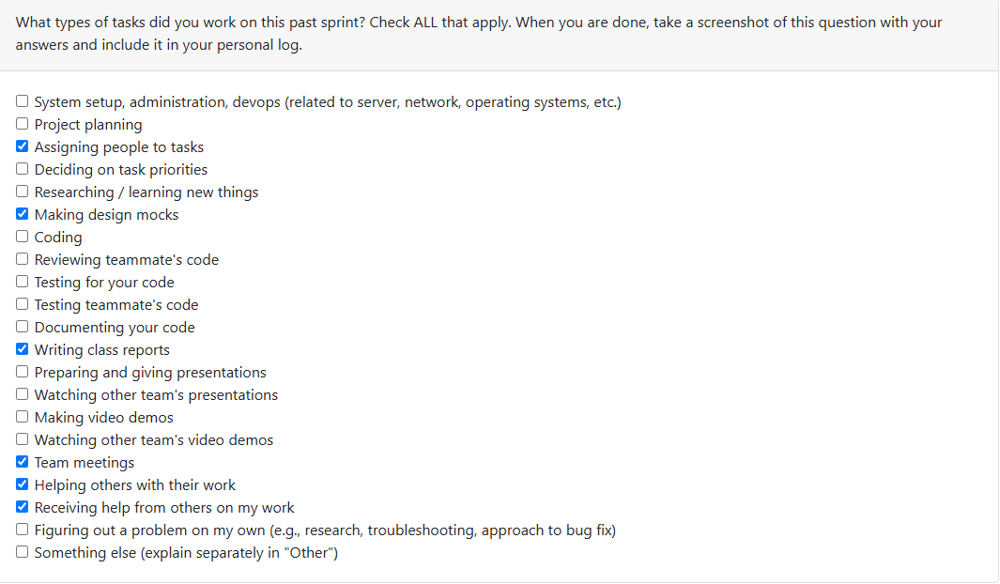
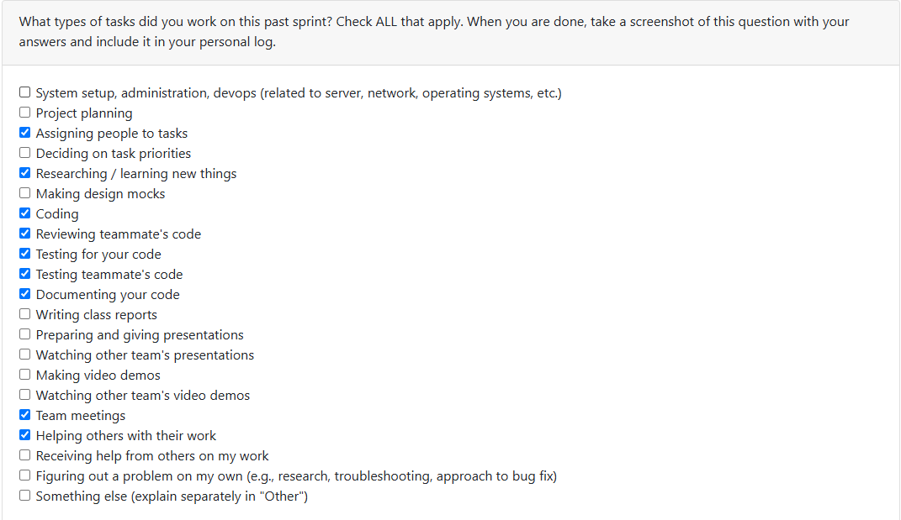
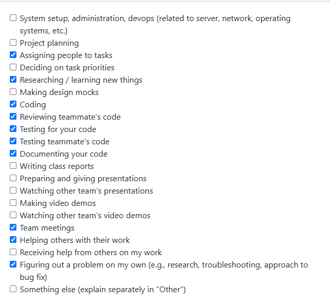
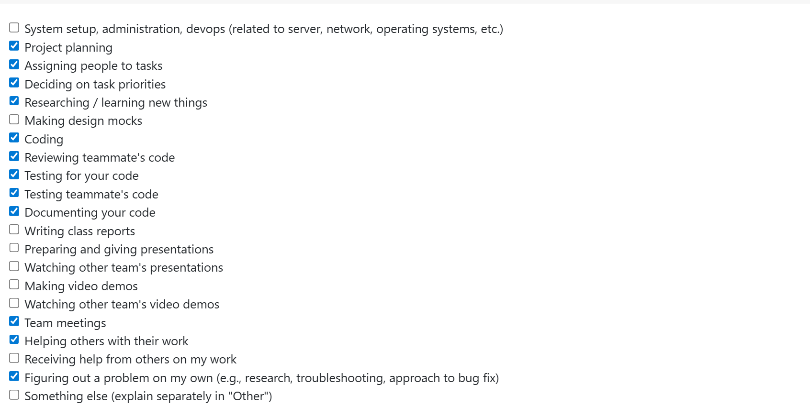
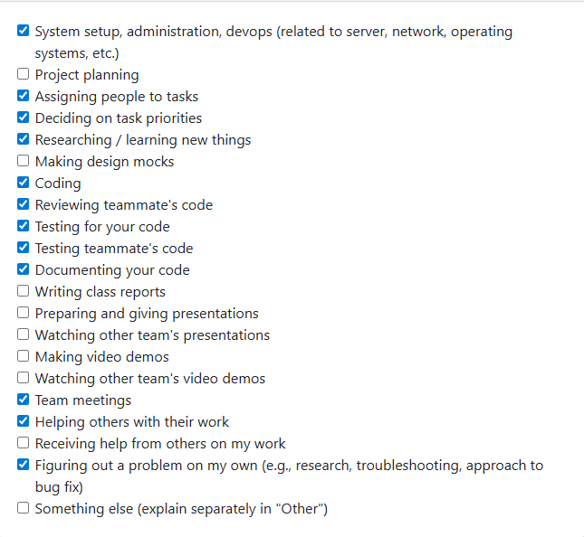
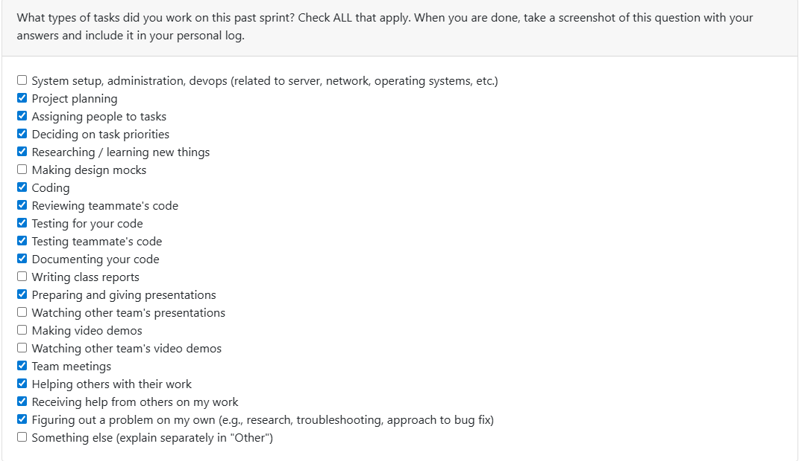
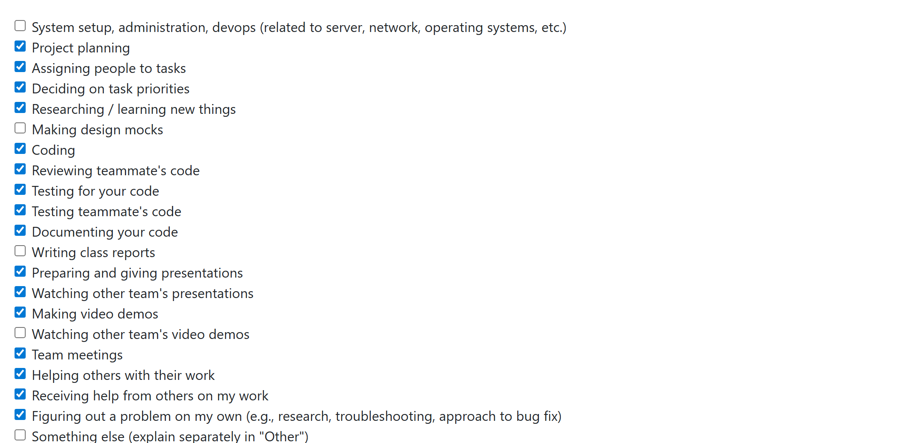
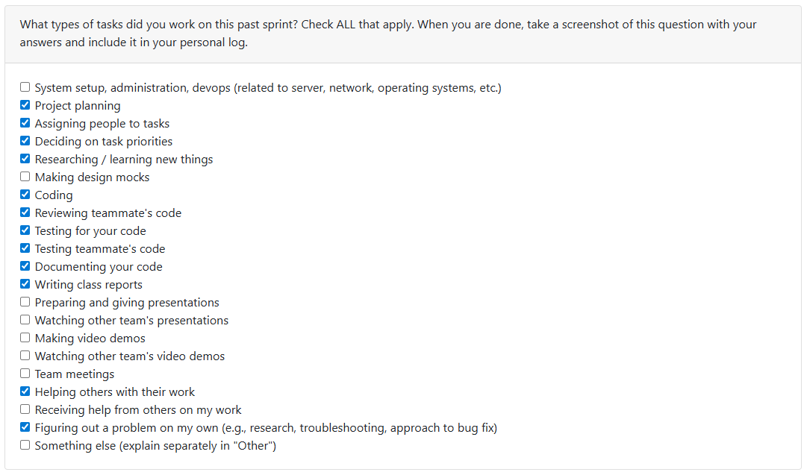

# Immanuel Wiessler - Personal Log

---

## Quick Navigation

### Term 2
- [Week 17 (01/19/2026 – 01/25/2026)](#-personal-log--week-17-01192026--01252026)
- [Week 16 (01/12/2026 – 01/18/2026)](#-personal-log--week-16-01122026--01182026)
- [Week 15 (01/05/2026 – 01/11/2026)](#-personal-log--week-15-01052026--01112026)

### Term 1

- [Week 14 (12/01/2025 – 12/07/2025)](#-personal-log--week-14-12012025--12072025)
- [Week 13 (11/24/2025 – 11/28/2025)](#-personal-log--week-13-11242025--11282025)
- [Week 11-12 (11/10/2025 – 11/27/2025)](#-personal-log--week-11-12-11102025--11272025)
- [Week 10 (11/03/2025 – 11/07/2025)](#-personal-log--week-10-11032025--11072025)
- [Week 9 (10/27/2025 – 10/30/2025)](#-personal-log--week-9-10272025--10302025)
- [Week 8 (10/20/2025 – 10/26/2025)](#-personal-log--week-8-10202025--10262025)
- [Week 7 (10/12/2025 – 10/18/2025)](#-personal-log--week-7-10122025--10182025)
- [Week 6 (10/06/2025 – 10/09/2025)](#-personal-log--week-6-10062025--10092025)
- [Week 5 (09/29/2025 – 10/05/2025)](#-personal-log--week-5-09292025--10052025)
- [Week 4 (09/22/2025 – 09/28/2025)](#-personal-log--week-4-09222025--09282025)
- [Week 3 (09/15/2025 – 09/21/2025)](#-personal-log--week-3-09152025--09212025)

---

# 📝 Personal Log – Week 3 (09/15/2025 – 09/21/2025)

## 📊 Peer Evaluation


---

## 🔗 Connection to Previous Week

This is the first week of the project, marking the beginning of the capstone journey.

---

## 🚀 Work Completed

### Coding Tasks
- N/A (Project setup phase)

### Testing/Debugging Tasks
- N/A (Project setup phase)

### Reviewing/Collaboration Tasks
- Collaborated with team members to discuss and refine project requirements (functional and non-functional)
- Participated in finalizing the proposal document
- Contributed to deciding on the development stack

---

## 📌 Associated Tasks from Project Board
- N/A (Project board not yet populated)

---

## 📈 Progress Update

| Task/Issue | Status |
|------------|--------|
| Completion of Project requirements (draft & refine) |  |
| GitHub repository established |  |

---

## ⚠️ Issues/Blockers
- No issues encountered this week

---

## 🎯 Next Week's Goals
- Continue refining project requirements
- Begin working on system design documentation


# 📝 Personal Log – Week 4 (09/22/2025 – 09/28/2025)

## 📊 Peer Evaluation
*(Screenshot not available for this week)*

---

## 🔗 Connection to Previous Week

Building on Week 3's requirements gathering and proposal work, this week focused on translating those requirements into system design documentation.

---

## 🚀 Work Completed

### Coding Tasks
- N/A (Design phase)

### Testing/Debugging Tasks
- N/A (Design phase)

### Reviewing/Collaboration Tasks
- Created and finalized the system design graph
- Worked on the **Project Scope and Usage Scenario** sections of the project proposal document
- Contributed to finalizing the development stack decisions
- Worked on the initial design of the system architecture layout

---

## 📌 Associated Tasks from Project Board
- N/A (Project board not yet populated)

---

## 📈 Progress Update

| Task/Issue | Status |
|------------|--------|
| Completion of Project Proposal (draft & refine) |  |
| Completion of System design mockup |  |

---

## ⚠️ Issues/Blockers
- No significant issues this week

---

## 🎯 Next Week's Goals
- Work on creating our **Data Flow Diagram (DFD)** for our system

---

## 🧠 Reflection on Past Cycle (Week 3)

Looking back at Week 3, our team developed a better understanding of each member's working style, which helped us stay more consistent with the assignment of tasks. This improved coordination allowed us to finalize our project requirements in a timely manner. Week 4 marked a turning point where the team really began to "click", laying the groundwork for smoother collaboration in the following weeks.


# 📝 Personal Log – Week 5 (09/29/2025 – 10/05/2025)

## 📊 Peer Evaluation


---

## 🔗 Connection to Previous Week

Following Week 4's system design work, this week focused on creating the Data Flow Diagrams (DFD) as planned, translating the architecture into detailed data flow documentation.

---

## 🚀 Work Completed

### Coding Tasks
- N/A (Design documentation phase)

### Testing/Debugging Tasks
- N/A (Design documentation phase)

### Reviewing/Collaboration Tasks
- Collaborated with teammates on the **DFD Graph** (Level 0 and Level 1)
- Completed the **team log** for Week 5

---

## 📌 Associated Tasks from Project Board
- N/A (Project board not yet populated)

---

## 📈 Progress Update

| Task/Issue | Status |
|------------|--------|
| **DFD Design (Level 0 & Level 1)** |  |
| **Team Log – Week 5** |  |

---

## ⚠️ Issues/Blockers

- **Communication issue**: One team member created both Level 0 and Level 1 DFD without informing others, leading to potential duplicate work
- **Resolution**: Introduced a new system in Discord server to ensure everyone knows who is currently working on what task, preventing duplicate tasks or code

---

## 🎯 Next Week's Goals
- Review finalized **project requirements**
- Finalize **system design** for new project requirements
- Create a new **DFD Design** for these new project requirements
- Revise Docker

---

## 🧠 Reflection on Current Cycle (Week 5)

This week we demonstrated effective teamwork in the development of the **DFD design** based on our project requirements which we submitted in Week 4, making sure to include the necessary requirements for both **Level 0** and **Level 1**. This included the external actors and the way in which the data flowed from our backend to the frontend **(UI)**. One thing I noticed is that we have finally settled into assumed roles.

---

## 🧠 Reflection on Past Cycle (Week 4)

Looking back at **Week 4**, our team developed a better understanding of each member's working style, which helped us stay more consistent with the assignment of tasks. This improved coordination allowed us to finalize our **project requirements** in a timely manner. In my view, Week 4 marked a turning point where the team really began to **"click"**, laying the groundwork for smoother collaboration in the following weeks.

---


# 📝 Personal Log – Week 6 (10/06/2025 – 10/09/2025)

## 📊 Peer Evaluation


---

## 🔗 Connection to Previous Week

Following Week 5's DFD design work and the new communication system introduced in Discord, this week marked the transition from design to actual coding. The project requirements were finalized and we began implementing the core functionality.

---

## 🚀 Work Completed

### Coding Tasks
- Created the **Python requirements.txt** file with libraries accessible for team members with varying Python skill levels
- Developed initial **file extraction system** (`extraction.py`) for extracting contents from zip files

### Testing/Debugging Tasks
- Created **pytest file** to test the functionality of the extraction method

### Reviewing/Collaboration Tasks
- Added newly defined issues to our Kanban board
- Updated **DFD graph** and **System Architecture Design** to incorporate new Milestone 1 requirements

---

## 📌 Associated Tasks from Project Board
- [Extract files from zip folder provided #34](https://github.com/COSC-499-W2025/capstone-project-team-2/issues/34)
- [Create requirements file #27](https://github.com/COSC-499-W2025/capstone-project-team-2/issues/27)

---

## 📈 Progress Update

| Task/Issue | Status |
|------------|--------|
| **Creation of Python requirements.txt** |  |
| **Created a class function for file extraction (zip file)** |  |
| **Created pytest file for testing the extraction method** |  |

---

## ⚠️ Issues/Blockers
- **Team skill consideration**: Needed to ensure chosen Python libraries were easy to pick up given the team's minimal Python experience
- **Resolution**: Selected beginner-friendly libraries and discussed them with the team

---

## 🎯 Next Week's Goals
- Begin work on the newly created issues in our Kanban project
- Continue working on current issues assigned to me

---

## 🧠 Reflection on Current Cycle (Week 6)

This week marks the actual start of the project coding phase. I worked on the initial development of the **file extraction system**, focusing on extracting components from zip files. At the same time, I worked on creating the **pytest file** to test the functionality. I also made the **requirements.txt** file with Python libraries appropriate for our team's skill level.

Overall, this week we did not encounter any significant issues with each other, and the communication system introduced in Week 5 helped prevent duplicate work.

---

## 🧠 Reflection on Past Cycle (Week 5)

For Week 5, I noticed that our team structure became more organized. The DFD design work went well and we successfully established clearer communication channels.

---


# 📝 Personal Log – Week 7 (10/12/2025 – 10/18/2025)

## 📊 Peer Evaluation


---

## 🔗 Connection to Previous Week

Building on the pytest knowledge gained from Week 6's file extraction testing work, this week I applied that experience to create tests for a new feature: user configuration storage.

---

## 🚀 Work Completed

### Coding Tasks
- N/A (Focus was on test development this week)

### Testing/Debugging Tasks
- Created `test_userConfig_store.py` - testing function for saving user configurations
- Applied knowledge gained from Week 6's pytest learning to this new test suite

### Reviewing/Collaboration Tasks
- Participated in code reviews with team members

---

## 📌 Associated Tasks from Project Board
- [Tests for storing user configuration #61](https://github.com/COSC-499-W2025/capstone-project-team-2/issues/61)

---

## 📈 Progress Update

| Task/Issue | Status |
|------------|--------|
| **Creation of test Python file for saving user configuration** |  |

---

## ⚠️ Issues/Blockers
- No significant blockers this week
- Successfully applied previous pytest learning to new test development

---

## 🎯 Next Week's Goals
- Continue working on [storing user configuration #36](https://github.com/COSC-499-W2025/capstone-project-team-2/issues/36), integrating the actual coding implementation

---

## 🧠 Reflection on Current Cycle (Week 7)

For **Week 7**, I began working on the storing of user's configuration, specifically creating the tests for user storage. This week was a validation week because after learning about pytest in Week 6, I was able to easily integrate my newfound knowledge into the test cases (`test_userConfig_store.py`) for this sprint.

---

## 🧠 Reflection on Past Cycle (Week 6)

For **Week 6**, I worked on the extraction of a zip file and exporting its contents to a temporary directory for file mapping, while creating tests simultaneously. This week was challenging because it was my first time creating tests using Python's **unittest framework**. It was also our first time reviewing each other's code and having meaningful conversations about improvements—in my case, adding more edge cases. Overall, Week 6 was valuable for learning the **unittest Python framework** and reviewing other team members' code.

---


# 📝 Personal Log – Week 8 (10/20/2025 – 10/26/2025)

## 📊 Peer Evaluation


---

## 🔗 Connection to Previous Week

Following Week 7's test development for user configuration storage, this week I implemented the actual configuration storage system and built a CLI interface to allow users to interact with it.

---

## 🚀 Work Completed

### Coding Tasks
- Implemented actual user configuration storage system using **[orjson](https://pypi.org/project/orjson/)** library for faster JSON processing
- Created interactive CLI interface for modifying user configurations
- Added error checking to prevent modification of protected fields (e.g., ID)
- Implemented exit system for clean return to main application

### Testing/Debugging Tasks
- Created comprehensive tests using **mock inputs**, **patching**, and **mock print** to simulate user interaction
- Fixed infinite loop bug in CLI identified by Puneet

### Reviewing/Collaboration Tasks
- Collaborated with Puneet on identifying and fixing the CLI infinite loop issue

---

## 📌 Associated Tasks from Project Board
- [Create CLI interface for saving user configuration #82](https://github.com/COSC-499-W2025/capstone-project-team-2/issues/82)
- [Store a user configuration file #36](https://github.com/orgs/COSC-499-W2025/projects/11/views/2?pane=issue&itemId=132426853&issue=COSC-499-W2025%7Ccapstone-project-team-2%7C36)
- [Infinite loop when selecting 'n' in CLI confirm_modification #84](https://github.com/COSC-499-W2025/capstone-project-team-2/issues/84)

---

## 📈 Progress Update

| Task/Issue | Status |
|------------|--------|
| **Creation of actual implementation for saving user configuration** |  |
| **Creation of user Configuration CLI** |  |
| **Applying fix/patch to infinite loop issue in CLI** |  |

---

## ⚠️ Issues/Blockers

- **Infinite loop bug**: Puneet identified an error in `test_configuration_CLI.py` that caused an infinite loop
- **Resolution**: Quickly identified the root cause and deployed a fix within the hour

---

## 🎯 Next Week's Goals
- [Work on consent doc for users to agree when program starts #32](https://github.com/COSC-499-W2025/capstone-project-team-2/issues/32)
- Continue implementing our code into a CLI for end of term showcase (**Milestone 1 showcase**)

---

## 🧠 Reflection on Current Cycle (Week 8)

**Week 8** was an interesting week. I implemented the [user configuration storage](https://github.com/orgs/COSC-499-W2025/projects/11/views/2?pane=issue&itemId=132426853&issue=COSC-499-W2025%7Ccapstone-project-team-2%7C36) system and discovered **orjson**, which processes JSON files much faster than Python's built-in `json` library.

I then built the [CLI interface](https://github.com/COSC-499-W2025/capstone-project-team-2/issues/82) for users to update their configuration through the terminal, including error checking for protected fields and a clean exit system.

### 🧪 Example Test from `test_configuration_CLI.py`

```python
import unittest
from unittest.mock import patch, call

class TestConfigurationCLI(unittest.TestCase):

    @patch('builtins.input', side_effect=["2", "fdfd", "n"])
    @patch('builtins.print')
    def test_invalid_input(self, mock_print, mock_input):
        """
        Test that when the user enters an invalid input (not 'y' or 'n'),
        an appropriate error message is printed and the method returns False.
        """
        chosen_setting = self.instance.get_setting_choice()
        self.instance.validate_modifiable_field(chosen_setting)
        result = self.instance.modify_settings(chosen_setting)

        mock_print.assert_any_call("ERROR: Please choose(y/n):")
        self.assertFalse(result)
```

---

## 🧠 Reflection on Past Cycle (Week 7)

**Week 7** was challenging because we encountered an issue where a team member's code contribution had failing tests and wasn't properly structured as a class. I didn't catch this during review and approved it, which could have led to bigger issues if **Samantha** hadn't noticed and brought it to our attention. Going forward, I will ensure that all tests pass and carefully verify the agreed-upon structure is implemented.

---


# 📝 Personal Log – Week 9 (10/27/2025 – 10/30/2025)

## 📊 Peer Evaluation


---

## 🔗 Connection to Previous Week

Following Week 8's CLI implementation for user configuration, this week I extended the configuration system to include user consent storage and restructured the file organization.

---

## 🚀 Work Completed

### Coding Tasks
- Updated user configuration to store user consent status (**External** or **Internal**)
- Added `save_with_consent` function to `configuration.py`
- Introduced new **UserConfigs** folder for storing templates and user configs
- Implemented dynamic file pathing system in `__init__` method

### Testing/Debugging Tasks
- Created tests to verify user configuration updates correctly with consent data
- Manually tested the `user_consent.py` interface integration
- Tested Puneet's fix for Mahi's code issue

### Reviewing/Collaboration Tasks
- Worked with Puneet Maan on fixing an issue discovered by Cameron and myself in Mahi's code

---

## 📌 Associated Tasks from Project Board
- [Save consent status PR #119](https://github.com/COSC-499-W2025/capstone-project-team-2/pull/119)

---

## 📈 Progress Update

| Task/Issue | Status |
|------------|--------|
| **Creation of system to save user consent data** |  |
| **Refactored configuration to reflect internal system changes** |  |

---

## ⚠️ Issues/Blockers

- **Midterms**: Took on a lighter workload this week due to midterm preparation
- **Code issue in teammate's work**: Discovered an issue in Mahi's code with Cameron; resolved by Puneet

---

## 🎯 Next Week's Goals
- Begin working on the file analysis aspect of the system

---

## 🧠 Reflection on Current Cycle (Week 9)

**Week 9** was lighter due to midterm preparation. I focused on modifying `configuration.py` to add the `save_with_consent` function and introduced a new folder structure for user configs. This required implementing a dynamic file pathing system:

```python
def __init__(self, jsonfile, loc_to_save='User_config_files'):
    """
    Initializes the Configuration class instance
    """
    self.jsonfile = jsonfile
    self.project_Root = pa.Path(__file__).parent.parent
    self.loc_to_save = pa.Path(os.path.join(self.project_Root, loc_to_save, "UserConfigs.json"))

def save_config(self):
    """Saves the JSON configuration file to the user's system."""
    with open(self.loc_to_save, "wb") as f:
        f.write(orjson.dumps(self.jsonfile, option=orjson.OPT_INDENT_2))
    return os.path.exists(self.loc_to_save)
```

I also collaborated with Puneet Maan on fixing an issue discovered by Cameron and myself in Mahi's code.

---


# 📝 Personal Log – Week 10 (11/03/2025 – 11/07/2025)

## 📊 Peer Evaluation


---

## 🔗 Connection to Previous Week

Building on Week 9's configuration improvements, this week I created a CLI interface for the file extraction system, integrating the previously implemented `extraction.py` class.

---

## 🚀 Work Completed

### Coding Tasks
- Implemented CLI interface for zip extraction (`CLI_interface_for_file_extraction.py`)
- Added 'q' exit functionality for users to quit at any time
- Implemented `max_retries` parameter (default: 3) for failed upload attempts
- Integrated Samantha's built-in verification process for zip file error handling

### Testing/Debugging Tasks
- Added 3 new pytest tests to `test_extraction.py`
- Created full mocking tests simulating user interaction with the CLI
- Fixed bug where extraction ran even after user pressed 'q' to exit

### Reviewing/Collaboration Tasks
- Pair programmed with Sam and Cameron to fix bug in Sam's code
- Refactored Cameron's `test_data_extraction` tests to run smoothly

---

## 📌 Associated Tasks from Project Board
- [Zip file extraction CLI](https://github.com/COSC-499-W2025/capstone-project-team-2/issues/)

---

## 📈 Progress Update

| Task/Issue | Status |
|------------|--------|
| **Creation of CLI interface for zip extraction** |  |
| **Added 3 new pytest tests to `test_extraction.py`** |  |

---

## ⚠️ Issues/Blockers

- **Exit bug**: Sam Smith identified that extraction still ran after user pressed 'q'
- **Resolution**: Encapsulated extraction method in an if statement while keeping user input display outside

---

## 🎯 Next Week's Goals
- Add optional features to CLI (idle feature, multiple file upload)
- Work on Kanban backlog items
- Begin integrating an LLM into the system using **Ollama** or **ChatGPT**

---

## 🧠 Reflection on Current Cycle (Week 10)

For **Week 10**, I implemented a CLI interface for zip extraction, allowing users to input a filepath and upload data to the file analysis system. I was particularly proud of creating full mocking tests this week:

```python
@patch('src.CLI_interface_for_file_extraction.extractInfo')
@patch('src.CLI_interface_for_file_extraction.input')
@patch('builtins.print')
def test_valid_zip_file_extraction_cli(self, mock_print, mock_input, mock_extract_Info):
    """
    Simulating user interaction with the extraction CLI
    when uploading a valid zip file, returning a success message
    """
    test_file_name = Path(self.test_zip_file_path).name
    mock_input.return_value = self.test_zip_file_path
    mock_instance = MagicMock()
    mock_extract_Info.return_value = mock_instance

    cli = zipExtractionCLI()
    cli.run_cli()
    mock_extract_Info.assert_called_once_with(self.test_zip_file_path)
    mock_instance.runExtraction.assert_called_once()
    mock_print.assert_any_call(f"{test_file_name} has been extracted successfully")
```

This was a significant achievement—applying knowledge from previous mock tests to create comprehensive user interaction simulations.

--- 


# 📝 Personal Log – Week 11-12 (11/10/2025 – 11/27/2025)

## 📊 Peer Evaluation


---

## 🔗 Connection to Previous Week

Following Week 10's CLI development and goal to integrate LLM capabilities, this two-week sprint focused on AI integration using Ollama and resolving Docker connectivity issues discovered during development.

---

## 🚀 Work Completed

### Coding Tasks

**Week 11 (Bonus Week):**
- Added timeout feature to zip extraction CLI using **async** library
- Implemented contributor percentage calculation for git repos using **[PyGithub](https://pypi.org/project/PyGithub/)**
- Added detection for collaborative vs solo projects

**Week 12:**
- Integrated **[Ollama](https://ollama.com/)** and **[LangChain](https://www.langchain.com/)** for AI code analysis
- Selected **[qwen2.5-coder:1.5b](https://ollama.com/library/qwen2.5-coder)** model for accessibility on varying hardware
- Created `_clean_model_output()` function to parse JSON from model responses
- Developed automatic Docker connection file using **[docker](https://pypi.org/project/docker/)** Python API

### Testing/Debugging Tasks
- Created test suite for AI analysis system
- Implemented `setUpClass` pattern to optimize test performance
- Created tests for automatic Docker setup

### Reviewing/Collaboration Tasks
- Investigated and fixed MySQL connection configuration issue discovered by team member

---

## 📌 Associated Tasks from Project Board
- [Docker patch/fix (automatic configuration) #166](https://github.com/COSC-499-W2025/capstone-project-team-2/pull/168)
- [AI integration #164](https://github.com/COSC-499-W2025/capstone-project-team-2/pull/167)

---

## 📈 Progress Update

| Task/Issue | Status |
|------------|--------|
| **Creation of automatic Docker connection file** |  |
| **AI integration into the system** |  |

---

## ⚠️ Issues/Blockers

- **MySQL connection issue**: Team needed to manually configure MySQL connection in main.py
- **Resolution**: Created automatic Docker connection using Python docker API with try/catch for inside/outside container scenarios

---

## 🎯 Next Week's Goals
- Begin integrating everything for demo
- Work on video demo
- Create Team contract
- Review Milestone 1 checklist

---

## 🧠 Reflection on Current Cycle (Week 12)

For **Week 12**, I integrated the AI element into our file analysis system using **Ollama** and **LangChain**. I used prompt engineering to ensure the model understood its function and selected **qwen2.5-coder:1.5b** for accessibility across different hardware.

The model output needed cleaning to extract valid JSON:

```python
def _clean_model_output(self, text: str) -> str:

        """
 Cleans the output of the model by removing any code block fences and
 returning any JSON found in the output.

 Args:
 text (str): The output of the model

 Returns:
 str: The cleaned output of the model
 """
        if not text:
            return text
 cleaned = text.strip()
 fence_pattern = re.compile(r"```(?:json|python)?\s*([\s\S]*?)```", re.IGNORECASE)
 match = fence_pattern.search(cleaned)
        if match:
 cleaned = match.group(1).strip()
        else:
            if cleaned.startswith("```") and cleaned.endswith("```"):
 cleaned = cleaned[3:-3].strip()
 json_match = re.search(r"\{[\s\S]*\}", cleaned)
        if json_match:
 cleaned = json_match.group(0).strip()

        return cleaned


```

One issue discovered by a team member was that we needed to manually configure the main.py MySQL connection file, as shown below.

```py
conn = mysql.connector.connect(
        host="app_database",        
        port=3306,
        database="appdb",
        user="appuser",
        password="apppassword"
 )

```
Therefore after the discover of this issue, I decided to fix this issue so that in the further that we don't have this problem and more, the way that I tackled this problem was making use of the python [docker](https://pypi.org/project/docker/) API libary where I develop two outcome one 1. we connect to the database via the python file  2. from inside of the container, the way this was handle was doing a `try and catch block` where I would try to get the enviorment variables from docker app running if it return an error I would sent the host_name and port number to the one used inside of the container, otherwise it would find the port number and check to see if there was an host_ip and if it return 0.0.0.0 then I would set it to **localhost** or **127.0.0.1** the full implemenation can be seen down below
```py
def get_mysql_host_information(self):

        try:
 con=None
            for container in self.client.containers.list():

                if "database" in container.name:
 con=self.client.containers.get(container.name)
            for key,value in con.ports.items():
                if value is not None:
                    self.port_number=value[0]['HostPort']
                    self.host_ip=value[0]['HostIp']

            if self.host_ip =="0.0.0.0":
                self.host_ip="127.0.0.1" or "localhost"

        except AttributeError:
            self.host_ip="app_database"
            self.port_number="3306"
            pass


``` 
After creating these files I began working on the test suite for both the AI anlysis and automtically Docker setup which was  tested to see if the test run successfully with no issues at all, but I want to mention is that I discover that the `def setup(self):` in python's unittest libaray is ran each time for each test case, therefore for the AI system test I decided to make it only run once to prevent the testing from taking too long, where I used a new system which I found 

```py
   @classmethod
    def setUpClass(cls):
 root_folder = Path(__file__).resolve().parent
        cls.folder = root_folder / "tiny_scripts"
        cls.instance = codeAnalysisAI(cls.folder)
        cls.result = cls.instance.run_analysis()
```


## 🧠 Reflection on pervious Cycle bonus week (Week 11)

For the bonus week, I developed two things, which were adding a timeout feature to my zip_extraction CLI to allow for the system to return to the main menu if the user takes too long to upload a zip file, which was implemented using the **async** library
and also adding a system to calculate the contributor percentage if the uploaded zip is a git repo, which was implemented using the **[PyGithub](https://pypi.org/project/PyGithub/)**, and also identify if the project is a collab or solo, and if it is a collab, then it will return the percentage of the commits from each member. 


# 📝 Personal Log – Week 13 (11/24/2025 – 11/28/2025)

## 📊 Peer Evaluation


---

## 🔗 Connection to Previous Week

Building on Week 12's AI integration work with Ollama, this week focused on extending AI capabilities to generate resume-styled outputs and enhancing Docker connectivity for the Ollama system.

---

## 🚀 Work Completed

### Coding Tasks
- Created AI resume generation system using Google Gemini
- Implemented file type detection (code, docs, PDF) for building context
- Used **LangChain chains** concept for streamlined LLM pipeline
- Stored results in dataclass objects (`OOPPrinciple`, `ResumeItem`) for convenient access

### Testing/Debugging Tasks
- Created tests for AI resume generation and Docker connection

### Reviewing/Collaboration Tasks
- Enhanced Docker connection file for Ollama system connectivity

---

## 📌 Associated Tasks from Project Board
- [Docker patch for Ollama connection #191](https://github.com/COSC-499-W2025/capstone-project-team-2/pull/191)
- [AI generate resume #188](https://github.com/COSC-499-W2025/capstone-project-team-2/pull/188)

---

## 📈 Progress Update

| Task/Issue | Status |
|------------|--------|
| **Creation of automatic Docker connection file for Ollama** |  |
| **AI generated resume system** |  |

---

## ⚠️ Issues/Blockers

- **Milestone deadline pressure**: Stressful week due to looming deadlines for presentation and Milestone 1 submission
- **Resolution**: Prioritized tasks and focused on completing essential features

---

## 🎯 Next Week's Goals
- Work on video demo
- Create Team contract
- Begin finalizing Milestone 1 deliverables

---

## 🧠 Reflection on Current Cycle (Week 13)

For **Week 13**, I worked on more AI implementation including the resume generation system and an enhancement to the Docker connection file for Ollama connectivity. This week was stressful due to the looming Milestone 1 deadline for both our presentation and submission.

Key accomplishments:
- Discovered that **LangChain** had a library for cleaner JSON formatting
- Built a more defined prompt for Google Gemini to generate resumes
- Implemented file type detection to recursively identify code, docs, or PDF files and build context
- Used **LangChain chains** to streamline the LLM pipeline:

```python
self.chain = self.langChain_prompt | self.llm | self.parser
```

- Stored results in dataclass objects for convenient access:

```python
@dataclass()
class OOPPrinciple:
    present: bool
    description: str
    code_snippets: List[Dict[str, str]]

@dataclass()
class ResumeItem:
    project_title: str
    one_sentence_summary: str
    detailed_summary: str
    key_responsibilities: List[str]
    key_skills_used: List[str]
    tech_stack: str
    impact: str
    oop_principles_detected: Dict[str, OOPPrinciple]
```

I learned a lot about dataclasses from this implementation. I also enhanced the Docker automation script to auto-connect to the Ollama container and created tests to ensure everything worked correctly.

---


# 📝 Personal Log – Week 14 (12/01/2025 – 12/07/2025)

## 📊 Peer Evaluation


---

## 🔗 Connection to Previous Week

Following Week 13's AI resume generation work, this final sprint before Milestone 1 focused on integrating Gemini AI for PDF portfolio generation, updating documentation, and fixing critical bugs.

---

## 🚀 Work Completed

### Coding Tasks
- Integrated Gemini AI to create formatted PDF portfolio and resume using **reportLab**
- Created non-AI generated resume line option
- Performed hotfix on AI integration code (removed offending lines with Samantha M.)
- Performed hotfix for consent status change mid-session bug discovered during video demo

### Testing/Debugging Tasks
- Tested consent status change functionality
- Verified AI integration hotfix

### Reviewing/Collaboration Tasks
- Updated README.md to highlight key project parts and installation instructions
- Collaborated with Samantha M. on AI integration bugfix

---

## 📌 Associated Tasks from Project Board
- [PDF Generator + Integration #218](https://github.com/COSC-499-W2025/capstone-project-team-2/issues/218)
- [Improved readme file #229](https://github.com/COSC-499-W2025/capstone-project-team-2/pull/229)
- [When program is run AI_analysis on script is run #232](https://github.com/COSC-499-W2025/capstone-project-team-2/issues/232)
- [Consent bug issue #245](https://github.com/COSC-499-W2025/capstone-project-team-2/issues/245)
- [Non AI-external resume line generator #241](https://github.com/COSC-499-W2025/capstone-project-team-2/issues/241)

---

## 📈 Progress Update

| Task/Issue | Status |
|------------|--------|
| **Integrated Gemini AI for PDF portfolio/resume** |  |
| **Updated README.md** |  |
| **Consent status mid-session hotfix** |  |
| **Non-AI resume line generator** |  |

---

## ⚠️ Issues/Blockers

- **AI integration bug**: Discovered with Samantha M. - offending lines ran the class unnecessarily
- **Consent change bug**: Users couldn't change consent status mid-session (discovered during video demo)
- **Resolution**: Both bugs were quickly hotfixed

---

## 🎯 Next Week's Goals
- Relax and prepare for finals

---

## 🧠 Reflection on Current Cycle (Week 14)

**Week 14** was very stressful as the final sprint for M1 milestones. I focused on:
- Creating PDF versions of portfolio content using **reportLab** framework
- Integrating with Gemini AI for formatted PDF resume generation (dataclass integration made this easier)
- Updating the README with installation instructions
- Performing hotfixes for AI integration and consent status bugs

Following TA advice, I attempted to keep new coding contributions under 500 lines, though some complex systems and documentation requirements made this challenging.

---

## 🧠 Reflection on Previous Cycle (Week 13)

Week 13 was stressful due to Milestone 1 deadlines. I successfully implemented the AI resume generation system using Google Gemini and LangChain, and enhanced Docker connectivity for Ollama.

---


# 📝 Personal Log – Week 15 (01/05/2026 – 01/11/2026)

## 📊 Peer Evaluation



---

## 🚀 Features Worked On  
- Integrated with gemini AI to create a formated PDF protfolio and resume
- Updated the Readme.md to match our current progress
- Performed a hotfix on the AI Intergation code
- Pefromed a hotfix so that users can change consent status mid program
---

## 📌 Associated Tasks from Project Board  
- [PDF- Generator + Integration](https://github.com/COSC-499-W2025/capstone-project-team-2/issues/218)
- [Improved readme file](https://github.com/COSC-499-W2025/capstone-project-team-2/pull/229)
- [when program is run AI_anlysis on script is run](https://github.com/COSC-499-W2025/capstone-project-team-2/issues/232)
- [Consent bug issue](https://github.com/COSC-499-W2025/capstone-project-team-2/issues/245)
- [Non AI-external resume line generator ](https://github.com/COSC-499-W2025/capstone-project-team-2/issues/241)
---

## 📈 Progress Update (since 12/6/2025)  

| Task/Issue | Status |
|------------|--------|
|**Intergrated with gemini AI to create a formated PDF protfolio and resume** |  |
|**Updated the Readme.md to match our current progress**|
|**performed hotfix so that user can change their constent status mid-session** | 
| **Non AI-external resume line generator** |


## 🎯 Next Week’s Goals

- Relax and prepare for finals
---

## 🧠 Reflection on Current Cycle (Week 14)
 **Week 14** was very stressful because it was the final sprint for M1 milestones. I could feel the pressure of the looming deadline, the work that I focused on for this week was added a new feature to create PDF version of the protofilo content and then integrated with the gemini AI to create a formated PDF resume, which was a very fun and exciting experience to work on, to pull this I used a framework called `reportLab` for adding the content to pdf to generate the PDF, Where thanks to me intergrating **dataclass** into the ```ResumeItem``` class this make the process of access the elements of the returned dictonary more convenient to making the PDF easier and fasts. I also worked on the README file to clearly highlight the key parts of our project and added installation instructions. Lastly, I encountered a bug in the AI integration code with Samantha M. I performed a hotfix, which was very simple: I removed some offending lines of code that ran the actual class that wasn't needed inside the script it was created in. One additonal task that I did this week was created our video demo and during our video demo recording I noticed a bug that does not allow user to change their user constent mid-session in other words if they enable external tools and wanted to disabled them they cannot so quickly made a hotfix to solve this issue, additoanlly I also quickly added a non-AI Generated Resume line to our system.

Lastly, after taking some advice from the TA, I decided to make new coding contributions a bit smaller, less than 500 lines of code change, but for some of the code I was unable to do the complex nature of the system as well, and also the amount of documentation that was needed to explain certian aspects of the code itself.


## 📊 Peer Evaluation


---

## 🚀 Features Worked On  
- Resume/Portfolio Generator Refactor — Rebuilt the resume creation module using RenderCV libary to generate professional, fully-featured resumes instead of basic output snippets. Users can now produce complete, presentation-ready CVs/resume suitable for real-world job applications.
---

## 📌 Associated Tasks from Project Board  
- [Resume Generation Improvement using rendercv](https://github.com/COSC-499-W2025/capstone-project-team-2/issues/261)

---

## 📈 Progress Update (since 12/6/2025)  

| Task/Issue | Status |
|------------|--------|
|**resume Generation Improvement using rendercv** | 

**Week 15** marked continued progress in the second half of the capstone. My primary focus was refactoring and recreating the resume generator module from Milestone 1, which previously produced output insufficient for professional use. The goal was to create a fully-featured resume suitable for real-world settings to showcase users to potential employers.

I achieved this by integrating [RenderCV](https://github.com/rendercv/rendercv), a CLI-based resume generation library, into our system. This involved developing a comprehensive `Generate_RenderCV_Resume.py` module that serves as the backbone for resume creation and management. Key features include:

- **5 Dataclasses** (`Experience`, `Skills`, `Education`, `Connections`, `Project`) to cleanly structure CV/resume data
- **Full CRUD Operations** for each section of the resume/CV
- **AI Integration** through the `add_project_from_ai` method, which leverages `GenerateProjectResume` to automatically populate project descriptions from the analyzed project

The code was intentionally designed with modularity in mind for seamless integration into the Streamlit UI interface planned for Milestone 3. By following the single-responsibility principle, future UI binding should be straightforward.

The main challenge I encountered this week was maintaining the PR size limit of 500 lines despite multiple refactoring attempts. This didn't prove easy due to:

1. **Self-contained module requirement** — The RenderCV Generator requires all components (builder class, dataclasses, AI integration, YAML generation, and rendering logic) to function together as a cohesive unit
2. **Comprehensive test coverage** — 13 test classes were necessary to ensure reliability across all CRUD operations
3. **Documentation needs** — Extensive docstrings and comments were required to explain the code's functionality for reviewers

Breaking this into smaller PRs would have created incomplete functionality and increased integration complexity, so I included a justification in the PR description explaining why the size was necessary. 

For the next sprint, I plan to add the missing features required for Milestone 2. Additionally, I worked on fixing and improving a colleague's code to ensure that the refactoring allows the modified tests to pass without problems, and also added missing documentation for certian code and test 

# 📝 Personal Log – Week 16 (01/12/2026 – 01/18/2026)

## 📊 Peer Evaluation



-----

## 🔗 Connection to Previous Week

Building on the Resume Generator class (`Generate_RenderCV_Resume.py`) completed previously, this week I extended it to create a dedicated Portfolio generator (`Generate_AI_RenderCV_portfolio.py`) with enhanced functionality and cleaner code patterns.

-----

## 🚀 Work Completed

### Coding Tasks

- **Portfolio Generator:** Created a new feature to generate a portfolio using the RenderCV library to produce professional, fully-featured resumes instead of basic output snippets. Users can now produce complete, presentation-ready CVs/resumes suitable for real-world job applications with full CRUD operations.
- Refactored contact update methods from individual setters into a unified `update_portfolio_contact()` function with input validation
- Implemented `next()` generator expressions for cleaner, more Pythonic collection lookups

### Testing/Debugging Tasks

- Added comprehensive test coverage for `Generate_AI_RenderCV_portfolio.py` called `test_Generate_AI_RenderCV_portfolio.py` with detailed docstrings explaining purpose, parameters, return values, and edge cases

### Reviewing/Collaboration Tasks

- Conducted peer review on [RenderCV Integration for Portfolio Generation PR #290](https://github.com/COSC-499-W2025/capstone-project-team-2/pull/290) and provided feedback and fixes that must be made

-----

## 📌 Associated Tasks from Project Board

- [Added missing functionality to Generate_AI_RenderCV_portfolio.py](https://github.com/COSC-499-W2025/capstone-project-team-2/pull/288)
- [Portfolio RenderCV Builder](https://github.com/COSC-499-W2025/capstone-project-team-2/pull/286)

-----

## 📈 Progress Update (since 01/12/2026)

|Task/Issue         |Status                                                  |
|-------------------|--------------------------------------------------------|
|Portfolio Generator||

-----

## ⚠️ Issues/Blockers

- None this week. Development proceeded smoothly.

-----

## 🎯 Next Week’s Goals

- Work on requirements for peer testing happening the following week
- Work on integrating the CRUD operations portfolio generator into our terminal UI

-----

## 🧠 Reflection on Current Cycle (Week 16)
This week, I focused on creating the Portfolio Generator using the RenderCV library. The goal was to create a fully-featured portfolio suitable for real-world settings to showcase users to potential employers.

Following last week's work, I modified my Resume Generator class (`Generate_RenderCV_Resume.py`) by creating a new class (`Generate_AI_RenderCV_portfolio.py`) to generate professional portfolios. This was done by modifying the starter YAML file to use a portfolio-focused structure, removing resume-specific sections (like work experience and education) and keeping only portfolio-relevant fields:


```yaml
'cv': {
    'name': self.name.replace('_', ' '),
    'location': 'City, State',
    'email': 'your.email@example.com',
    'phone': '+1 234 567 9801',
    'website': 'https://yourwebsite.com',
    'social_networks': [
        {'network': 'LinkedIn', 'username': ''},
        {'network': 'GitHub', 'username': ''}
    ],
    'sections': {
        'projects': [
            {
                'name': 'Project Name',
                'start_date': '2023-01',
                'end_date': '2024-05',
                'summary': 'Brief description of the project',
                'highlights': [
                    'Key feature or accomplishment 1',
                    'Key feature or accomplishment 2'
                ]
            }
        ]
    }
},
'design': {
    'theme': self.chosen_theme
},
'locale': {
    'language': 'english'
}
```

In addition to peer reviews, I also added enhancements that were not present in my first version of the Generator. This included a clearer way of updating contact information, which went from individual setter methods:

```python
def update_email(self, email: str):
    self.data['cv']['email'] = email
    self._auto_save_if_enabled()

def update_phone(self, phone: str):
    self.data['cv']['phone'] = phone
    self._auto_save_if_enabled()

def update_location(self, location: str):
    self.data['cv']['location'] = location
    self._auto_save_if_enabled()

# ... repeated for each field
```

To a single unified method with input validation:

```python
def update_portfolio_contact(self, email: str = None, phone: str = None, 
                              location: str = None, website: str = None, 
                              name: str = None):
    contact_section = self.data['cv']
    updated_fields = []
    fields = {
        'email': email, 'phone': phone, 'website': website,
        'location': location, 'name': name
    }
    for field_name, value in fields.items():
        if value is None:
            continue
        if isinstance(value, str) and not value.strip():
            continue
        contact_section[field_name] = value
        updated_fields.append(field_name)
    self._auto_save_if_enabled()
    return f"Successfully updated: {', '.join(updated_fields)}" if updated_fields else "No fields updated"
```

I also added enhancements to the **CRUD** operations by using Python’s `next()` function with a generator expression for cleaner, more efficient lookups. An example of this can be seen below:

```python
def modify_portfolio_connection(self, network_name: str, new_username: str):
    if self.current_connections is None or not self.current_connections:
        return "No connections to modify"
    
    connection = next((c for c in self.current_connections if c.get('network') == network_name), None)
    
    if connection is None:
        return f"Connection '{network_name}' not found"
    
    connection['username'] = new_username
    self._auto_save_if_enabled()
    return f"Successfully updated: {network_name}"
```

This approach replaces traditional `for` loops with index tracking, providing a more Pythonic and readable way to find and modify specific items in a collection. The `next()` function with a default value of `None` elegantly handles the case where no matching connection is found.

**Note on Line Count:** The reason my PR reached close to 591 lines is largely due to comprehensive documentation—every function and test includes detailed docstrings explaining purpose, parameters, return values, and edge cases. While this added to the line count, thorough documentation is essential for code maintainability and helps teammates understand the codebase during future development.


# 📝 Personal Log – Week 17 (01/19/2026 – 01/25/2026)

## 📊 Peer Evaluation
*(Screenshot not available for this week)*

---

## 🔗 Connection to Previous Week

Building on Week 16's portfolio generator work, this week focused on...

---

## 🚀 Work Completed

### Coding Tasks
-

### Testing/Debugging Tasks
-

### Reviewing/Collaboration Tasks
-

---

## 📌 Associated Tasks from Project Board
-

---

## 📈 Progress Update

| Task/Issue | Status |
|------------|--------|
| |  |

---

## ⚠️ Issues/Blockers
-

---

## 🎯 Next Week's Goals
-

---

## 🧠 Reflection on Current Cycle (Week 17)


