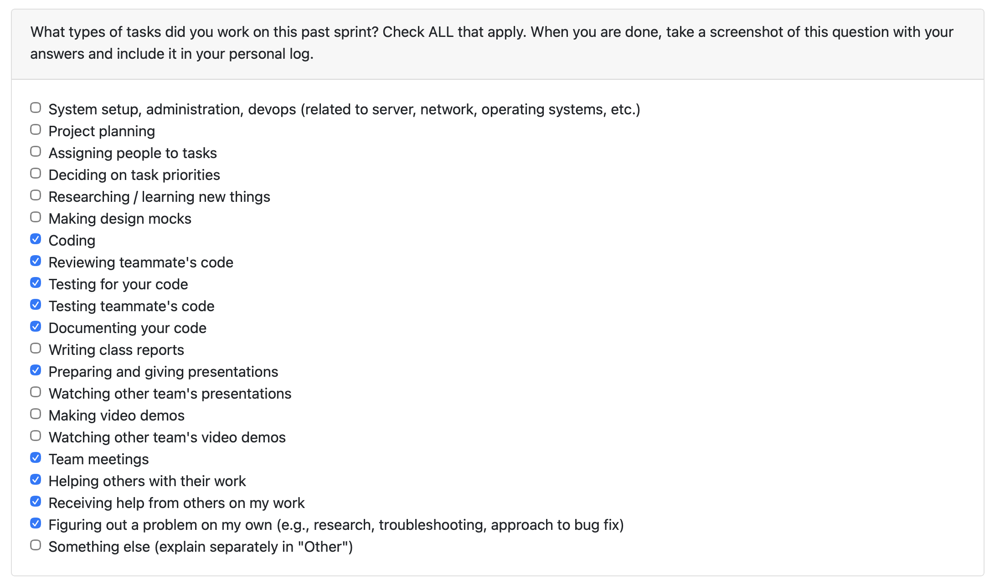
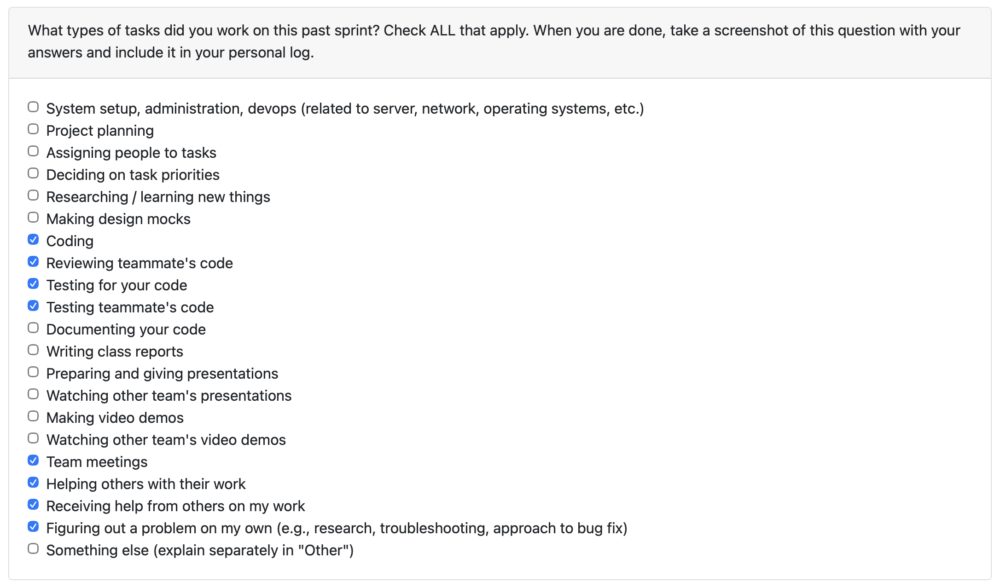
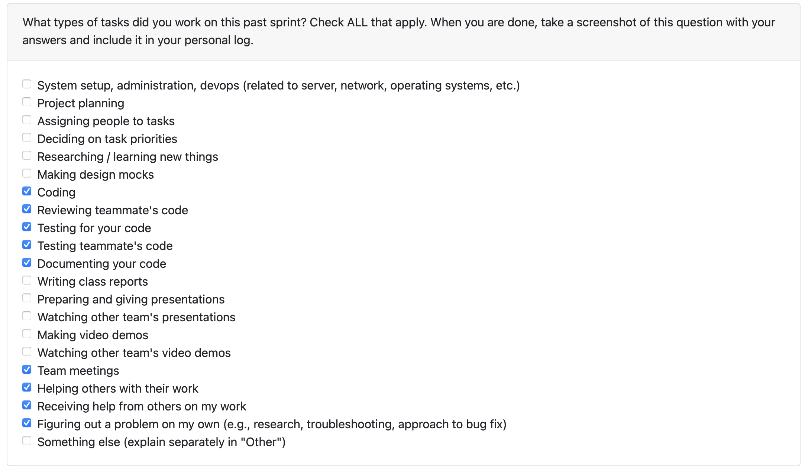
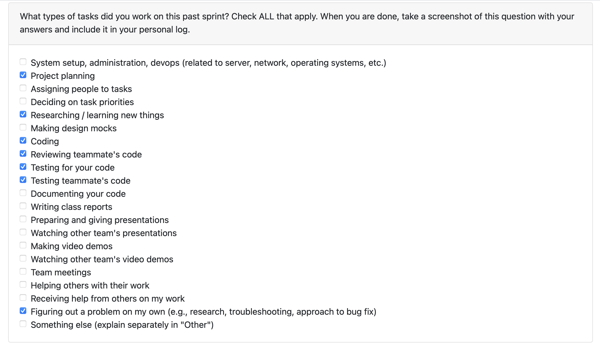
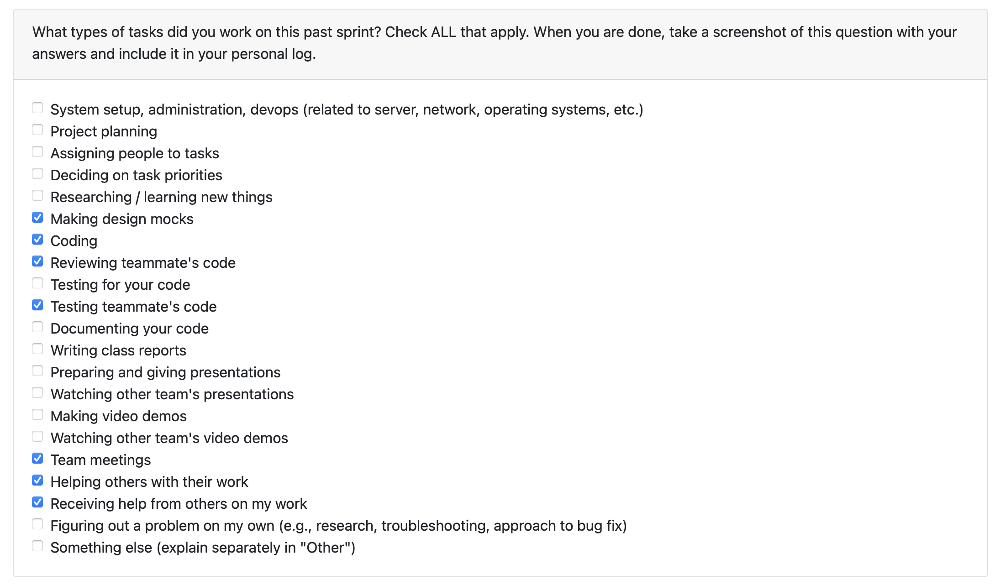

# Sprint Log: (01/12/2025 – 07/12/2025)

---

## Peer Evaluation

---

## Weekly Goals Recap
Final M1 polish before break: stabilize delete flows, preserve ZIP names in saved analyses, and surface Project Insights in the CLI with filtering and ranking. Better documentation with clearer module,test docstrings and ensured tests cover new insights behavior.

---

## Key Accomplishments
**PR #225 – Delete Menu Optimization, ZIP Naming Fixes**
- Fixed Delete Analysis menu DB query (id,filename,uploaded_at only) to avoid MySQL sort OOM.
- Passed ZIP stem into analyze_project so saved JSON entries keep original project names instead of temp folders.
- Updated tests around delete flow, labeling, and menu behavior.

**MPR #239 – Insights Helpers, Dedicated Insights Menu**
- Added shared insight utilities (insight_helpers.py) for date parsing, filtering, and composite scoring.
- Introduced a dedicated insights menu (menu_insights.py) exposing chronological projects, skill timelines, rankings, and top summaries.
- Wired the main menu to the new insights flow and expanded menu tests/docstrings for clarity.

### Code Reviews Completed
- Reviewed C analysis Coding task (#236 by Graves067).
- Reviewed Java In-depth Code Analysis and Integration (#224 by mahigangal).

---

## Deliverables Completed
- Stable Delete Analysis menu and correct ZIP based project naming.
- CLI Project Insights: chronological views, filters, composite ranking, and top summaries.
- Shared insight helpers with accompanying tests and documentation updates.

---

## Plan for Next Cycle
- I will be working on some bonus tasks (not yet decided) but in Milestone 2, the system will run as an API service instead of only a CLI. The goal will be to let users guide the results by making selections, edits, and corrections.

---

## Reflection
#### What Went Well
- Significant improvements to stability and correctness through optimized DB queries and cleaned project label handling.
- The Insights menu elevated the CLI’s usefulness and set a strong base for M2’s analytical API.
- Strong collaboration and smooth PR review cycles as we closed the semester.

#### What We Can Improve
- We should avoid letting any one code file become too large. Breaking code into smaller, focused modules will make the system easier to understand, test, and extend.
- We should try to break large features into smaller PRs to make reviews smoother.
- Better planning and communication around timing would help the team avoid these bottlenecks in the future.

## ====================================================

# Sprint Log: (24/11/2025 – 30/11/2025)

---

## Peer Evaluation

---

## Weekly Goals Recap
Coding: Focused on restructuring the CLI into modular layers. Broke main.py into dedicated modules (app_context, analysis_service, saved_projects, portfolio, menus) and reduced it to handle only consent/config and menu dispatch. Deferred MySQL connections until after consent. Added comprehensive docstrings and expanded pytest coverage for all new modules. Performed manual testing across all menu flows, project save/load operations, analysis workflows, and error handling.

---

## Key Accomplishments
**My Work (PR #214)**
- Separated CLI responsibilities into modular layers: `app_context`, `analysis_service`, `saved_projects`, `portfolio`, `menus`.
- Reduced `main.py` to manage only consent, configuration, and menu delegation.
- Deferred database creation to `create_app_context()` to ensure no MySQL calls happen before user consent.
- Added standards style docstrings across all refactored modules for clarity and maintainability.
- Built and ran pytest suites for all new modules (`main`, `app_context`, `analysis_service`, `saved_projects`, `portfolio`, `menus`) with all tests passing.
- Conducted manual testing of menu flows, project operations, analysis workflows, and error handling.

### Code Reviews Completed
Reviewed multiple team PRs.

---

## Deliverables Completed
- Modular CLI structure with deferred database initialization.
- Comprehensive documentation via docstrings.
- Passing pytest coverage for all new modules.
- Manual testing completed for our actual usage flows.

---

## Plan for Next Cycle
- Ensure all Milestone 1 deliverables are fully completed and validated.
- Fix any remaining issues or blockers from the CLI and Project Insights work.
- Prepare for final M1 submission, including demos, documentation, and team coordination.

---

## Reflection
#### What Went Well
- The CLI refactor went smoothly, and the code is now organized into clear, modular components that are easier to maintain and extend.  
- The team is wrapping up the final deliverables for Milestone 1, and progress is steady. It feels like we’re approaching the finish line for the semester.  
- Overall collaboration and coordination on tasks have improved, helping us keep things moving despite the complexity of the project.  

#### What We Can Improve
- Some PRs were submitted later than expected, which caused minor delays in progress and coordination. Planning for earlier submissions or better communication around timing could help avoid these bottlenecks in the future.  

## ====================================================

# Sprint Log: (17/11/2025 – 23/11/2025)

---

## Peer Evaluation

---

## Weekly Goals Recap

Team Log: This week I completed the Team Log for the group, summarizing team progress, Kanban status, completed tasks, and all testing results.
Coding: I focused on extending the new Project Insights subsystem that I introduced during last week's bonus work. Building on the initial logging and ranking functionality, I implemented richer analysis features (file-level statistics, skill history timelines, and top-ranked project summaries), hardened the JSON storage layer against corrupted data, and expanded the test suite so these behaviors are reliable over time.

---

## Key Accomplishments

### My Work (PR #176)
- Added full **file analysis** (file counts, total/avg size, type breakdown, largest/newest file).
- Implemented **skill history tracking** using chronological ordering.
- Added **top-ranked project summaries** with scoring and contributor statistics.
- Normalized contributors/skills for consistent ordering across old and new entries.
- Strengthened JSON storage:
  - Non-list or corrupted JSON logs are now safely stashed and replaced.
  - _read_entries handles malformed data gracefully.
- Expanded test coverage for:
  - File analysis
  - Skill history
  - Ranked summaries
  - Corrupted JSON handling

### Code Reviews Completed
I also supported the team through multiple PR reviews in the areas of Docker automation, contribution percentages, and database helpers.
- Docker auto-testing (#172)  
- Contribution percentage calculation (#161)  
- Database functions (#160)

---

## Deliverables Completed
- File analysis and statistics module  
- Skill history and ranking summaries  
- JSON storage improvements  
- Full test coverage for new features  
- Team Log completed for the group

---

## Plan for Next Cycle
- Integrate Project Insights with CLI/UI workflows.
- Add optional CLI/visualization helpers.
- Refine ranking metrics and contributor scoring.
- Support Milestone 1 integration tasks.

---

## Reflection

### What Went Well
- Smooth extension of Project Insights with no regressions.
- Strong test coverage for all new analytics.
- Robust storage layer with safe corruption handling.
- Completed the Team Log accurately and on time.

### What I Can Improve
- Add more developer facing documentation.
- Coordinate data schema alignment earlier.
- Explore performance optimizations for large project hierarchies.

---

## ====================================================

# Sprint Log: (03/11/2025 – 09/11/2025)

---

##  Peer Evaluation

---

##  Weekly Goals Recap

This week, I focused on completing the Resume Exporter, it is the second half of the resume automation system. Building on last week’s ResumeItem generator, I implemented a full export pipeline capable of discovering project directories, generating structured resume data for each, and writing deterministic JSON output with CLI support. I also wrote comprehensive automated tests to ensure stable export behavior, deterministic JSON generation, and CLI compatibility.

---

## Key Accomplishments
- Implemented Resume Exporter module and test suites
- Added new CLI entry point for exporting rseume data via command line
- Developed full test coverage for exporter logic, JSON payload validation, and CLI output
- Integrated timezone aware timestamps and project ordering
- Ensured compatibility with ResumeItem dataclass and prior generator outputs
- Supported teammate PR review and test debugging (**Mahi, Samantha, and Cameron's PR**)  

---

##  Deliverables Completed

## Resume Exporter Module
- Implemented resume_exporter.py for automated JSON export
- Added discover_projects, build_resume_items, and export_resume_items functions
- Deterministic export structure with ISO8601 timestamps

---

## Testing & Validation
- test_resume_exporter.py: Functional test suite for project discovery and JSON writing
- test_resume_exporter_json_validation.py: Validation suite for JSON structure, determinism, CLI invocation, and optional schema checking

##  Code Review & Collaboration
Reviewed teammate PRs related to:
- Individual contributions in git collaborative projects #154 (Mahi)
- Save project duration json #146 (Samantha)
- Database development #152 (Cameron)
- Discussed future integration between resume exporter output and contributor insights

---

##  Plan for Next Cycle
- Yet to be discussed. I will work to get some bonus marks during the reading break.

---

##  Reflection Points

##  What Went Well
- Successfully completed the second core component of resume automation
- Maintained deterministic behavior and clean, well tested output
- Improved cross module consistency between generator and exporter
- Addressed reviewer feedback proactively with validation updates

##  What I Can Improve
- Could introduce early stage error handling to handle failed project builds more gracefully
- Plan test execution across different OS environments (Mac vs Windows) earlier to catch path related issues
- Continue to collaborate closely during review cycles to align export format expectations

## ====================================================

# Sprint Log: (27/10/2025 – 02/11/2025)

---

##  Peer Evaluation

---

##  Weekly Goals Recap

This week, I focused on delivering the first half of the resume automation system and supporting teammates in maintaining cross platform reliability in our collaboration detection pipeline.  
I shipped the **Resume Item Generator** with full test coverage and reviewed / assisted on contribution-related logic fixes.  
I also opened and helped resolve a bug around contributor file precedence in project type detection.

---

## Key Accomplishments
-  Worked on **PR #111 :** Resume Item Generator + tests  
-  Created **Issue #120** – Project type detection bug (contributors should override metadata)  
-  Helped resolve Windows Git handle + test stability issues during contribution detection PR review  
-  Supported teammate PR review and test debugging (**Mahi’s PR**)  

---

##  Deliverables Completed

## **Resume Item Generator**
- Implemented `ResumeItem` dataclass and generation pipeline  
- Added stack, collaboration, and skills summary logic  
- Integrated Git based collaboration inference signals  
- Deterministic list ordering + predictable output format  

---

##  Code Review & Collaboration
- Reviewed and tested teammate’s Individual Contribution PR  
- Provided fix guidance for unattributed bucket edge case  
- Reviewed project type / Windows Git handle PR  

---

##  Plan for Next Cycle
- Submit PR for **Resume Exporter + CLI**  
- Add JSON schema snapshots + CLI integration tests  
- Support contributor insights integration into resume output  

---

##  Reflection Points

##  What Went Well
- Delivered core resume feature with deterministic tests  
- Strong collaboration while reviewing PRs & diagnosing cross-platform issues  
- Scoped PR responsibly by splitting generator and exporter work  

##  What I Can Improve
- Continue breaking large features into staged PRs (good start this week)  
- Increase automation confidence by running cross platform tests earlier

## ====================================================

# Sprint Log: (10/20/2025 – 10/26/2025)

---

## Peer Evaluation

---

## Weekly Goals Recap

This week, I focused on advancing the **Stack and Skill Detection v2** feature to expand our system’s ability to recognize technologies and frameworks, as well as supporting the review and maintenance of teammates’ pull requests. I also helped merge key configuration and collaboration-related updates to ensure the CLI and local project detection components remained aligned with our backend logic.

- Created an issue **#84** to fix infinite loop when selecting 'n' in CLI confirm modification from PR **#83**.
- Completed task **#30** – Implemented detection for programming language and framework used in a coding project.

---

## Additional Details

### Stack Detector Updates
- Now works with C/C++ files in addition to `.mjs` and `.cjs`.
- Can find Dockerfiles, Docker Compose files, and Terraform modules, and shows which files were found.
- Ignores folders like `node_modules` and `.git` to make scans faster.
- Keeps track of where each framework was discovered using a new `framework_sources` list.

### Skill Insight Module
- Connects new infrastructure tools (like Docker and Terraform) to DevOps and Infrastructure-as-Code (IaC) skills.
- Groups Express, NestJS, and Koa under the main Web Development skill category.

---

## Code Review & Maintenance
- **Reviewer on PR #92** – Refactored CLI configuration save flow with validation and tests.  
- **Reviewer on PR #86** – Infinite loop when selecting 'n' in CLI confirm modification (fix).  
- **Reviewer on PR #87** – Added detection for individual vs. collaborative projects on local (non-repo) files.

---

## Plan for the Next Cycle
*(To be finalized on Oct 27, Monday)*

- Ship a CLI wrapper so teammates can run from the terminal and view the report.  
- Coordinate with the metadata team to surface infrastructure signals inside project summaries.

---

## Reflection Points

### What Went Well
- Expanded the project’s detection logic substantially to include infrastructure and multi-language signals.  
- Merging teammates’ PRs helped maintain workflow momentum and keep the codebase stable.  
- The code review cycle helped identify minor reliability issues before integration.  

### What Didn't Go Well
- Encountered a couple of failing tests after initial merges; this was due to system variation between different OSs.  
- Balancing both review duties and feature development was challenging.

---

Overall, this sprint had strong technical progress with broader detection coverage and improved collaboration signals. The next step is ensuring those new modules integrate seamlessly and pass all test cases for stable deployment.

## ====================================================

## Sprint Log: (10/13/2025 – 10/19/2025)

### Peer Evaluation

### Weekly Goals Recap  
Focused on delivering the **skill insight module** so the system can automatically map detected languages, frameworks, and libraries to résumé-ready skills. Also refreshed the weekly **team log** and reviewed teammates’ PRs to stay aligned with their contributions.

### Additional Details
- **Skill Insight Module (#41 / PR #79)**  
  - Added `project_stack_detection.py` plus `project_skill_insights.py`.  
  - Created unit suites (`test_project_stack_detection.py`, `test_project_skills.py`) using temporary project fixtures (Python/Flask, React, FastAPI+Vue).  
  - Verified everything inside the project `venv` with `python -m unittest ...`.  
- **Team Log (logs branch)**  
  - Documented week 7 deliverables, Kanban/burn-up placeholders, and linked teammate PRs (#71, #73, #68, #69, #62, #79).  
- **Cross-team context**  
  - Read merged PRs to understand JSON storage (Samantha), startup config tests (Sam), hierarchy refinements (Cameron), consent screen (Mahi), and config storage tests (Immanuel).  

### Plan for the Next Cycle
- Support backlog analytics tasks: distinguish collaboration vs. individual projects and surface contributor roles.  
- Pair with Immanuel/Cameron on metadata signals needed for collaboration insights.  
- Help finalize consent documentation once Mahi has a draft.  
- Add skill detection outputs into the artifact storage pipeline once JSON schemas are finalized.  

### Reflection Points
#### What Went Well  
- TDD approach kept the skill module tight, fixtures caught edge cases across multiple stacks.  
- Running tests inside the `venv`and avoided “missing dependency” surprises.  
- Reviewing teammate PRs made it easy to write an accurate team log and identify followup integration work.  

#### What Didn't Go Well  
- I inadvertently caused a last minute scramble by delaying the final save of the team log and project assets until the submission deadline was imminent. This put undue stress on the team. In the future, I will prioritize and enforce early and frequent saving/committing to ensure the entire team can submit calmly and confidently.

Overall, the week moved us from documentation heavy work into actionable analytics. We now have automated signals describing project skills, and a clear picture of team progress for the sprint report. Next up is turning those insights into collaboration aware summaries.

## ====================================================

## Sprint Log: (10/06/2025 – 10/12/2025)

### Peer Evaluation

### Weekly Goals Recap  
This week, the primary focus was on updating the project documentation to reflect the most current system requirements. This included a major update to the `README.md` file, where we integrated a detailed **Level 1 Data Flow Diagram (DFD)** and added structured visual and tabular representations of system components and processes. These updates were aligned with Milestones 1 through 3.

### Additional Details  
- **README Updates**:  
  - Added a visual **Level 1 DFD** (`level1 dfd updated.png`) representing the current architecture.
  - Included clearly labeled tables for:
    - External Entities  
    - Core Processes (P1–P5) with milestone mappings  
    - Internal Data Stores (D1–D5)  
  - Created a **Milestone Overview Table** to support development planning.
- **System Design Alignment**: The updated DFD and tables ensure a consistent understanding of how the system components interact, both internally and externally.
- **Issue Closures**:  
  - Closes [#43](https://github.com/COSC-499-W2025/capstone-project-team-2/issues/43) – Edited README to include DFD and architectural details.  
  - Closes [#25](https://github.com/COSC-499-W2025/capstone-project-team-2/issues/25) – Created new Level 1 DFD based on updated system requirements.

### Plan for the Next Cycle  
For the week ahead (10/13/2025 – 10/19/2025), we plan to:
- Ensure every team member has their local environment fully prepared for implementation.
- Begin setting up **Docker** in local development environments? (not sure yet).
- Define roles for backend setup as we move closer to implementation.
- Review and potentially iterate on the updated DFD and milestone mappings.

### Reflection Points  

#### What Went Well  
- Successfully updated and documented the **Level 1 DFD** with a visual and organized format.
- Documentation clarity improved significantly, making the system easier to understand for both current and new contributors.
- Issue tracking and resolution were efficient, with tasks clearly linked and completed as planned.

#### What Didn't Go Well  
- Encountered a minor issue with GitHub-hosted image linking, requiring multiple uploads.
- Initial file handling led to confusion about proper resource referencing

This sprint was productive, with a strong focus on aligning documentation with the evolving system design. The updated DFD and milestone breakdowns now offer a clearer roadmap for development going forward.

## ====================================================

## Sprint Log: (09/29/2025 – 10/05/2025)

### Peer Evaluation

### Weekly Goals Recap
This week, our main goal was to finalize the Level 1 Data Flow Diagram (DFD) based on the previous sprint’s requirements. We also reviewed the system design to ensure it aligned with the finalized project requirements. The DFD was developed with a focus on accurately representing data flow between backend and frontend, external actors, and system components.

### Additional Details
- **DFD Design**: Finalized the Level 1 DFD, ensuring all external actors and data flow were accurately represented.
- **Team Meetings**: Held discussions to finalize the DFD design and review progress on system architecture.
- **Individual Contributions**: Contributed to the refinement and documentation of the Level 1 DFD, clarifying data flows and external actor interactions.

### Plan for the Next Cycle
In the upcoming week (10/06/2025 – 10/12/2025), we’ll focus on reviewing and finalizing our system requirements, revising the system architecture, and allocating tasks more clearly. Additionally, we’ll begin working with Docker and set up our local environments to integrate it into the project.

### Reflection Points
#### What Went Well
We made solid progress in completing the DFD Level 1, which greatly clarified the system’s data flow. Team collaboration was smooth, and the weekly meetings ensured that everyone stayed on track with their tasks. We’ve also improved our understanding of the system design and how the components interact, making the project clearer overall.

#### What Didn't Go Well
There were no major issues this week. The team worked efficiently, and communication was strong, allowing us to stay on schedule.

This week was effective, with meaningful progress on the DFD and overall system design. The team’s dynamics continue to improve, and we’re well on track for the next phase of the project.

## ====================================================

## Sprint Log: (09/22/2025 – 09/28/2025)

### Peer Evaluation

### Weekly Goals Recap
This week, I focused on contributing to the project proposal by developing detailed use cases and creating the UML use case diagram. We collaborated as a team on this and outlining the system architecture, incorporating feedback from our initial drafts to ensure they aligned with the project's overall objectives.

### Additional Details
- **Project Proposal Tasks**: Completed use cases, UML diagram and system architecture outline.
- **Team Meetings**: Participated in discussions to align on proposal structure.
- **Individual Contributions**: Researched best practices for UML diagrams and system architecture.

### Plan for the Next Cycle
In the upcoming week (09/29/2025 – 10/05/2025), I will collaborate with the team on creating the data flow diagram at level 1. Additionally, we will work on finalizing the system design, allocating work tasks and reading up on agile development practices.

### Reflection Points
#### What Went Well
Our team collaborated effectively, with strong communication through regular Discord check-ins and clearly defined responsibilities that kept everyone accountable. We also made efficient use of shared documents for real-time edits, which streamlined our workflow and helped us meet deadlines without last-minute rushes.

#### What Didn't Go Well
We encountered no significant issues this week, though minor delays in gathering reference materials slightly extended our research phase.

This week was effective, with solid progress on the project proposal and clear use cases supported by UML diagrams. Suggestions from other teams and the professor helped us spot and fix design gaps. Our team's strong rapport led to smooth conversations and prompt updates, keeping the group in sync.

## ====================================================

## Sprint Log: (09/15/2025 – 09/21/2025)

### Peer Evaluation

---

### Weekly Goals Recap
We worked on outlining the project’s functional and non-functional requirements based on our current understanding. We created a draft and then got input from three other teams to see where we could make improvements.
With their feedback, we made some adjustments to ensure the requirements were more specific, measurable, and easier to follow.

---

### Additional Details
- **Project Requirements Quiz**: Completed successfully.
- **Discord Server**: Joined for team communication.
- **Individual Weekly Logs**: Documented personal progress.

---
