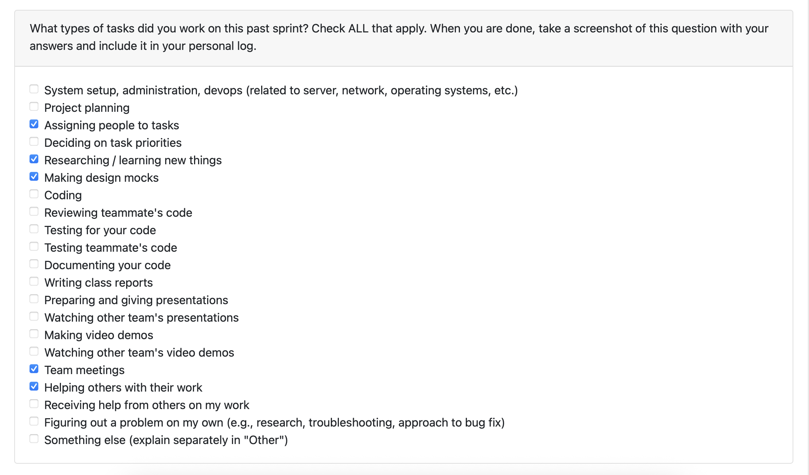
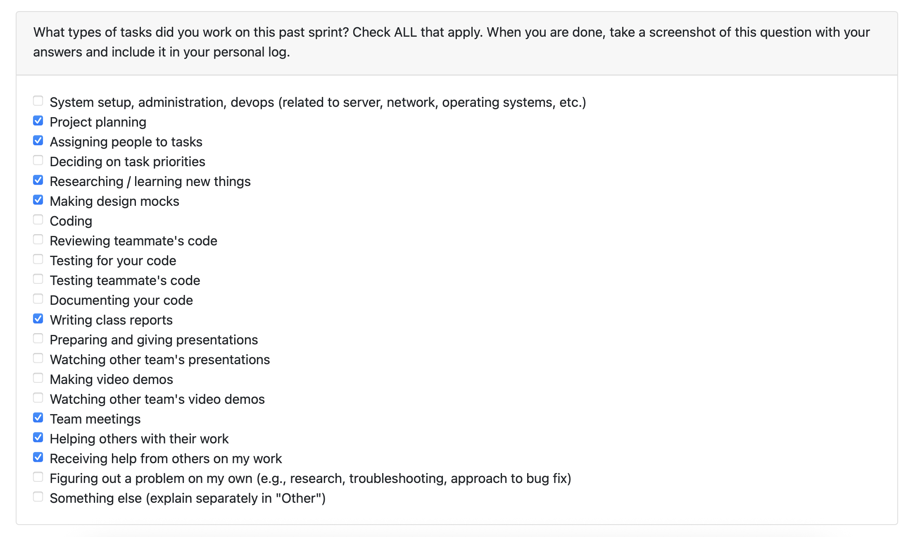

## Sprint Log: (09/29/2025 – 10/05/2025)

### Peer Evaluation

### Weekly Goals Recap
This week, our main goal was to finalize the Level 1 Data Flow Diagram (DFD) based on the previous sprint’s requirements. We also reviewed the system design to ensure it aligned with the finalized project requirements. The DFD was developed with a focus on accurately representing data flow between backend and frontend, external actors, and system components.

### Additional Details
- **DFD Design**: Finalized the Level 1 DFD, ensuring all external actors and data flow were accurately represented.
- **Team Meetings**: Held discussions to finalize the DFD design and review progress on system architecture.
- **Individual Contributions**: Contributed to the refinement and documentation of the Level 1 DFD, clarifying data flows and external actor interactions.

### Plan for the Next Cycle
In the upcoming week (10/06/2025 – 10/12/2025), we’ll focus on reviewing and finalizing our system requirements, revising the system architecture, and allocating tasks more clearly. Additionally, we’ll begin working with Docker and set up our local environments to integrate it into the project.

### Reflection Points
#### What Went Well
We made solid progress in completing the DFD Level 1, which greatly clarified the system’s data flow. Team collaboration was smooth, and the weekly meetings ensured that everyone stayed on track with their tasks. We’ve also improved our understanding of the system design and how the components interact, making the project clearer overall.

#### What Didn't Go Well
There were no major issues this week. The team worked efficiently, and communication was strong, allowing us to stay on schedule.

This week was effective, with meaningful progress on the DFD and overall system design. The team’s dynamics continue to improve, and we’re well on track for the next phase of the project.

## ====================================================

## Sprint Log: (09/22/2025 – 09/28/2025)

### Peer Evaluation

### Weekly Goals Recap
This week, I focused on contributing to the project proposal by developing detailed use cases and creating the UML use case diagram. We collaborated as a team on this and outlining the system architecture, incorporating feedback from our initial drafts to ensure they aligned with the project's overall objectives.

### Additional Details
- **Project Proposal Tasks**: Completed use cases, UML diagram and system architecture outline.
- **Team Meetings**: Participated in discussions to align on proposal structure.
- **Individual Contributions**: Researched best practices for UML diagrams and system architecture.

### Plan for the Next Cycle
In the upcoming week (09/29/2025 – 10/05/2025), I will collaborate with the team on creating the data flow diagram at level 1. Additionally, we will work on finalizing the system design, allocating work tasks and reading up on agile development practices.

### Reflection Points
#### What Went Well
Our team collaborated effectively, with strong communication through regular Discord check-ins and clearly defined responsibilities that kept everyone accountable. We also made efficient use of shared documents for real-time edits, which streamlined our workflow and helped us meet deadlines without last-minute rushes.

#### What Didn't Go Well
We encountered no significant issues this week, though minor delays in gathering reference materials slightly extended our research phase.

This week was effective, with solid progress on the project proposal and clear use cases supported by UML diagrams. Suggestions from other teams and the professor helped us spot and fix design gaps. Our team's strong rapport led to smooth conversations and prompt updates, keeping the group in sync.

## ====================================================

## Sprint Log: (09/15/2025 – 09/21/2025)

### Peer Evaluation

---

### Weekly Goals Recap
We worked on outlining the project’s functional and non-functional requirements based on our current understanding. We created a draft and then got input from three other teams to see where we could make improvements.
With their feedback, we made some adjustments to ensure the requirements were more specific, measurable, and easier to follow.

---

### Additional Details
- **Project Requirements Quiz**: Completed successfully.
- **Discord Server**: Joined for team communication.
- **Individual Weekly Logs**: Documented personal progress.

---