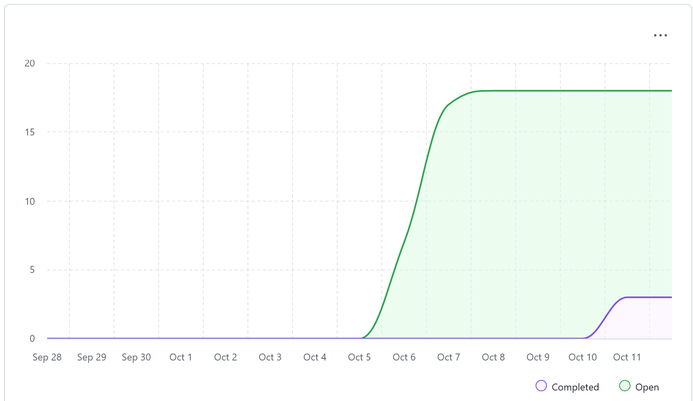

# Weekly Team Log  
---
## Date Range for this sprint:
- [09/15/2025] - [09/20/2025]  

---

## Features in the Project Plan Cycle:
- GitHub Repository Setup  
- Requirements Document Creation & Refinement  

---

## Associated Tasks from Kanban Board:
- N/A (Kanban board not yet populated)  

---

### Screenshot from Kanban board
-N/A (Kanban board not yet populated)  

---

## Burn-up Chart (Velocity):

---

## Team Members  

| Name              | Role/Title          | GitHub Username                                          | Responsibilities |
|-------------------|---------------------|----------------------------------------------------------|------------------|
| Immanuel Wiessler | Full Stack Developer | [@ThunderIW](https://github.com/ThunderIW)               | Requirements    |
| Samantha Maranda  | Full Stack Developer | [@Weebtrian](https://github.com/Weebtrain)               | Repo setup and requirements      |
| Cameron Gillespie | Full Stack Developer | [@Graves067](https://github.com/Graves067)               | Requirements    |
| Purrnet Mann      | Full Stack Developer | [@Puneet-Maan](https://github.com/Puneet-Maan)           | Requirements    |
| Sam Smith         | Full Stack Developer | [@ssmith86](https://github.com/ssmith86)                 | Requirements    |
| Mahi Gangal       | Full Stack Developer | [@mahigangal](https://github.com/mahigangal)             | Requirements    |

---

## Completed Tasks:

| Task ID | Description                 | Completed By |
| ------- | --------------------------- | ------------ |
| #01     | GitHub repo created         | Samantha Maranda|
| #02     | Requirements doc refined    | Team         |

---

## In Progress Tasks / To Do:

| Task ID | Description        | Assigned To |
| ------- | ------------------ | ----------- |
| -       | N/A                | -           |

---

## Test Report / Testing Status:
- N/A  

---

## Overview:
This week the team focused on **initial project setup**: creating the GitHub repository and refining the requirements document.  

The **next cycle** will focus on:  
- Selecting the Core requirements for our project
