# Team Logs (Consolidated)

## Quick Navigation
### Term 2
- [T2 Weekly #9 (Mar 2 to Mar 8, 2026) - Prepared by Puneet Maan](#t2-weekly-9)
- [T2 Weekly #8 (Feb 9 to Mar 1, 2026)](#t2-weekly-8)
- [T2 Weekly #5 (Jan 26 to Feb 8, 2026)](#t2-weekly-5)
- [T2 Weekly #3 (Jan 19 to Jan 25, 2026)](#t2-weekly-3)
- [T2 Weekly #2 (Jan 12 to Jan 18, 2026)](#t2-weekly-2)
- [T2 Weekly #1 (Jan 5 to Jan 11, 2026)](#t2-weekly-1)

### Term 1
- [T1 Weekly #14 (Dec 1 to Dec 7, 2025)](#t1-weekly-14)
- [T1 Weekly #13 (Nov 24 to Nov 29, 2025)](#t1-weekly-13)
- [T1 Weekly #12 (Nov 17 to Nov 23, 2025)](#t1-weekly-12)
- [T1 Weekly #10 (Nov 3 to Nov 9, 2025)](#t1-weekly-10)
- [T1 Weekly #9 (Oct 26 to Nov 2, 2025)](#t1-weekly-9)
- [T1 Weekly #8 (Oct 20 to Oct 26, 2025)](#t1-weekly-8)
- [T1 Weekly #7 (Oct 13 to Oct 19, 2025)](#t1-weekly-7)
- [T1 Weekly #6 (Oct 6 to Oct 12, 2025)](#t1-weekly-6)
- [T1 Weekly #5 (Sep 29 to Oct 3, 2025)](#t1-weekly-5)
- [T1 Weekly #4 (Sep 20 to Sep 28, 2025)](#t1-weekly-4)
- [T1 Weekly #3 (Sep 15 to Sep 20, 2025)](#t1-weekly-3)

---

## Term 2

## T2 Weekly #9 (Mar 2 to Mar 8, 2026) - Prepared by Puneet Maan

## Features in the Project Plan Cycle
- Added final missing resume/portfolio CRUD endpoints
- Updated API endpoint documentation for newly added API routes
- Streamlit starter UI for resume/portfolio workflows (Part 1)
- Streamlit dashboard and public/private mode behavior
- Upload frontend integration
- Frontend user-configuration consent flow for external tools
- API/CLI error handling fixes and related test updates
- Refactored persistence layer from MySQL to SQLite
- Removed Ollama integration

### Screenshot from Kanban board
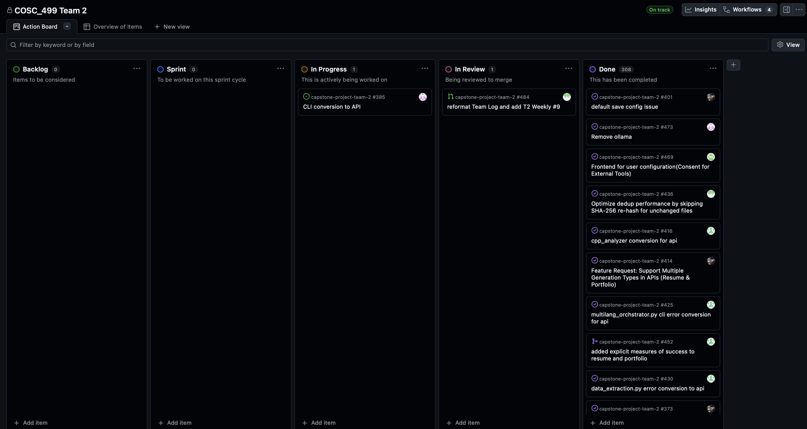

## Burn-up Chart (Velocity)
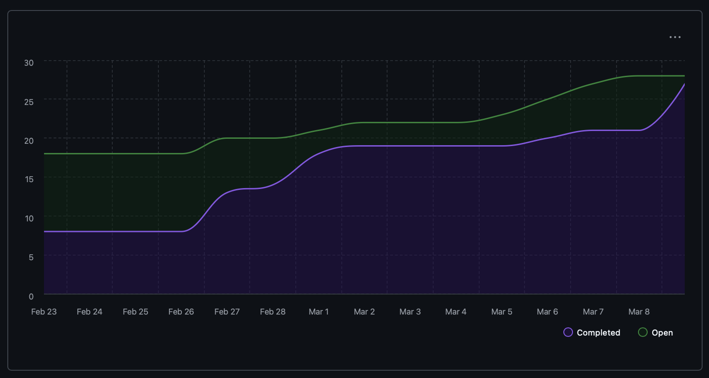
## Delivery Summary
| PR | Owner | Change | Closes | Status |
| ------- | ------------------ | ----------- | ----------- | ----------- |
| [#472](https://github.com/COSC-499-W2025/capstone-project-team-2/pull/472) | Immanuel Wiessler | Update API endpoint docs | N/A | ✅ |
| [#466](https://github.com/COSC-499-W2025/capstone-project-team-2/pull/466) | Immanuel Wiessler | Streamlit starter UI (resume/portfolio, part 1) | [#464](https://github.com/COSC-499-W2025/capstone-project-team-2/issues/464) | ✅ |
| [#465](https://github.com/COSC-499-W2025/capstone-project-team-2/pull/465) | Immanuel Wiessler | Add missing resume/portfolio skill endpoints | [#463](https://github.com/COSC-499-W2025/capstone-project-team-2/issues/463) | ✅ |
| [#483](https://github.com/COSC-499-W2025/capstone-project-team-2/pull/483) | Puneet Maan | Streamlit dashboard + public/private behavior | [#482](https://github.com/COSC-499-W2025/capstone-project-team-2/issues/482) | ✅ |
| [#481](https://github.com/COSC-499-W2025/capstone-project-team-2/pull/481) | Sam Smith | Upload frontend CLI/UI integration | [#471](https://github.com/COSC-499-W2025/capstone-project-team-2/issues/471) | ✅ |
| [#479](https://github.com/COSC-499-W2025/capstone-project-team-2/pull/479) | Sam Smith | API/CLI/UI error handling + tests | [#477](https://github.com/COSC-499-W2025/capstone-project-team-2/issues/477), [#480](https://github.com/COSC-499-W2025/capstone-project-team-2/issues/480) | ✅ |
| [#478](https://github.com/COSC-499-W2025/capstone-project-team-2/pull/478) | Cameron Gillespie | MySQL to SQLite refactor | [#468](https://github.com/COSC-499-W2025/capstone-project-team-2/issues/468) | ✅ |
| [#476](https://github.com/COSC-499-W2025/capstone-project-team-2/pull/476) | Sam Smith | Fix error handling in `data_extraction.py` | [#475](https://github.com/COSC-499-W2025/capstone-project-team-2/issues/475) | ✅ |
| [#474](https://github.com/COSC-499-W2025/capstone-project-team-2/pull/474) | Samantha Maranda | Remove Ollama | [#473](https://github.com/COSC-499-W2025/capstone-project-team-2/issues/473) | ✅ |
| [#488](https://github.com/COSC-499-W2025/capstone-project-team-2/pull/488) | Mahi Gangal | Frontend for user configuration consent for external tools | [#469](https://github.com/COSC-499-W2025/capstone-project-team-2/issues/469) | ✅ |

## Testing
| PR | Test Type | Command / Check | Result |
| ------- | ------------------ | ----------- | ----------- |
| [#472](https://github.com/COSC-499-W2025/capstone-project-team-2/pull/472) | Docs review | Documentation-only review | ✅ |
| [#466](https://github.com/COSC-499-W2025/capstone-project-team-2/pull/466) | Manual run | `uvicorn src.API.general_API:app --host 0.0.0.0 --port 8000 --reload` + `streamlit run src/web/streamlit_app.py` | ✅ |
| [#465](https://github.com/COSC-499-W2025/capstone-project-team-2/pull/465) | Pytest | `python -m pytest test/test_resume_generator_API.py::TestSkillEndpoints test/test_portfolio_generator_API.py::TestSkillEndpoints -v` | ✅ |
| [#465](https://github.com/COSC-499-W2025/capstone-project-team-2/pull/465) | Pytest | `python -m pytest test/test_resume_generator_API.py::TestAddProjectManual test/test_portfolio_generator_API.py::TestAddProjectManual -v` | ✅ |
| [#483](https://github.com/COSC-499-W2025/capstone-project-team-2/pull/483) | Manual checks | Multipage navigation, mode toggle, public/private behavior | ✅ |
| [#483](https://github.com/COSC-499-W2025/capstone-project-team-2/pull/483) | Static compile | `python3 -m py_compile src/web/streamlit_app.py src/web/mode.py src/web/pages/Dashboard.py src/web/pages/ResumeAndPortfoiloMaker.py` | ✅ |
| [#481](https://github.com/COSC-499-W2025/capstone-project-team-2/pull/481) | Pytest | `pytest test/test_project_upload_page.py` | ✅ |
| [#479](https://github.com/COSC-499-W2025/capstone-project-team-2/pull/479) | Pytest | `pytest test/test_portfolio_service.py` | ✅ |
| [#478](https://github.com/COSC-499-W2025/capstone-project-team-2/pull/478) | Pytest | `python -m pytest test/test_sqlite_db.py -v` | ✅ |
| [#478](https://github.com/COSC-499-W2025/capstone-project-team-2/pull/478) | Pytest | `python -m pytest test/test_db_helper_functions.py -v` | ✅ |
| [#478](https://github.com/COSC-499-W2025/capstone-project-team-2/pull/478) | Pytest | `python -m pytest test/test_db_versioning_functions.py -v` | ✅ |
| [#476](https://github.com/COSC-499-W2025/capstone-project-team-2/pull/476) | Pytest | `pytest test/test_data_extraction.py` | ✅ |
| [#474](https://github.com/COSC-499-W2025/capstone-project-team-2/pull/474) | Docker test suite | Run full Docker tests to confirm no breaking changes | ✅ |
| [#488](https://github.com/COSC-499-W2025/capstone-project-team-2/pull/488) | Pytest | `python -m pytest -q test/test_user_configuration_helpers.py test/test_user_configuration_integration.py` | ✅ |
| [#488](https://github.com/COSC-499-W2025/capstone-project-team-2/pull/488) | Manual verification | Start API + frontend; verify consent capture/persistence, optional name/theme updates, and config reload behavior | ✅ |

## Team Members

| Name              | Role/Title          | GitHub Username                                    | Contributions this cycle |
|-------------------|---------------------|----------------------------------------------------|--------------------------|
| Immanuel Wiessler | Full Stack Developer | [@ThunderIW](https://github.com/ThunderIW)         | PRs #472, #466, #465 |
| Samantha Maranda  | Full Stack Developer | [@Weebtrian](https://github.com/Weebtrain)         | PR #474 |
| Cameron Gillespie | Full Stack Developer | [@Graves067](https://github.com/Graves067)         | PR #478 |
| Puneet Maan       | Full Stack Developer | [@Puneet-Maan](https://github.com/Puneet-Maan)     | PR #483, prepared team log |
| Sam Smith         | Full Stack Developer | [@ssmith86](https://github.com/ssmith86)           | PRs #481, #479, #476 |
| Mahi Gangal       | Full Stack Developer | [@mahigangal](https://github.com/mahigangal)       | PR #488 |

## Overview
This week focused on building the frontend foundation for Milestone 3. The team added Streamlit starter pages, dashboard flow, public/private mode behavior, upload UI support, and user-configuration consent capture for external tools, while also completing related backend cleanup (error-handling fixes, SQLite refactor, and Ollama removal) to stabilize the full workflow.

The **next cycle** will focus on:
- Continuing frontend development, including Streamlit UI polish.

---

## T2 Weekly #8 (Feb 9 to Mar 1, 2026)

# Weekly Team Log  

---

## Date Range for this sprint:
- [02/09/2026] - [03/01/2026]
 
---
## Features in the Project Plan Cycle:
- CLI Functions to API Endpoints
- Fix project re-analysis, versioning, and duplicate detection
- Fixing default save config issue
- Generating AI resume with DB interaction
- Database schema updates
- Improving clarity of document-analysis output
- Fix project identity consistency, safe analysis deletion, and CLI delete transparency
- Incorporate a key role of the user in a given project
- Support multiple generation types in APIs resume/portfolio and export of document
- Error Handling to raise appropriate errors to the API
- Generate project summary integration into CLI
- Incremental Uploads with Snapshot Aware Insights
- Adding missing tests for API endpoints
- Implement thumbnail management as api endpoints
- Added API documentation
- Added missing endpoints to resume and portfolio api 
- fix ranking and clarity about the metrics
- Multi project upload and completion

## Associated Tasks from Kanban Board:
- https://github.com/COSC-499-W2025/capstone-project-team-2/pull/396
- https://github.com/COSC-499-W2025/capstone-project-team-2/pull/400
- https://github.com/COSC-499-W2025/capstone-project-team-2/pull/402
- https://github.com/COSC-499-W2025/capstone-project-team-2/pull/403
- https://github.com/COSC-499-W2025/capstone-project-team-2/pull/408
- https://github.com/COSC-499-W2025/capstone-project-team-2/pull/409
- https://github.com/COSC-499-W2025/capstone-project-team-2/pull/412
- https://github.com/COSC-499-W2025/capstone-project-team-2/pull/413
- https://github.com/COSC-499-W2025/capstone-project-team-2/pull/415
- https://github.com/COSC-499-W2025/capstone-project-team-2/pull/417
- https://github.com/COSC-499-W2025/capstone-project-team-2/pull/419
- https://github.com/COSC-499-W2025/capstone-project-team-2/pull/422
- https://github.com/COSC-499-W2025/capstone-project-team-2/pull/424
- https://github.com/COSC-499-W2025/capstone-project-team-2/pull/427
- https://github.com/COSC-499-W2025/capstone-project-team-2/pull/429
- https://github.com/COSC-499-W2025/capstone-project-team-2/pull/431
- https://github.com/COSC-499-W2025/capstone-project-team-2/pull/434
- https://github.com/COSC-499-W2025/capstone-project-team-2/pull/435
- https://github.com/COSC-499-W2025/capstone-project-team-2/issues/455
- https://github.com/COSC-499-W2025/capstone-project-team-2/issues/385
- https://github.com/COSC-499-W2025/capstone-project-team-2/issues/370
- https://github.com/COSC-499-W2025/capstone-project-team-2/issues/372
- https://github.com/COSC-499-W2025/capstone-project-team-2/issues/366
- https://github.com/COSC-499-W2025/capstone-project-team-2/issues/441
- https://github.com/COSC-499-W2025/capstone-project-team-2/issues/438
- https://github.com/COSC-499-W2025/capstone-project-team-2/issues/436
- https://github.com/COSC-499-W2025/capstone-project-team-2/pull/448
- https://github.com/COSC-499-W2025/capstone-project-team-2/pull/446

### Screenshot from Kanban board
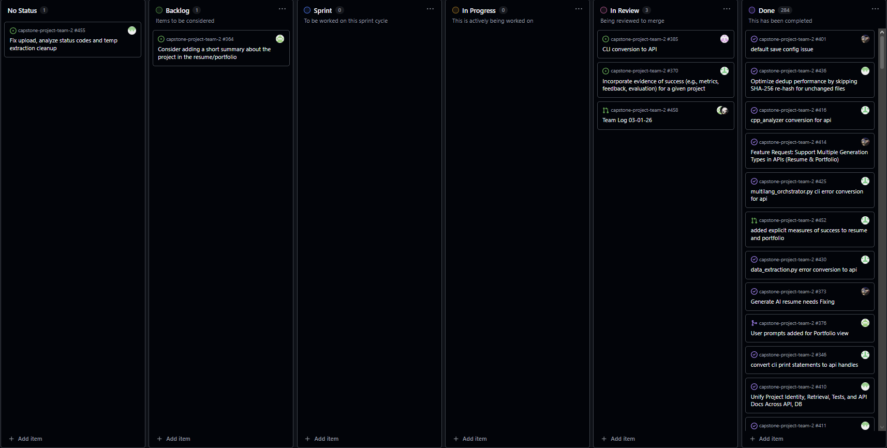
---

## Burn-up Chart (Velocity)
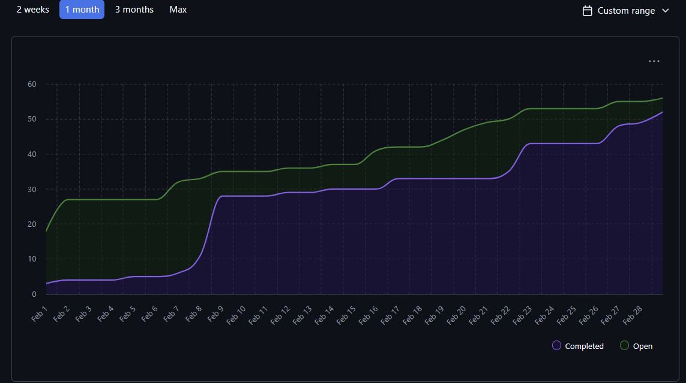
---
## Team Members  

| Name              | Role/Title          | GitHub Username                                          | Responsibilities |
|-------------------|---------------------|----------------------------------------------------------|------------------|
| Immanuel Wiessler | Full Stack Developer | [@ThunderIW](https://github.com/ThunderIW)               |Fix project re-analysis, versioning, and duplicate detection, Fixing default save config issue, Generating AI resume with DB interaction, Support multiple generation types in APIs resume/portfolio and export of document, Generate project summary integration into CLI |
| Samantha Maranda  | Full Stack Developer | [@Weebtrian](https://github.com/Weebtrain)               |CLI Functions to API Endpoints|
| Cameron Gillespie | Full Stack Developer | [@Graves067](https://github.com/Graves067)               |Database schema updates|
| Puneet Maan      | Full Stack Developer | [@Puneet-Maan](https://github.com/Puneet-Maan)           |Fix project identity consistency, safe analysis deletion, and CLI delete transparency, Incremental Uploads with Snapshot Aware Insights|
| Sam Smith         | Full Stack Developer | [@ssmith86](https://github.com/ssmith86)                 |Error Handling to raise appropriate errors to the API|
| Mahi Gangal       | Full Stack Developer | [@mahigangal](https://github.com/mahigangal)             |Improving clarity of document-analysis output, Incorporate a key role of the user in a given project, Adding missing tests for API endpoints, Implement thumbnail management as api endpoints, Added API documentation |

## Completed Tasks:

| Task ID | Description                 | Completed By |
| ------- | --------------------------- | ------------ |
| https://github.com/COSC-499-W2025/capstone-project-team-2/pull/396 | cli conversion to api part 1 | Samantha Maranda |
| https://github.com/COSC-499-W2025/capstone-project-team-2/pull/400 | Fix project re-analysis, versioning, and duplicate detection | Immanuel Wiessler|
| https://github.com/COSC-499-W2025/capstone-project-team-2/pull/402| default save config issue| Immanuel Wiessler |
| https://github.com/COSC-499-W2025/capstone-project-team-2/pull/403 |generate AI resume with DB interaction| Immanuel Wiessler |
|https://github.com/COSC-499-W2025/capstone-project-team-2/pull/406|296 convert resume generation into fastapi format| Immanuel Wiessler |
| https://github.com/COSC-499-W2025/capstone-project-team-2/pull/408 |Timstamp primary key|Cameron Gillespie|
| https://github.com/COSC-499-W2025/capstone-project-team-2/pull/409 |clarity on the factors mentioned in the document analysis |Mahi Gangal|
| https://github.com/COSC-499-W2025/capstone-project-team-2/pull/412 |Fix project identity consistency, safe analysis deletion, and CLI delete transparency | Puneet Maan |
| https://github.com/COSC-499-W2025/capstone-project-team-2/pull/413 |incorporate a key role of the user in a given project| Mahi Gangal|
|https://github.com/COSC-499-W2025/capstone-project-team-2/pull/415|feature request support multiple generation types in apis resume portfolio and export of doc|Immanuel Wiessler|
|https://github.com/COSC-499-W2025/capstone-project-team-2/pull/417|updated error handling in csharp analyzer and added tests to check changes| Sam Smith|
|https://github.com/COSC-499-W2025/capstone-project-team-2/pull/419|generate project summary integration(GEN AI VER_2)| Immanuel Wiessler|
|https://github.com/COSC-499-W2025/capstone-project-team-2/pull/422|Incremental Uploads with Snapshot Aware Insights|Puneet Maan|
|https://github.com/COSC-499-W2025/capstone-project-team-2/pull/424|added error handling to __init__ function|Sam Smith|
|https://github.com/COSC-499-W2025/capstone-project-team-2/pull/427|added error handling for save_config method |Sam Smith|
|https://github.com/COSC-499-W2025/capstone-project-team-2/pull/429|fixed error handling in load method to raise appropriate errors to the api|Sam Smith|
|https://github.com/COSC-499-W2025/capstone-project-team-2/pull/431|add coverage for GET /projects/{id} and project delete flows|Mahi Gangal|
|https://github.com/COSC-499-W2025/capstone-project-team-2/pull/434|implement thumbnail management as api endpoints|Mahi Gangal|
|https://github.com/COSC-499-W2025/capstone-project-team-2/pull/435|add endpoint reference and required endpoint test coverage|Mahi Gangal|
|https://github.com/COSC-499-W2025/capstone-project-team-2/pull/437|Optimize dedup pipeline with metadata precheck and hash cache| Puneet Maan|
|https://github.com/COSC-499-W2025/capstone-project-team-2/pull/439|Expose dedup cleanup toggle in GET /analyze and document behavior| Puneet Maan|
|https://github.com/COSC-499-W2025/capstone-project-team-2/pull/440|414 Added missing endpoints to resume and portfolio api| Immanuel Wiessler|
|https://github.com/COSC-499-W2025/capstone-project-team-2/pull/444|443 milestone2 requirement34|Sam Smith|
|https://github.com/COSC-499-W2025/capstone-project-team-2/pull/445|fix ranking and clarity about the metrics |Mahi Gangal|
|https://github.com/COSC-499-W2025/capstone-project-team-2/pull/446|Clean repository (IDE metadata, unused Dockerfile .yml, etc.)|Puneet Maan|
|https://github.com/COSC-499-W2025/capstone-project-team-2/pull/447|385 cli conversion to api part 2|Samantha Maranda|
|https://github.com/COSC-499-W2025/capstone-project-team-2/pull/448|Multi project upload and completion|Cameron Gillespie|
|https://github.com/COSC-499-W2025/capstone-project-team-2/pull/451|missing endpoints added to the doc|Sam Smith|
|https://github.com/COSC-499-W2025/capstone-project-team-2/pull/452|added explicit measures of success to resume and portfolio|Sam Smith|
|https://github.com/COSC-499-W2025/capstone-project-team-2/pull/453|442 milestone2 requirement33|Sam Smith|
|https://github.com/COSC-499-W2025/capstone-project-team-2/pull/456|Fix upload, analyze API behavior and temp extraction cleanup|Puneet Maan|
---

## In Progress Tasks / To Do:

---

## Test Report / Testing Status:
| Task / PR | Test description / command                                    | Successful |
| ------- | ------------------ | ----------- |
| #400  | python -m pytest test/test_dedup_index.py test/test_saved_projects.py test/test_menus.py test/test_db_helper_functions.py test/test_db_versioning_functions.py -v |  ✅(100%) |
| #402    |python -m pytest test/test_startup_pull.py test/test_saved_projects.py -v| ✅(100%) |
| #403   |pytest test/test_Generate_Resume_AI_Ver2.py -v|✅(100%) |
| #408 |python -m pytest test/test_db_versioning_functions.py, python -m pytest test\test_db_helper_functions.py |✅(100%) |
| #409|docker compose run --rm app python -m pytest test/test_saved_projects.py -q| ✅(100%) |
| #396, |All docker tests | ✅(100%) |
| #412|test_project_io_API.py, test_resume_generator_API.py, test_portfolio_generator_API.py, test_saved_projects.py, test_menus.py, test_representation_API.py, test_consent_API.py, test_skills_API.py | ✅(100%)|
| #413|docker compose run --rm app python -m pytest test/test_portfolio_generator_API.py test/test_portfolio_service.py -q | ✅(100%)|
|#415| docker-compose run --rm app pytest test/test_resume_generator_API.py test/test_portfolio_generator_API.py -v | ✅(100%)|
|#417|python -m pytest test/test_csharp_analyzer.py|✅(100%)|
|#419|python -m pytest test/test_document_generator_menu.py -v |✅(100%)|
|#422|pytest test/test_analysis_service.py test/test_analysis_API.py test/test_project_io_API.py test/test_representation_API.py|✅(100%)|
|#424|pytest test/test_javascript_oop_analyzer.py|✅(100%)|
|#427|python -m pytest test/test_user_config_store.py|✅(100%)|
|#429|python -m pytest test/test_startup_pull.py|✅(100%)|
|#431| python -m pytest test/test_project_io_API.py, python -m py_compile test/test_project_io_API.py |✅(100%)|
|#434|python -m pytest test/test_project_thumbnail_API.py, python -m pytest test/test_project_io_API.py|✅(100%)|   
|#435|python -m pytest -q test/test_project_io_API.py|✅(100%)|
|#456|test/test_analysis_API.py, test/test_project_io_API.py, test/test_extraction.py, test/test_analysis_service.py, test/test_app_context.py|✅(100%)|
|#447|test_return_skill_insights_chronological(), test_return_project_insights_chronological()|✅(100%)|
|#452|pytest test/test_resume_item_generator.py, pytest test/test_analysis_service.py, pytest test/test_document_generator_menu.py, pytest test/test_portfolio_service.py|✅(100%)|
|#448|python -m pytest test/test_multi_project_handler.py|✅(100%)|
|#446|Confirm no code path references depend on removed|✅(100%)|
|#445|test_menus.py -q|✅(100%)|
|#440|python -m pytest test/test_portfolio_generator_API.py test/test_resume_generator_API.py -v, docker-compose run test python -m pytest test/test_portfolio_generator_API.py test/test_resume_generator_API.py|✅(100%)|
|#439|pytest test/test_analysis_API.py, test/test_analysis_service.py|✅(100%)|
|#437|test/test_dedup_index.py|✅(100%)|

---
## Overview:
The team progressed the milestone by expanding API coverage, strengthening persistence/versioning behavior, and improving project insight generation across resume, portfolio, and document-analysis workflows. Recent work also focused on reliability and usability: better error handling, safer deletion and duplicate handling, thumbnail/document export support, snapshot-aware uploads, and updated API test/documentation coverage.

The **next cycle** will focus on:  
- Plan / Design Front end
- Creating HTML and  CSS Stylesheets
- Ensure Back end analysis and API are completed

---

## T2 Weekly #5 (Jan 26 to Feb 8, 2026)

# Weekly Team Log  
---
## Date Range for this sprint:
- [01/26/2026] - [02/08/2026]  
---
## Features in the Project Plan Cycle:
- Fixed Render CV
- Fixed consent form not viewable
- Conversion of print errors to error raising
- Skills endpoint error handling
- Database rebuild/updates
- Test Coverage Review
- Fixed project duration estimation
- Project file traverser/sorter framework
- Deduplication across uploads with API output
- Convert portfolio generation to fastapi
- Convert resume generation to fastapi
- Fixed errors handling to work with fastapi
- Add user controlled representation prefs (API and CLI) for project insights
- Add multiple export formats

## Associated Tasks from Kanban Board:
- [#344](https://github.com/COSC-499-W2025/capstone-project-team-2/pull/344)
- [#345](https://github.com/COSC-499-W2025/capstone-project-team-2/pull/345)
- [#348](https://github.com/COSC-499-W2025/capstone-project-team-2/pull/348)
- [#349](https://github.com/COSC-499-W2025/capstone-project-team-2/pull/349)
- [#352](https://github.com/COSC-499-W2025/capstone-project-team-2/pull/352)
- [#353](https://github.com/COSC-499-W2025/capstone-project-team-2/pull/353)
- [#355](https://github.com/COSC-499-W2025/capstone-project-team-2/pull/355)
- [#356](https://github.com/COSC-499-W2025/capstone-project-team-2/pull/356)
- [#358](https://github.com/COSC-499-W2025/capstone-project-team-2/pull/358)
- [#374](https://github.com/COSC-499-W2025/capstone-project-team-2/pull/374)
- [#375](https://github.com/COSC-499-W2025/capstone-project-team-2/pull/375)
- [#379](https://github.com/COSC-499-W2025/capstone-project-team-2/pull/379)
- [#388](https://github.com/COSC-499-W2025/capstone-project-team-2/pull/388)
- [#382](https://github.com/COSC-499-W2025/capstone-project-team-2/pull/382)
- [#384](https://github.com/COSC-499-W2025/capstone-project-team-2/pull/384)
- [#391](https://github.com/COSC-499-W2025/capstone-project-team-2/pull/391)
- [#394](https://github.com/COSC-499-W2025/capstone-project-team-2/pull/394)

### Screenshot from Kanban board
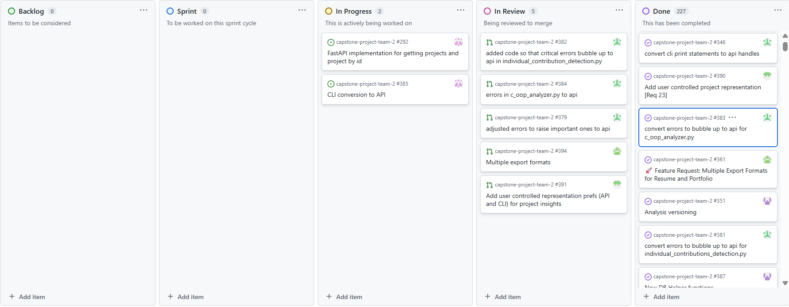
---

## Burn-up Chart (Velocity)
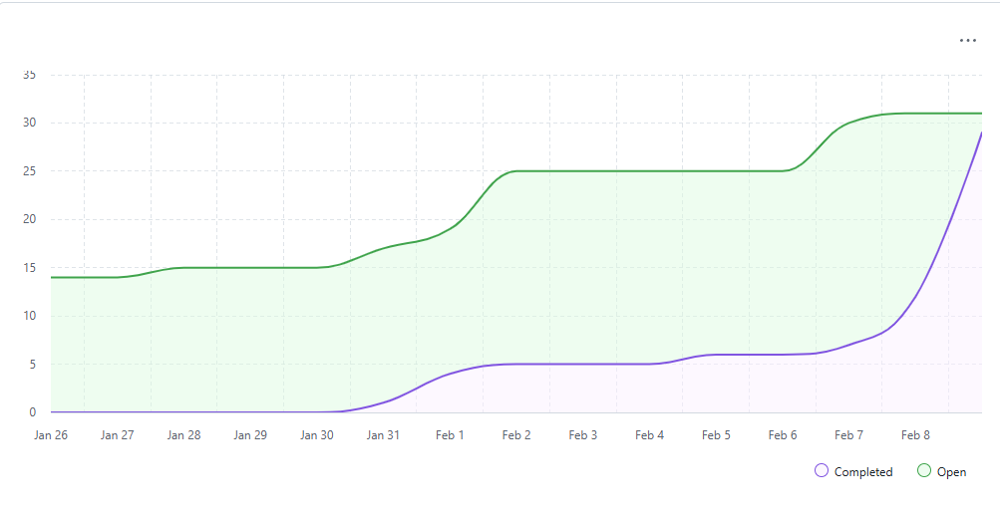
---
## Team Members  

| Name              | Role/Title          | GitHub Username                                          | Responsibilities |
|-------------------|---------------------|----------------------------------------------------------|------------------|
| Immanuel Wiessler | Full Stack Developer | [@ThunderIW](https://github.com/ThunderIW)               |Refactor render cv Generation, consent form bug, convert portfolio and resume gen to fastapi|
| Samantha Maranda  | Full Stack Developer | [@Weebtrian](https://github.com/Weebtrain)               |Test coverage review, project file traverser/sorter|
| Cameron Gillespie | Full Stack Developer | [@Graves067](https://github.com/Graves067)               |Database rebuild/update|
| Puneet Maan      | Full Stack Developer | [@Puneet-Maan](https://github.com/Puneet-Maan)           |Deduplication across uploads with API output and tests, user controlled representation prefs|
| Sam Smith         | Full Stack Developer | [@ssmith86](https://github.com/ssmith86)                 |conversion of print errors for api|
| Mahi Gangal       | Full Stack Developer | [@mahigangal](https://github.com/mahigangal)             |skills endpoint error handling, project duration fix, add multiple export formats|

## Completed Tasks:

| Task ID | Description                 | Completed By |
| ------- | --------------------------- | ------------ |
| [#344](https://github.com/COSC-499-W2025/capstone-project-team-2/pull/344) | Update Generate_AI_RenderCV_Portfolio_and_Resume.py + adding some new helper functions | Immanuel Wiessler |
| [#345](https://github.com/COSC-499-W2025/capstone-project-team-2/pull/345) | Fixed constent_md not showing up | Immanuel Wiessler|
| [#348](https://github.com/COSC-499-W2025/capstone-project-team-2/pull/348) | Converted print errors to error raising for api | Sam Smith |
| [#349](https://github.com/COSC-499-W2025/capstone-project-team-2/pull/349) |Skills endpoint error handling| Mahi Gangal |
| [#352](https://github.com/COSC-499-W2025/capstone-project-team-2/pull/352) |Database rebuild|Cameron Gillespie|
| [#353](https://github.com/COSC-499-W2025/capstone-project-team-2/pull/353) |Test Coverage Review |Samantha Maranda|
| [#355](https://github.com/COSC-499-W2025/capstone-project-team-2/pull/355) |Fixed Project duration |Mahi Gangal|
| [#356](https://github.com/COSC-499-W2025/capstone-project-team-2/pull/356) |Project file traverser/sorter| Samantha Maranda|
|[#358](https://github.com/COSC-499-W2025/capstone-project-team-2/pull/358)|Deduplication across uploads with API output and tests| Puneet Maan|
|[#374](https://github.com/COSC-499-W2025/capstone-project-team-2/pull/374)|Convert portfolio generation to fastapi| Immanuel Wiessler|
|[#375](https://github.com/COSC-499-W2025/capstone-project-team-2/pull/375)|Convert resume generation to fastapi| Immanuel Wiessler|
|[#388](https://github.com/COSC-499-W2025/capstone-project-team-2/pull/388)|Database update|Cameron Gillespie|
|[#379](https://github.com/COSC-499-W2025/capstone-project-team-2/pull/379)|adjusted errors to raise important ones to api|Sam Smith|
|[#382](https://github.com/COSC-499-W2025/capstone-project-team-2/pull/382)|added code so that critical errors bubble up to api in individual_contribution_detection.py|Sam Smith|
|[#384](https://github.com/COSC-499-W2025/capstone-project-team-2/pull/384)|errors in c_oop_analyzer.py to api|Sam Smith|
|[#391](https://github.com/COSC-499-W2025/capstone-project-team-2/pull/391)|Add user controlled representation prefs (API and CLI) for project insights|Puneet Maan|
|[#394](https://github.com/COSC-499-W2025/capstone-project-team-2/pull/394)|Multiple export formats|Mahi Gangal|
---

## In Progress Tasks / To Do:

| Task ID | Description        | Assigned To |
| ------- | ------------------ | ----------- |
|[#292](https://github.com/COSC-499-W2025/capstone-project-team-2/issues/292) | FastAPI implementation for getting projects and project by id | Samantha Maranda |     
|[#385](https://github.com/COSC-499-W2025/capstone-project-team-2/issues/385) | CLI conversion to API | Samantha Maranda |

---

## Test Report / Testing Status:
| Task / PR | Test description / command                                    | Successful |
| ------- | ------------------ | ----------- |
| #344   | python -m pytest test/test_Generate_AI_RenderCV_portfolio.py test/test_Generate_Render_CV_Resume.py -v |  ✅(100%) |
| #345    |python -m pytest test/test_consent_API.py -v| ✅(100%) |
| #348   |python -m pytest test/test_analysis_service.py -v|✅(100%) |
| #349 |python -m pytest test/test_skills_API.py |✅(100%) |
| #352|python -m pytest test/test_db_versioning_functions.py| ✅(100%) |
| #353|All docker tests | ✅(100%) |
| #355|python -m unittest discover -s test -p "test_project_duration.py"| ✅(100%)|
| #356|test_file_traverser.py| ✅(100%)|
|#358|pytest test/test_analysis_API.py, pytest test/test_analysis_service.py, pytest test/test_dedup_index.py| ✅(100%)|
|#374|pytest test/test_portfolio_generator_API.py -v|✅(100%)|
|#375|pytest test/test_resume_generator_API.py -v |✅(100%)|
|#388|python -m pytest test/test_db_versioning_functions.py, python -m pytest test\test_db_helper_functions.py|✅(100%)|
|#379|python -m pytest test/test_analysis_service.py|✅(100%)|
|#382|python -m pytest test/test_individual_contribution_detection.py|✅(100%)|
|#384|python -m pytest test/test_c_analyzer.py|✅(100%)|
|#391| pytest test/test_representation_API.py |✅(100%)|
|#394|python -m pytest test/test_Generate_Render_CV_Resume.py test/test_document_generator_menu.py test/test_portfolio_rendercv_service.py|✅(100%)|   
---
## Overview:
This log represents the last two weeks of work. Last week we had our peer testing session. A few bugs were found, and we worked on those that week, however, most of the feedback was front end stuff, which we will address once the GUI system is up and running.
This week we pushed forward on milestone 2 features and continued improving some of the backend features.

The **next cycle** will focus on:  
- additional Milstone 2 features
- improvement of backend features

---

## T2 Weekly #3 (Jan 19 to Jan 25, 2026)

# T2 Week 3 Team Log  
---
## Date Range for this sprint:
- [19/01/2026] - [25/01/2026]  
---

## Features in the Project Plan Cycle:
- Local document insights (summary/highlights/metadata/stats)
- Saved Projects CLI display for document analysis
- Delete flow safety and JSON save robustness
- API groundwork (consent/skills, upload)  
- C# code analysis
- CLI CRUD operations for demo flows
- Multi-language OOP aggregation and unified report output

## Associated Tasks from Kanban Board:
- [#334: Add local document analysis insights, CLI display, and tests](https://github.com/COSC-499-W2025/capstone-project-team-2/pull/334)
- [#325: Fix delete flow and safer JSON saves](https://github.com/COSC-499-W2025/capstone-project-team-2/pull/325)
- [#322: Added API endpoint for POST /privacy-consent and GET /skills](https://github.com/COSC-499-W2025/capstone-project-team-2/pull/322)
- [#328: Upload file api](https://github.com/COSC-499-W2025/capstone-project-team-2/pull/328)
- [#327: C# analysis](https://github.com/COSC-499-W2025/capstone-project-team-2/pull/327)
- [#317: implement crud operations into cli for demo](https://github.com/COSC-499-W2025/capstone-project-team-2/pull/317)
- [#333: OOP aggregator unified report](https://github.com/COSC-499-W2025/capstone-project-team-2/pull/333)

### Screenshot from Kanban board
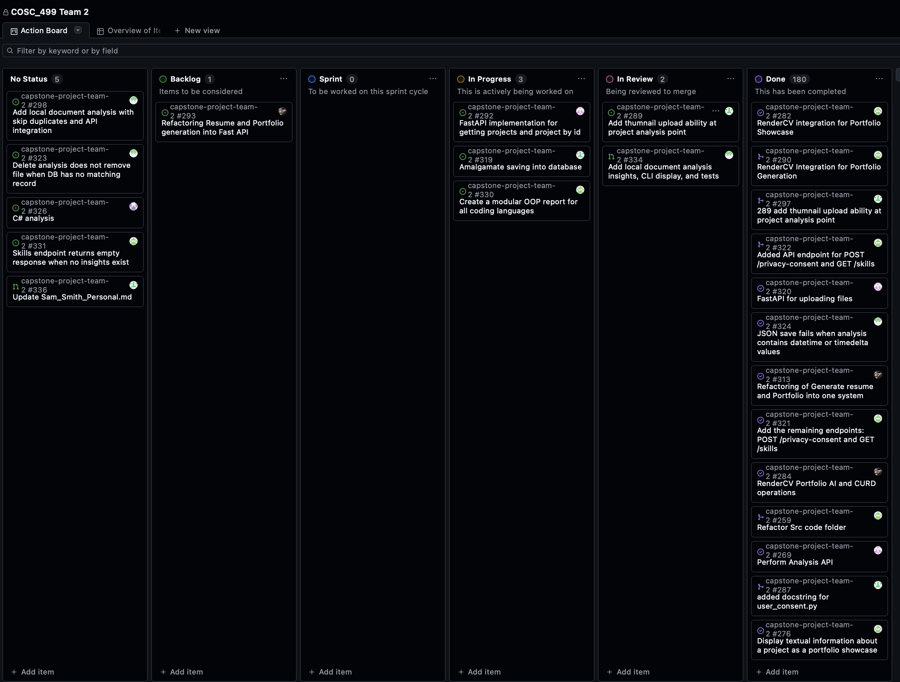

---

## Burn-up Chart (Velocity):
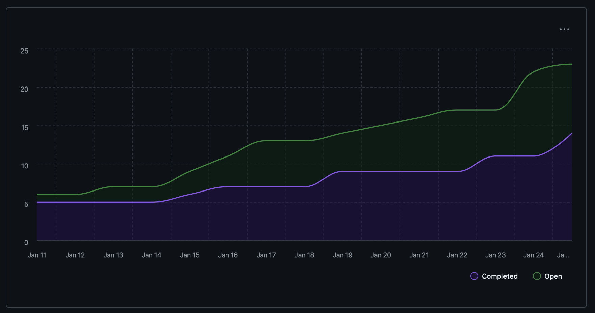

---

## Team Members  

| Name              | Role/Title            | GitHub Username                                          | Responsibilities |
|-------------------|-----------------------|----------------------------------------------------------|------------------|
| Immanuel Wiessler | Full Stack Developer  | [@ThunderIW](https://github.com/ThunderIW)               | AI portfolio generation |
| Samantha Maranda  | Full Stack Developer  | [@Weebtrian](https://github.com/Weebtrain)               | FastAPI implementation, upload API |
| Cameron Gillespie | Full Stack Developer  | [@Graves067](https://github.com/Graves067)               | C++/C# code analysis |
| Puneet Maan       | Full Stack Developer  | [@Puneet-Maan](https://github.com/Puneet-Maan)           | Document analysis insights, delete flow |
| Sam Smith         | Full Stack Developer  | [@ssmith86](https://github.com/ssmith86)                 | Thumbnails/menus |
| Mahi Gangal       | Full Stack Developer  | [@mahigangal](https://github.com/mahigangal)             | Portfolio generation, API endpoints |

## Completed Tasks:

| Task ID | Description                                     | Completed By |
| ------- | ----------------------------------------------- | ------------ |
| [#334](https://github.com/COSC-499-W2025/capstone-project-team-2/pull/334) | Added local document analysis insights, CLI display, and tests | Puneet Maan |
| [#325](https://github.com/COSC-499-W2025/capstone-project-team-2/pull/325) | Fixed delete flow and safer JSON saves | Puneet Maan |
| [#322](https://github.com/COSC-499-W2025/capstone-project-team-2/pull/322) | Added API endpoint for POST /privacy-consent and GET /skills | Mahi Gangal |
| [#328](https://github.com/COSC-499-W2025/capstone-project-team-2/pull/328) | Upload file API | Samantha Maranda |
| [#327](https://github.com/COSC-499-W2025/capstone-project-team-2/pull/327) | Added C# analyzer (based on C++ analyzer); tests and docs included | Cameron Gillespie |
| [#317](https://github.com/COSC-499-W2025/capstone-project-team-2/pull/317) | Implemented CLI CRUD for document generation (RenderCV), consolidated menu and tests for demo | Immanuel Wiessler |
| [#333](https://github.com/COSC-499-W2025/capstone-project-team-2/pull/333) | Added multi-language OOP aggregation, unified report output, and stack-based language detection | Mahi Gangal |

---

## Test Report / Testing Status:
| Task / PR | Test description / command                      | Successful |
| --------- | ------------------------------------------------ | ---------- |
| #334      | `pytest test/test_document_analysis.py`          | ✅ |
| #325      | `pytest test/test_menus.py` and CLI delete verification | ✅ |
| #322      | `python -m unittest discover -s test -p "test_consent_API.py"` and `python -m unittest discover -s test -p "test_skills_API.py"` | ✅ |
| #328      | Tests added in `test_project_io_API.py`, `test_extraction.py`; full run via Docker (see PR #328 notes) | ✅ |
| #327      | `python -m pytest test/test_csharp_analyzer.py -v` (requires tree-sitter-c-sharp) | ✅ |
| #317      | `python -m pytest test/test_document_generator_menu.py -v` | ✅ |
| #333      | OOP aggregator unified report verification        | ✅ |

---

## Overview:
This week the team delivered richer document insights in the Saved Projects CLI, hardened delete/JSON save behavior, shipped a C# analyzer with tests, added consent/skills and upload API work, completed CLI CRUD flows for document generation, and shipped multi-language OOP aggregation with unified reporting.

The **next cycle** will focus on:
- Peer testing session on Monday to gather feedback, log issues, and update the approach
- Strengthening API coverage and related tests
- Improving analyzers and related functionality
- Focusing on non coding project insights

---

## T2 Weekly #2 (Jan 12 to Jan 18, 2026)

# Weekly Team Log  
---
## Date Range for this sprint:
- [11/01/2026] - [18/01/2026]  
---

## Features in the Project Plan Cycle:
- Portfolio Generation
- AI Portfolio Generation
- Cpp Code File Analysis
- Upload Thumbnail for Project
- Analyze non-code non-image files
- FastAPI Implementation for analysis & returning saved projects
- Analysis Code Refactor

## Associated Tasks from Kanban Board:
- [304: Major Refactoring and Start of FastAPI implementation](https://github.com/COSC-499-W2025/capstone-project-team-2/pull/304)
- [301: Cpp Analysis](https://github.com/COSC-499-W2025/capstone-project-team-2/pull/301)
- [299: Add local doc reading with skip duplicates for API](https://github.com/COSC-499-W2025/capstone-project-team-2/pull/299)
- [297: Add thumnail upload ability at project analysis point](https://github.com/COSC-499-W2025/capstone-project-team-2/pull/297)
- [290: RenderCV Integration for Portfolio Generation](https://github.com/COSC-499-W2025/capstone-project-team-2/pull/290)
- [288: Added missing functionality to Generate_AI_RenderCV_portfolio.py](https://github.com/COSC-499-W2025/capstone-project-team-2/pull/288)
- [286: Portfolio RenderCV Builder](https://github.com/COSC-499-W2025/capstone-project-team-2/pull/286)

### Screenshot from Kanban board
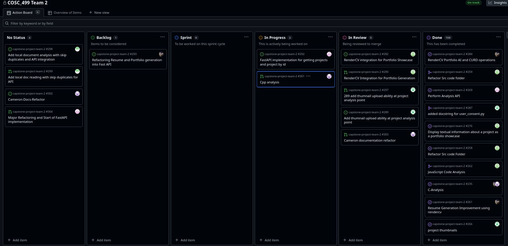

---

## Burn-up Chart (Velocity):
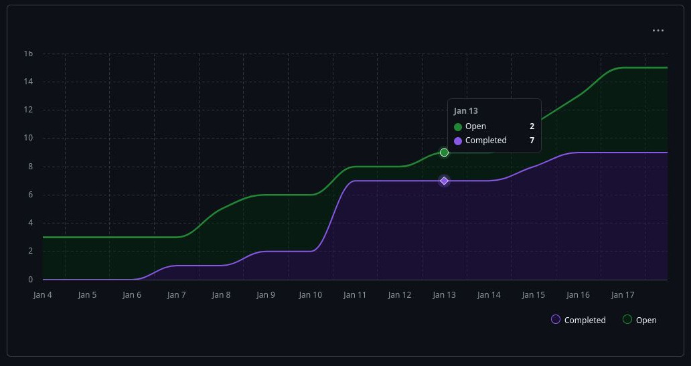

---

## Team Members  

| Name              | Role/Title          | GitHub Username                                          | Responsibilities |
|-------------------|---------------------|----------------------------------------------------------|------------------|
| Immanuel Wiessler | Full Stack Developer | [@ThunderIW](https://github.com/ThunderIW)               |AI Portfolio Generation|
| Samantha Maranda  | Full Stack Developer | [@Weebtrian](https://github.com/Weebtrain)               |Analysis code refactoring, FastAPI Implementation|
| Cameron Gillespie | Full Stack Developer | [@Graves067](https://github.com/Graves067)               |C++ code analysis|
| Puneet Maan      | Full Stack Developer | [@Puneet-Maan](https://github.com/Puneet-Maan)           |Document file analysis|
| Sam Smith         | Full Stack Developer | [@ssmith86](https://github.com/ssmith86)                 |Adding thumbnail to projects|
| Mahi Gangal       | Full Stack Developer | [@mahigangal](https://github.com/mahigangal)             |Portfolio Generation|

## Completed Tasks:

| Task ID | Description                 | Completed By |
| ------- | --------------------------- | ------------ |
| [#304](https://github.com/COSC-499-W2025/capstone-project-team-2/pull/304) | Refactoring of analysis_service.py and start of implementing FastAPI| Samantha Maranda |
| [#301](https://github.com/COSC-499-W2025/capstone-project-team-2/pull/301) | Analysis of C++ code files to detect basic oop practices and complexity | Cameron Gillespie |
| [#299](https://github.com/COSC-499-W2025/capstone-project-team-2/pull/299) | Functionality for analyzing documents in project | Puneet Maan |
| [#297](https://github.com/COSC-499-W2025/capstone-project-team-2/pull/297) | Functionality for adding a thumbnail when project is provided for analysis | Sam Smith |
| [#290](https://github.com/COSC-499-W2025/capstone-project-team-2/pull/290) | Adds use of RenderCV to non-LLM portfolio generation for consistent pdf generation between our other generators | Mahi Gangal |
| [#288](https://github.com/COSC-499-W2025/capstone-project-team-2/pull/288) | Added functionality to update contact information on AI generated portfolio| Immanuel Wiessler |
| [#286](https://github.com/COSC-499-W2025/capstone-project-team-2/pull/286) | Added AI portfolio generation through RenderCV | Immanuel Wiessler |

---

## Test Report / Testing Status:
| Task / PR | Test description / command                                    | Successful |
| ------- | ------------------ | ----------- |
| #304   | Database-Docker instructions.md details how to run docker tests |  ✅(100%) |
| #301    |python -m pytest test/test_cpp_analyzer.py -v| ✅(100%) |
| #299     |python -m pytest test/test_document_analysis.py|✅(100%)              |
| #297 | Manual testing described in PR, python -m pytest test/test_menus.py -v | N/A          |
| #290|pytest test/test_portfolio_service.py, pytest test/test_portfolio_rendercv_service.py| ✅(100%)          |
| #288|pytest test/test_Generate_AI_RenderCV_portfolio.py   | ✅(100%)          |
| #286| python -m pytest test/test_Generate_AI_RenderCV_portfolio.py -v| ✅(100%)          |

          
---

## Overview:
This week we devloped the frameworks for several new features needed for the new milestone as well as begun the process of refactoring and building our API with FastAPI.

The **next cycle** will focus on:  
- Additional Milestone 2 features
- Further refactoring in the CLI and other segments of our project
- Reducing redundant file and directory traversing

---

## T2 Weekly #1 (Jan 5 to Jan 11, 2026)

# Weekly Team Log  
---
## Date Range for this sprint:
- [01/05/2026] - [01/11/2026]  
---

## Features in the Project Plan Cycle:
- C Analysis Refactor
- API analysis
- Project Thumbnails
- Resume Generation Refactor
- Java Script Analysis
- SRC folder Refactor
- Standardized Doc Strings

## Associated Tasks from Kanban Board:
- [265: C Analysis Refactor](https://github.com/COSC-499-W2025/capstone-project-team-2/pull/265)
- [272: analysis API](https://github.com/COSC-499-W2025/capstone-project-team-2/pull/272)
- [271: Project Thumbnails](https://github.com/COSC-499-W2025/capstone-project-team-2/pull/271)
- [262: Java Script Analysis](https://github.com/COSC-499-W2025/capstone-project-team-2/pull/262)
- [259: SRC folder Refactor](https://github.com/COSC-499-W2025/capstone-project-team-2/pull/259)
- [263: Resume Generation Refactor](https://github.com/COSC-499-W2025/capstone-project-team-2/pull/263)
- [275: Standardize Test Docstring](https://github.com/COSC-499-W2025/capstone-project-team-2/pull/275)
- [277: Portfolio Showcase](https://github.com/COSC-499-W2025/capstone-project-team-2/pull/277)

### Screenshot from Kanban board
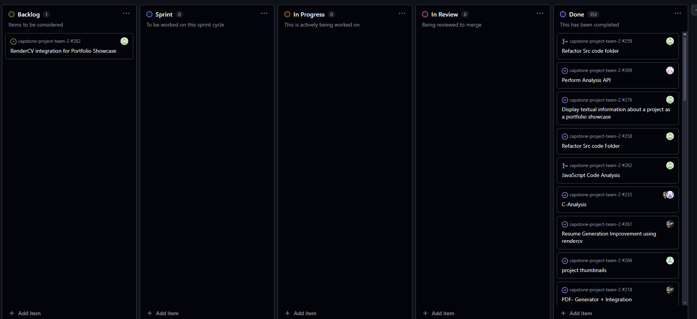

---

## Burn-up Chart (Velocity):
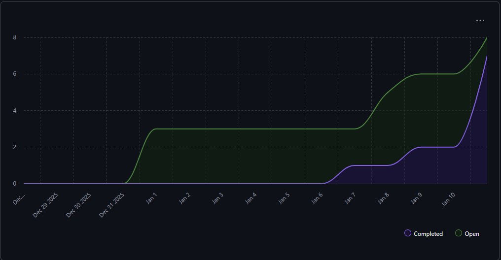

---

## Team Members  

| Name              | Role/Title          | GitHub Username                                          | Responsibilities |
|-------------------|---------------------|----------------------------------------------------------|------------------|
| Immanuel Wiessler | Full Stack Developer | [@ThunderIW](https://github.com/ThunderIW)               |Refactor Resume Generation,|
| Samantha Maranda  | Full Stack Developer | [@Weebtrian](https://github.com/Weebtrain)               |Documentation checking, analysis API|
| Cameron Gillespie | Full Stack Developer | [@Graves067](https://github.com/Graves067)               |Documentation, C analysis refactoring|
| Puneet Maan      | Full Stack Developer | [@Puneet-Maan](https://github.com/Puneet-Maan)           |Standarized Doc strings|
| Sam Smith         | Full Stack Developer | [@ssmith86](https://github.com/ssmith86)                 |Documentation checking, project thumb nails |
| Mahi Gangal       | Full Stack Developer | [@mahigangal](https://github.com/mahigangal)             |Java script code analysis, documentation, SRC refactoring|

## Completed Tasks:

| Task ID | Description                 | Completed By |
| ------- | --------------------------- | ------------ |
| [#265](https://github.com/COSC-499-W2025/capstone-project-team-2/pull/265) | Alternative analysis for C files, Alters Display for C specific projects | Cameron Gillespie |
| [#272](https://github.com/COSC-499-W2025/capstone-project-team-2/pull/272) | API call added for performing analysis on project. Handles zip files and folders | Samantha Maranda |
| [#271](https://github.com/COSC-499-W2025/capstone-project-team-2/pull/271) | CLI menu items allowing user to add, update, and remove thumbnails from a previously saved project | Sam Smith |
| [#262](https://github.com/COSC-499-W2025/capstone-project-team-2/pull/262) | Comprehensive JavaScript support to the OOP analysis system, enabling detection and analysis of object-oriented programming patterns, data structure usage, and time complexity metrics in JavaScript projects | Mahi Gangal |
| [#259](https://github.com/COSC-499-W2025/capstone-project-team-2/pull/259) | Restructures the src/ directory into a clearer, modular layout to improve maintainability, separation of concerns, and long-term extensibility | Mahi Gangal |
| [#263](https://github.com/COSC-499-W2025/capstone-project-team-2/pull/263) | Adds a Comprehensive RenderCV Generator Module (Generate_RenderCV_Resume.py) which is responsible for creating and managing CV/Resume YAML files, being stored in the system | Immanuel Wiessler |
| [#275](https://github.com/COSC-499-W2025/capstone-project-team-2/pull/275) | Documentation coverage by adding and standardizing docstrings in the test suite based on review feedback from the team | Puneet Maan |
| [#277](https://github.com/COSC-499-W2025/capstone-project-team-2/pull/277) | New portfolio showcase format and fixes the issue where the portfolio showcase wasn't displaying in the portfolio generator menu | Mahi Gangal |

---

## In Progress Tasks / To Do:

| Task ID | Description        | Assigned To |
| ------- | ------------------ | ----------- |
|      |  |   |     
|      |  |   |

---

## Test Report / Testing Status:
| Task / PR | Test description / command                                    | Successful |
| ------- | ------------------ | ----------- |
| #265   | python -m pytest test/test_c_analyzer.py -v |  ✅(100%) |
| #272    |Utilizes previously Established Tests| N/A |
| #262     |python -m pytest test/test_java_analyzer.py -v, python -m pytest test/test_javascript_oop_analyzer.py -v |✅(100%)              |
| #259 | Refactoring File struct no tests required | N/A          |
| #271|pytest test/test_project_insights.py -v, pytest test/test_menus.py -v| ✅(100%)          |
| #263|python -m pytest test/test_Generate_Render_CV_Resume.py -v | ✅(100%)          |
| #263|python -m pytest test/test_portfolio_service.py -v | ✅(100%)          |

          
---

## Overview:
This week we decided on team structure going forward to effectively refactor, add and communicate new features and documentation, establishing new standards going forward as well as completing refactors for code created during the break.

The **next cycle** will focus on:  
- additional Milstone 2 features
- Addition to analysis engines
- Documentation

---

## Term 1

## T1 Weekly #14 (Dec 1 to Dec 7, 2025)

# Weekly Team Log  
---
## Date Range for this sprint:
- [12/01/2025] - [12/07/2025]  
---

## Features in the Project Plan Cycle:
- PDF creation and integration
- In depth Java code analysis
- Updated Readme
- Gemini ai resume line
- Ollama scrubbed data integrated into analysis
- In depth C code analysis
- dedicated insights menu
- Option for non-LLM generation of resume items
- consent patch

## Associated Tasks from Kanban Board:
- [220: Pdf creator + integration](https://github.com/COSC-499-W2025/capstone-project-team-2/pull/220)
- [224: Java In-depth Code Analysis and Integration into System](https://github.com/COSC-499-W2025/capstone-project-team-2/pull/224)
- [225: Fix delete menu DB query (issue 221) and preserve zip project names (issue 222)](https://github.com/COSC-499-W2025/capstone-project-team-2/pull/225)
- [228: test patches to fix test_analysis_service.py and test_AI_generated_resume.py](https://github.com/COSC-499-W2025/capstone-project-team-2/pull/228)
- [229: Improved readme file](https://github.com/COSC-499-W2025/capstone-project-team-2/pull/229)
- [230: Added menu item for Gemini ai generated resume line and integrated with backend to produce output](https://github.com/COSC-499-W2025/capstone-project-team-2/pull/230)
- [231: 204 integrate ollama scrubbed data](https://github.com/COSC-499-W2025/capstone-project-team-2/pull/231)
- [233: Ai analysis fix](https://github.com/COSC-499-W2025/capstone-project-team-2/pull/233)
- [236: C analysis](https://github.com/COSC-499-W2025/capstone-project-team-2/pull/236)
- [239: Enhance CLI project insights with shared helpers, composite ranking, …](https://github.com/COSC-499-W2025/capstone-project-team-2/pull/239)
- [242: Ai resume fix to now have local resume generations](https://github.com/COSC-499-W2025/capstone-project-team-2/pull/242)
- [245: Consent patch fix](https://github.com/COSC-499-W2025/capstone-project-team-2/pull/244)

### Screenshot from Kanban board
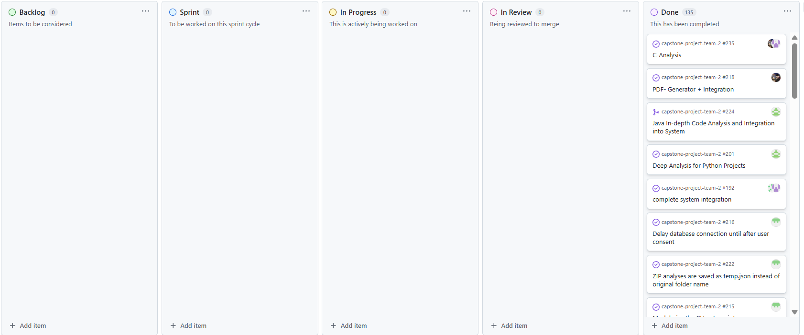

---

## Burn-up Chart (Velocity):
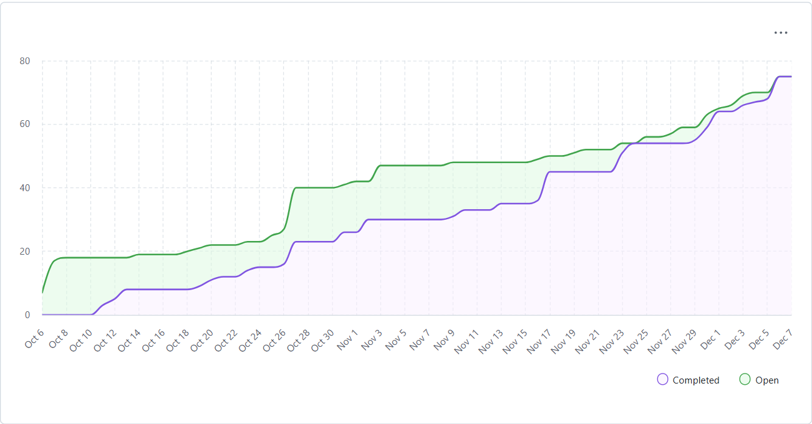

---

## Team Members  

| Name              | Role/Title          | GitHub Username                                          | Responsibilities |
|-------------------|---------------------|----------------------------------------------------------|------------------|
| Immanuel Wiessler | Full Stack Developer | [@ThunderIW](https://github.com/ThunderIW)               |ai analysis fix, consent bug fix, Improved readme, merge dev to main, demo video, in class presentation|
| Samantha Maranda  | Full Stack Developer | [@Weebtrian](https://github.com/Weebtrain)               |integrate ollama scrubbed data, in class presentation|
| Cameron Gillespie | Full Stack Developer | [@Graves067](https://github.com/Graves067)               |PDF creator development and integration, C code analysis, in class presentation|
| Puneet Maan      | Full Stack Developer | [@Puneet-Maan](https://github.com/Puneet-Maan)           |Enhance CLI project insights, fix menu bugs, in class presentation|
| Sam Smith         | Full Stack Developer | [@ssmith86](https://github.com/ssmith86)                 |Gemini ai resume line integration, test bug fixes, demo video, in class presentation, Team log|
| Mahi Gangal       | Full Stack Developer | [@mahigangal](https://github.com/mahigangal)             |Java code analysis, team contract writing, in class presentation|

## Completed Tasks:

| Task ID | Description                 | Completed By |
| ------- | --------------------------- | ------------ |
| [#220](https://github.com/COSC-499-W2025/capstone-project-team-2/pull/220)|can generate PDF of resume |Immanuel Wiessler|
| [#224](https://github.com/COSC-499-W2025/capstone-project-team-2/pull/2240)    |non LLM OOP analysis for Java|Mahi Gangal|
| [#225] (https://github.com/COSC-499-W2025/capstone-project-team-2/pull/225)    |Menu DB query bug fixes |Puneet Maan|
| [#228] (https://github.com/COSC-499-W2025/capstone-project-team-2/pull/228)|Test patches| Sam Smith and Immanuel Wiessler      |
| [#229, #225](https://github.com/COSC-499-W2025/capstone-project-team-2/pull/229, https://github.com/COSC-499-W2025/capstone-project-team-2/pull/255)    |improved Readme|Immanuel Wiessler |
| [#230](https://github.com/COSC-499-W2025/capstone-project-team-2/pull/230)  |Gemini ai generated resume line|Sam Smith|
| [#231](https://github.com/COSC-499-W2025/capstone-project-team-2/pull/231) |ollama scrubbed data integration|Samantha Maranda          |    
| [#233, #242](https://github.com/COSC-499-W2025/capstone-project-team-2/pull/233, https://github.com/COSC-499-W2025/capstone-project-team-2/pull/242) |AI analysis fix| Immanuel Wiessler|
| [#236](https://github.com/COSC-499-W2025/capstone-project-team-2/pull/236)| C code analysis| Cameron Gillespie|
|[#239] (https://github.com/COSC-499-W2025/capstone-project-team-2/pull/239) |Enhance CLI project insights| Puneet Maan|
|[#240, #246, #248] (https://github.com/COSC-499-W2025/capstone-project-team-2/pull/240, https://github.com/COSC-499-W2025/capstone-project-team-2/pull/246, https://github.com/COSC-499-W2025/capstone-project-team-2/pull/248) |move docs from dev branch to main branch| Immanuel Wiessler|
|[#245](https://github.com/COSC-499-W2025/capstone-project-team-2/pull/244)|consent patch fix| Immanuel Wiessler|
|[#247](https://github.com/COSC-499-W2025/capstone-project-team-2/pull/247)|update Readme| Immanuel Wiessler|

---

## In Progress Tasks / To Do:

| Task ID | Description        | Assigned To |
| ------- | ------------------ | ----------- |
|      |  |   |     
|      |  |   |

---

## Test Report / Testing Status:
| Task / PR | Test description / command                                    | Successful |
| ------- | ------------------ | ----------- |
| #218   | test_resume_pdf_generator.py |  ✅(100%) |
| #225    |pytest test/test_saved_projects.py test/test_menus.py test/test_analysis_service.py|✅(100%) |
| #228     |pytest test test\test_analysis_service.py, pytest test test\test_AI_generated_resume.p|✅(100%)              |
| #231 | pytest test\test_docker_Finder.py, pytest test\test_main.py, | ✅(100%)          |
| #236|python -m pytest test/test_c_analyzer.py| ✅(100%)          |
| #239|pytest test/test_menus.py | ✅(100%)          |
| #242| pytest test/test_local_resume_generator.py| ✅(100%)|
          
---

## Overview:
This week we finalized our submission for Milestone 1, completed an in class presentation on our project, created a Demo video of our project and completed our Team Contract

The **next cycle** will focus on:  
- Milestone #2

---

## T1 Weekly #13 (Nov 24 to Nov 29, 2025)

# Weekly Team Log  
---
## Date Range for this sprint:
- [11/24/2025] - [11/29/2025]  

---

## Features in the Project Plan Cycle:
- In Depth analysis for python projects in Features in the Project
- Resume generation using AI(**Google Gemini**) in Features in the Project
- User portfolio generator in Features in the Project
- Modularize the CLI entrypoint in Features in the Project
- Integration with all other features in Features in the Project

## Associated Tasks from Kanban Board:
- [193: Calculate contributions percentage per person in non-git folder ](https://github.com/COSC-499-W2025/capstone-project-team-2/issues/193)
- [192: complete system integration](https://github.com/COSC-499-W2025/capstone-project-team-2/issues/192)
- [187: Saving AI data results  ](https://github.com/COSC-499-W2025/capstone-project-team-2/issues/187)
- [190: Automation script for docker for ollama host](https://github.com/COSC-499-W2025/capstone-project-team-2/issues/190)
- [186: Resume Generation using AI](https://github.com/COSC-499-W2025/capstone-project-team-2/issues/186)
- [198: User Portfolio Generator](https://github.com/COSC-499-W2025/capstone-project-team-2/issues/198)
- [201: Deep Analysis for Python Projects](https://github.com/COSC-499-W2025/capstone-project-team-2/issues/201)
- [192: complete system integration](https://github.com/COSC-499-W2025/capstone-project-team-2/issues/192)
- [215 :Modularize the CLI entrypoint](https://github.com/COSC-499-W2025/capstone-project-team-2/issues/215)    
---

### Screenshot from Kanban board
.png)

---

## Burn-up Chart (Velocity):
.png)

---

## Team Members  

| Name              | Role/Title          | GitHub Username                                          | Responsibilities |
|-------------------|---------------------|----------------------------------------------------------|------------------|
| Immanuel Wiessler | Full Stack Developer | [@ThunderIW](https://github.com/ThunderIW)               | Create AN AI generated Resume,Ollama docker automation script, Team log  |
| Samantha Maranda  | Full Stack Developer | [@Weebtrian](https://github.com/Weebtrain)               | Formated data from local LLM into save json data |
| Cameron Gillespie | Full Stack Developer | [@Graves067](https://github.com/Graves067)               |   Integration of created features into CLI and setup of local Ollama container |
| Puneet Maan      | Full Stack Developer | [@Puneet-Maan](https://github.com/Puneet-Maan)           | Checking to see if all M1 deliverables have been met,improvement of local anylsis,CLI Modularization(Seperation of CLI elements),anlysis/persistence of layers with docs and post-consent DB setup |
| Sam Smith         | Full Stack Developer | [@ssmith86](https://github.com/ssmith86)                 |Integration of created features into CLI |
| Mahi Gangal       | Full Stack Developer | [@mahigangal](https://github.com/mahigangal)             | Calculate contributions percentage per person in non-git folder and doing deeper analysis on the actual code itself |

---

## Completed Tasks:

| Task ID | Description                 | Completed By |
| ------- | --------------------------- | ------------ |
| [#193](https://github.com/COSC-499-W2025/capstone-project-team-2/issues/193)     | Calculate contributions percentage per person in non-git folder | Mahi Gangal |
| [#190](https://github.com/COSC-499-W2025/capstone-project-team-2/issues/190)    | Docker automation for ollama container  | Immanuel Wiessler      |
| [#192](https://github.com/COSC-499-W2025/capstone-project-team-2/issues/192)    | CLI Integration | Sam Smith  and Cameron Gillespie |
| [#186](https://github.com/COSC-499-W2025/capstone-project-team-2/issues/186)    | AI generated Resume  | Immanuel Wiessler      |
| [#198](https://github.com/COSC-499-W2025/capstone-project-team-2/issues/198)      |     User Portfolio Generator                 | Cameron Gillespie      |
| [#201](https://github.com/COSC-499-W2025/capstone-project-team-2/issues/201)|  Deep Analysis for Python Projects   | Mahi Gangal |
| [#215](https://github.com/COSC-499-W2025/capstone-project-team-2/issues/215) | Modularize the CLI entrypoint |  Puneet maan                             |             |                                |

---

## In Progress Tasks / To Do:

| Task ID | Description        | Assigned To |
| ------- | ------------------ | ----------- |
|      |  |   |     
|      |  |   |

---

## Test Report / Testing Status:
| Task / PR | Test description / command                                    | Successful |
| ------- | ------------------ | ----------- |
| #186     | pytest test/test_AI_generated_resume.py |  ✅(100%) |
| #193     | pytest test/test_get_contributors_percentage.py |✅(100%) |
| #191     | pytest test/test_docker_Finder.py|  ✅(100%)              |
| #201     | pytest test/test_python_oop_metrics.py| ✅(100%)          |
| #192 and #198    | pytest test/test_main.py              | ✅(100%)          |
| #215     | pytest test/test_main.py test/test_app_context.py test/test_analysis_service.py test/test_saved_projects.py test/test_portfolio.py test/test_menus.py              | ✅(100%)          |
          

---

## Overview:

This week marks the final stretch for Milestone 1, where we began finalizing our CLI demo for viewing and interaction.Focus was on creating a proper resume and portfolio, as dictated by the professor.Immanuel handled this through the Google LLM (Gemma) to receive key project information, including project summary, tech stack, skills exercised, and more.
Mahi worked on integrating contributors’ data to return the amount of work done by each person, and performed deeper analysis on code files to retrieve key information about abstraction, encapsulation, and other metrics when the user does not want to use external services.Samantha worked on exporting data from the local LLM into a JSON file.Sam and Cameron began integrating the finalized parts into a workable demo.Additionally, Cameron formatted the AI-generated resume data into a clean portfolio and created/implemented the Ollama Docker container.am worked on integrating contributions for both git and non-git projects.Puneet restructured the CLI, separating database, menu, and analysis/persistence layers, added clear documentation, wrote tests, and ensured the database initializes only after user consent.

The **next cycle** will focus on:  
- Creating the video Demo
- Creating the team contract
- Fix up any underlaying issues that are still present 
- Preaping for final M1 submission

---

## T1 Weekly #12 (Nov 17 to Nov 23, 2025)

# Weekly Team Log  
---
## Date Range for this sprint:
- [2025-11-17] - [2025-11-23]

---

## Features in the Project Plan Cycle:
- Complete delete functionality for stored analyses (DB and filesystem, safe-delete)
- Full system integration across CLI/UI workflows
- Loading saved project JSON data with correct restoration of project duration
- Docker auto-testing with a dedicated test container
- Automatic Docker database configuration (DockerFinder)
- AI-powered code analysis integration using Qwen 2.5-coder
- Storage of analyzed file data, skill history, and project summaries in JSON

---

## Associated Tasks from Kanban Board:
- [Delete previous generated insights #114](https://github.com/COSC-499-W2025/capstone-project-team-2/issues/114)  
- [System Integration CLI/UI #174](https://github.com/COSC-499-W2025/capstone-project-team-2/issues/174)  
- [Load saved project data #165](https://github.com/COSC-499-W2025/capstone-project-team-2/issues/165)  
- [Save project duration #109](https://github.com/COSC-499-W2025/capstone-project-team-2/issues/109)  
- [Store chronological list of projects #113](https://github.com/COSC-499-W2025/capstone-project-team-2/issues/113)  
- [Store key project information #115](https://github.com/COSC-499-W2025/capstone-project-team-2/issues/115)  
- [Docker auto-testing #171](https://github.com/COSC-499-W2025/capstone-project-team-2/issues/171)  
- [Docker automatic configuration #166](https://github.com/COSC-499-W2025/capstone-project-team-2/issues/166)  
- [AI Integration #164](https://github.com/COSC-499-W2025/capstone-project-team-2/issues/164)  
- [Skill history & ranked summaries #176](https://github.com/COSC-499-W2025/capstone-project-team-2/issues/176)  
- [Summaries of top ranked projects #116](https://github.com/COSC-499-W2025/capstone-project-team-2/issues/116)  
- [Chronological list of user skills exercised #112](https://github.com/COSC-499-W2025/capstone-project-team-2/issues/112)  
- [Store analyzed data about files in JSON #67](https://github.com/COSC-499-W2025/capstone-project-team-2/issues/67)  
- [Contribution percentage calculation #159](https://github.com/COSC-499-W2025/capstone-project-team-2/issues/159)

---

### Screenshot from Kanban board
.png)

---

## Burn-up Chart (Velocity):
.png)

---

## Team Members  

| Name              | Role/Title          | GitHub Username                                          | Responsibilities |
|-------------------|---------------------|----------------------------------------------------------|------------------|
| Immanuel Wiessler | Full Stack Developer | [@ThunderIW](https://github.com/ThunderIW)               | AI integration, Docker auto-config |
| Samantha Maranda  | Full Stack Developer | [@Weebtrain](https://github.com/Weebtrain)               | JSON loading, duration handling |
| Cameron Gillespie | Full Stack Developer | [@Graves067](https://github.com/Graves067)               | Docker auto-testing |
| Puneet Maan       | Full Stack Developer | [@Puneet-Maan](https://github.com/Puneet-Maan)           | Skill history & ranking logic |
| Sam Smith         | Full Stack Developer | [@ssmith86](https://github.com/ssmith86)                 | CLI polish, full-system integration, cross-feature wiring |
| Mahi Gangal       | Full Stack Developer | [@mahigangal](https://github.com/mahigangal)             | Delete workflow & system integration |

---

## Completed Tasks:

| Task ID | Description                                   | Completed By       |
| ------- | --------------------------------------------- | ------------------ |
| #114    | Delete insights workflow                      | Mahi Gangal        |
| #174    | System Integration (CLI/UI)                   | Mahi Gangal        |
| #165    | Load saved project data                       | Samantha Maranda   |
| #109    | Save project duration                         | Samantha Maranda   |
| #113    | Store chronological list of projects          | Samantha Maranda   |
| #115    | Store project metadata in JSON                | Samantha Maranda   |
| #171    | Docker auto-testing                           | Cameron Gillespie  |
| #166    | Docker automatic configuration (DockerFinder) | Immanuel Wiessler  |
| #164    | AI-powered code analysis                      | Immanuel Wiessler  |
| #176    | Add skill history & ranked summaries          | Puneet Maan        |
| #116    | Summaries of top ranked projects              | Puneet Maan        |
| #112    | Chronological skills exercised                | Puneet Maan        |
| #67     | Store analyzed file data in JSON              | Puneet Maan        |
| #159    | Contribution percentage calculation           | Cameron / Immanuel |

---

## In Progress Tasks / To Do :

| Task ID | Description                       | Assigned To      |
| ------- | --------------------------------- | ---------------- |
| —       | Milestone 1 integration           | Entire Team      |
| —       | Docker auto-launch enhancements   | Cameron Gillespie|
| —       | AI JSON formatting refinements    | Immanuel Wiessler|
| —       | Further JSON–CLI integration      | Samantha Maranda |
| —       | Summary & ranking refinement      | Puneet Maan      |
| —       | system integration & cross-feature wiring              | Sam Smith   |

---

## Test Report / Testing Status:
| Task / PR | Test description / command             | Successful |
|----------|-----------------------------------------|-----------|
| #114     | Delete FS + DB entries, safe-delete tests | ✅ (100%) |
| #174     | Full CLI/UI integration test suite        | ✅ (100%) |
| #165     | pytest test/test_load_json_save.py        | ✅ (100%) |
| #171     | Docker test runner (143 passed, 6 skipped)| ✅ (100%) |
| #166     | DB connection auto-config tests           | ✅ (100%) |
| #164     | AI output structure & validity tests      | ✅ (100%) |
| #176     | Skill history & summary logic tests       | ✅ (100%) |
| #112     | Chronological skills tracking tests       | ✅ (100%) |
| #67      | JSON storage and structure tests          | ✅ (100%) |
| #159     | Contribution percentage calculation       | ✅ (100%) |

---

## Overview:
This week the team focused heavily on core system stability, integration, and feature completeness as we approach Milestone 1. Major progress was made across all layers of the system: deleting analyses safely, integrating the CLI/UI workflows, loading project JSON data reliably, improving Docker automation for testing, and introducing AI powered analysis support.

Mahi delivered substantial integration updates and the full delete workflow, Samantha ensured accurate project loading and metadata restoration, Cameron improved the Docker based testing pipeline, Immanuel added automatic Docker configuration and integrated AI analysis, and Puneet expanded the insights and ranking engine with skill history and summary generation. Sam contributed to the overall system integration and CLI improvements, working on wiring together multiple workflows to ensure the system behaves consistently across all entry points

The **next cycle** will focus on:  
- Final integration of all remaining components  
- Docker auto-launch quality improvements  
- AI JSON formatting enhancements  
- Strengthening connections between JSON storage and CLI  
- Final polishing before Milestone 1 demo

---

## T1 Weekly #10 (Nov 3 to Nov 9, 2025)

# Weekly Team Log  
---
## Date Range for this sprint:
- [11/03/2025] - [11/09/2025]  

---

## Features in the Project Plan Cycle:
- Creation of **ZIP file extraction CLI**
- **CLI integration** in **main.py**
- Creation of **main.py** to run application
- Storage of **analyzed data** in **json file**
- **project duration** in **json file**
- Generation of **resume items**
- Identification of **individual contributions in git collaborative projects**
- Creation of **Database**
- Creation of a module that **exports resumes** as json files

---

## Associated Tasks from Kanban Board:
- [Zip file extraction CLI #138](https://github.com/COSC-499-W2025/capstone-project-team-2/issues/138)
- [CLI integration #137](https://github.com/COSC-499-W2025/capstone-project-team-2/issues/137)
- [Zip verification #46](https://github.com/COSC-499-W2025/capstone-project-team-2/pull/46)
- [Create a starter file to run application #140](https://github.com/COSC-499-W2025/capstone-project-team-2/issues/140)
- [140 create a starter file to run application #148](https://github.com/COSC-499-W2025/capstone-project-team-2/pull/148)
- [Store analyzed data about files in json file #67](https://github.com/COSC-499-W2025/capstone-project-team-2/issues/67)
- [Save project duration to JSON #109](https://github.com/COSC-499-W2025/capstone-project-team-2/issues/109)
- [Generate resume items #111](https://github.com/COSC-499-W2025/capstone-project-team-2/issues/111)
- [Identify individual contributions in git collaboration projects #127](https://github.com/COSC-499-W2025/capstone-project-team-2/issues/127)
- [Build database #151](https://github.com/COSC-499-W2025/capstone-project-team-2/issues/151)
- Implement resume exporter module with JSON export and validation tests #156](https://github.com/COSC-499-W2025/capstone-project-team-2/pull/156)
---

### Screenshot from Kanban board
.png)

---

## Burn-up Chart (Velocity):
.png)

---

## Team Members  

| Name              | Role/Title          | GitHub Username                                          | Responsibilities |
|-------------------|---------------------|----------------------------------------------------------|------------------|
| Immanuel Wiessler | Full Stack Developer | [@ThunderIW](https://github.com/ThunderIW)               | Zip file extraction CLI, CLI integration  |
| Samantha Maranda  | Full Stack Developer | [@Weebtrian](https://github.com/Weebtrain)               | Store analyzed data about files in json, save project duration in json|
| Cameron Gillespie | Full Stack Developer | [@Graves067](https://github.com/Graves067)               |Docker setup, database development|
| Puneet Maan      | Full Stack Developer | [@Puneet-Maan](https://github.com/Puneet-Maan)            |generate resume items|
| Sam Smith         | Full Stack Developer | [@ssmith86](https://github.com/ssmith86)                 |CLI integration, create starter file to run application|
| Mahi Gangal       | Full Stack Developer | [@mahigangal](https://github.com/mahigangal)             |ID individual contributions in git collaboration projects|

---

## Completed Tasks:

| Task ID | Description                 | Completed By |
| ------- | --------------------------- | ------------ |
| #138   | Zip file extraction CLI | Immanuel Wiessler|
| #137    | CLI Integration    | Immanuel Wiessler, Sam Smith|
| #140/148 |created main.py to run application |Sam Smith|
| #109    |Save project duration in json| Samantha Maranda |
| #151| Database Development| Cameron Gillespie|
| #127   | ID individual contributions in git collaborative projects|Mahi Gangal|
| #111   | Generate resume items| Puneet Maan|

---

## In Progress Tasks / To Do :

| Task ID | Description        | Assigned To |
| ------- | ------------------ | ----------- |
| #67    | Store analyzed data in json |Samantha Maranda|

---

## Test Report / Testing Status:
| Task ID |Task name|  Test description     | Successful  |
| ------- |------------| ------------------ | ----------- |
| #138    | Zip file extraction CLI|pytest test/test_extraction.py -k "test_valid_zip_file_extraction_cli",  pytest test/test_extraction.py -k "test_invalid_zip_file_extraction_cli", pytest test/test_extraction.py -k "test_invalid_zip_file_extraction_minimum_retries", pytest test/test_extraction.py -k "test_successfully_exit_cli" |  ✅(100%) |
| #127 |ID individual contributions in git collaborative projects   |pytest test/test_individual_contribution_detection.py   | ✅(100%) |
| #140/#148  | created main.py to run application| pytest test/test_main.py | ✅(100%) |
| #109 | Save project duration in json | pytest test/test_json_saving.py | ✅(100%) |
| #111 | generate resume items |  pytest test/test_resume_exporter.py, test_resume_exporter_json_validation.py  | ✅(100%) |

---

## Overview:
This week we focused on **CLI Integration** that we built in previous weeks, **zip file extraction CLI**, creating the **main.py file** that runs the overall application, **creating the database** that will hold the json files, and finishing some of the outstanding backend code including **saving project duration to json files**, **generating resume items**, and **identifying individual contributions in git collaboration projects**
The **next cycle** will focus on:  
- Continuing to tie up loose ends for the required features for Milestone 1 (**storage of chronological list of skills exercised**, **association of contributions with skills**, **file display for file hierarchy**, **calculating contributions percentage per person in a git repo**, **allowing users to delete previous analyses**, and **adding summaries**)
- Continuing integration of the last few features with the CLI in main.py
- and we will start setting up the foundations for future ai integration

---

## T1 Weekly #9 (Oct 26 to Nov 2, 2025)

# Weekly Team Log  
---
## Date Range for this sprint:
- [10/26/2025] - [11/02/2025]  

---

## Features in the Project Plan Cycle:
- Creation of class for project duration estimation
- Framework of resume item generation
- Created user consent document for data analysis
- Setting up docker for stable environment testing
- Identification of files individual user contributed to in collaborative project
- Saving consent status upon consent given

---

## Associated Tasks from Kanban Board:
- [Save project duration to JSON #109](https://github.com/COSC-499-W2025/capstone-project-team-2/issues/109)
- [Identify individual contributions in non-git collaboration projects #40](https://github.com/COSC-499-W2025/capstone-project-team-2/issues/40)
- [Set up project with docker#118](https://github.com/COSC-499-W2025/capstone-project-team-2/issues/118)
- [Create consent document for data access before program use #32](https://github.com/COSC-499-W2025/capstone-project-team-2/issues/32)
- [Save consent status#106](https://github.com/COSC-499-W2025/capstone-project-team-2/issues/106)
- [Generate resume items#111](https://github.com/COSC-499-W2025/capstone-project-team-2/issues/111)

---

### Screenshot from Kanban board
.png)

---

## Burn-up Chart (Velocity):
.png)

---

## Team Members  

| Name              | Role/Title          | GitHub Username                                          | Responsibilities |
|-------------------|---------------------|----------------------------------------------------------|------------------|
| Immanuel Wiessler | Full Stack Developer | [@ThunderIW](https://github.com/ThunderIW)               | Save consent status  |
| Samantha Maranda  | Full Stack Developer | [@Weebtrian](https://github.com/Weebtrain)               | Add important project info to JSON save |
| Cameron Gillespie | Full Stack Developer | [@Graves067](https://github.com/Graves067)               |   Set up docker  |
| Puneet Maan      | Full Stack Developer | [@Puneet-Maan](https://github.com/Puneet-Maan)           | generation of portfolio and resume items |
| Sam Smith         | Full Stack Developer | [@ssmith86](https://github.com/ssmith86)                 | Consent form |
| Mahi Gangal       | Full Stack Developer | [@mahigangal](https://github.com/mahigangal)             | Identify individual contributions |

---

## Completed Tasks:

| Task ID | Description                 | Completed By |
| ------- | --------------------------- | ------------ |
| #40     | Identify individual contributions | Mahi Gangal |
| #118    | Set up docker  | Cameron Gillespie      |
| #32    | Create consent form  | Sam Smith      |
| #106    | Save consent status  | Immanuel Wiessler      |

---

## In Progress Tasks / To Do :

| Task ID | Description        | Assigned To |
| ------- | ------------------ | ----------- |
|  #111    | Generate resume items | Puneet Maan  |
| #109    | Save project duration to JSON  | Samantha Maranda      |

---

## Test Report / Testing Status:
| Task / PR | Test description / command                                    | Successful |
| ------- | ------------------ | ----------- |
| #40     | pytest -v test/test_individual_contribution_detection.py |  ✅(100%) |
| #118     | Test detailed in main.py. Test comprised of initializing project in docker. |  ✅(100%) |
| #32     | py -m pytest test/test_user_consent.py, py -m src.user_consent for manual test |  ✅(100%) |
| #106     | py -m pytest test/test_user_consent_update.py |  ✅(100%) |
| #111     | python3 -m unittest discover -s test -p "test_resume_item_generator.py" |  ✅(100%) |
| #109     | py -m pytest test/test_project_duration.py |  ✅(100%) |

---

## Overview:
This week marks the transitionary period as we move to focus on making a working demo as well as developing our data analysis mechanisms. Focus was put on finishing modules that are neccessary to the initial work for the demo as well as setting up systems that are essential to the demo's devlopment. Sam, Immanuel and Cameron were given these tasks and enough progress has been made that an incomplete demo could be made in the next few cycles. A secondary focus for remaining team members with the ideas to set up data analysis structures was placed so development of the data analysis module could gain momentum. Samantha, Puneet and Mahi have been working on this and the frameworks for further development are established.

The **next cycle** will focus on:  
- Demo prototyping with our in place modules will begin.
- Further devlopment of data analysis structures, and hopefully communication between systems this or next cycle.

---

## T1 Weekly #8 (Oct 20 to Oct 26, 2025)

# Weekly Team Log  
---
## Date Range for this sprint:
- [10/20/2025] - [10/26/2025]  

---

## Features in the Project Plan Cycle:
- Implemented distinction between individual and collaborative projects for both GitHub-based and non-GitHub-based project files
- Created a CLI interface for saving and updating user configuration, with refactored configuration class
- Enhanced file hierarchy formatting for improved skill and stack analysis, and improved author metadata parsing for both Windows and non-Windows systems
- Released Stack & Skill Detection v2 with Infra, DevOps, and extended language coverage
- Updated startup configuration loader and integrated it with the new CLI interface for user settings
- Added a unified data extraction orchestrator function that executes all extraction routines and returns detailed success or error feedback

---

## Associated Tasks / Pull Requests:
- [#96 Distinction between individual and collaborative projects for Git-repo files](https://github.com/COSC-499-W2025/capstone-project-team-2/pull/96)
- [#100 File hierarchy formatting + Metadata Author Reading](https://github.com/COSC-499-W2025/capstone-project-team-2/pull/100)
- [#87 Distinction between individual and collaborative projects for non-repo files](https://github.com/COSC-499-W2025/capstone-project-team-2/pull/87)
- [#94 Stack & Skill Detection v2 (Infra, DevOps, and extended languages)](https://github.com/COSC-499-W2025/capstone-project-team-2/pull/94)
- [#88 Startup Configuration Loader Integration](https://github.com/COSC-499-W2025/capstone-project-team-2/pull/88)
- [#92 CLI interface for User Configuration + Refactor](https://github.com/COSC-499-W2025/capstone-project-team-2/pull/92)
- [#95 Unified data extraction orchestrator function](https://github.com/COSC-499-W2025/capstone-project-team-2/pull/95)

---

### Screenshot from Kanban board
.png)

---

## Burn-up Chart (Velocity):
.png)

---

## Team Members  

| Name              | Role/Title           | GitHub Username                                    | Focus this cycle |
|-------------------|----------------------|----------------------------------------------------|------------------|
| Immanuel Wiessler | Full Stack Developer | [@ThunderIW](https://github.com/ThunderIW)         | CLI interface for user configuration and configuration refactor |
| Samantha Maranda  | Full Stack Developer | [@Weebtrain](https://github.com/Weebtrain)         | Unified extraction function and error-handling improvements |
| Cameron Gillespie | Full Stack Developer | [@Graves067](https://github.com/Graves067)         | File hierarchy enhancement, metadata author parsing, Docker research |
| Puneet Maan       | Full Stack Developer | [@Puneet-Maan](https://github.com/Puneet-Maan)     | Stack & Skill Detection v2 (Infra, DevOps, extended language coverage) |
| Sam Smith         | Full Stack Developer | [@ssmith86](https://github.com/ssmith86)           | Startup user configuration loader integration with CLI |
| Mahi Gangal       | Full Stack Developer | [@mahigangal](https://github.com/mahigangal)       | Individual vs Collaborative project detection and team logs |

---

## Completed Tasks:

| Task / PR | Description                                                                 | Completed By    |
|-----------|-----------------------------------------------------------------------------|------------------|
| #95       | Unified extraction orchestrator handling all extraction protocols           | Samantha Maranda |
| #88       | Startup configuration loader integrated with CLI interface                  | Sam Smith        |
| #100      | File hierarchy formatting enhancements and metadata author parsing          | Cameron Gillespie|
| #96, #87  | Distinguish between individual and collaborative projects (repo & non-repo) | Mahi Gangal      |
| #92       | CLI interface for user configuration and configuration class refactor       | Immanuel Wiessler|
| #94       | Stack & Skill Detection v2 (Infra, DevOps, extended language coverage)      | Puneet Maan      |

---

## In Progress Tasks / To Do :

| Task | Description                                                    | Assigned To         |
|------|----------------------------------------------------------------|---------------------|
| Backlog | Docker Setup                                                | Cameron Gillespie |
| Backlog | Identify individual contributions in collaboration projects | Team analysis pairing |
| Backlog | Refactoring Tests for #96 for multiple OS systems           | Mahi Gangal         |

---

## Test Report / Testing Status:
| Task / PR | Test description / command                                    | Successful |
|-----------|---------------------------------------------------------------|------------|
| #96, #87      | `python3 -m unittest discover -s test -p test_project_type_detection.py"` | ✅ |
| #95       | `python3 -m unittest discover -s test -p test_extraction.py"` | ✅ |
| #88       | `pytest -q test/test_startup_pull.py` | ✅ |
| #100       |  `python3 -m unittest discover -s test -p test_data_extraction.py"` | ✅ |
| #92       | `python3 -m unittest discover -s test -p test_configuration_CLI.py"` | ✅ |
| #92       | `python3 -m unittest discover -s test -p test_user_config_store.py"` | ✅ |
| #94       | `python3 -m unittest discover -s test -p "test_project_stack_detection.py"` | ✅ |
| #94       | `python3 -m unittest discover -s test -p "test_project_skills.py"`  | ✅ |

---

## Overview:
This sprint marked significant functional growth in the analysis and configuration modules. Mahi successfully implemented the logic to distinguish between individual and collaborative projects for both GitHub and non-repository sources, supported by comprehensive unit testing. Immanuel introduced a refined CLI interface for saving and updating user configurations, simplifying the configuration workflow. Cameron enhanced file hierarchy parsing and ensured author metadata was extracted consistently across platforms, while continuing Docker environment research. Puneet extended the stack and skill detection module to include Infrastructure and DevOps categories, broadening insight coverage. Sam completed the integration of the startup configuration loader with the CLI interface, ensuring user preferences are loaded automatically at runtime. Samantha built a unified data extraction orchestrator that runs all extraction protocols in sequence, improving modularity and error reporting.

As a team, we have also begun transitioning key components into a prototype CLI-based system, aligning our work with upcoming Milestone 1 Demo goals. This shift allows us to gradually integrate core features—such as configuration handling, project-type detection, and data extraction—into a cohesive, interactive prototype that we can showcase during the demo. The next sprint will focus on refining the CLI experience, enhancing cross-platform stability, and optimizing the prototype for presentation readiness.

---

## T1 Weekly #7 (Oct 13 to Oct 19, 2025)

# Weekly Team Log  
---
## Date Range for this sprint:
- [10/13/2025] - [10/19/2025]  

---

## Features in the Project Plan Cycle:
- Saved analyzed file hierarchy metadata to JSON for downstream reporting
- Pulled user configuration preferences on application startup with validation tests
- Refined hierarchy scanner output and metadata harvesting for consistency
- Implemented consent screen covering local analysis and optional external services
- Added project stack & skill insight detection with accompanying unit tests

---

## Associated Tasks / Pull Requests:
- [#79 Project skill insight detection with tests](https://github.com/COSC-499-W2025/capstone-project-team-2/pull/79)
- [#71 Store analyzed project file data in JSON](https://github.com/COSC-499-W2025/capstone-project-team-2/pull/71)
- [#73 Pull user configuration file on startup (tests)](https://github.com/COSC-499-W2025/capstone-project-team-2/pull/73)
- [#68 File hierarchy reader refinement](https://github.com/COSC-499-W2025/capstone-project-team-2/pull/68)
- [#69 User data consent flow](https://github.com/COSC-499-W2025/capstone-project-team-2/pull/69)
- [#62 Store a user configuration file (tests)](https://github.com/COSC-499-W2025/capstone-project-team-2/pull/62)
- [#41 Identify key skills used in project](https://github.com/COSC-499-W2025/capstone-project-team-2/issues/41)

---

### Screenshot from Kanban board
.png)

---

## Burn-up Chart (Velocity):
.png)

---

## Team Members  

| Name              | Role/Title           | GitHub Username                                    | Focus this cycle |
|-------------------|----------------------|----------------------------------------------------|------------------|
| Immanuel Wiessler | Full Stack Developer | [@ThunderIW](https://github.com/ThunderIW)         | User configuration storage tests |
| Samantha Maranda  | Full Stack Developer | [@Weebtrain](https://github.com/Weebtrain)         | JSON export utilities |
| Cameron Gillespie | Full Stack Developer | [@Graves067](https://github.com/Graves067)         | Hierarchy scanner refinement |
| Puneet Maan       | Full Stack Developer | [@Puneet-Maan](https://github.com/Puneet-Maan)     | Skill insight module & sprint log |
| Sam Smith         | Full Stack Developer | [@ssmith86](https://github.com/ssmith86)           | Startup configuration pull tests |
| Mahi Gangal       | Full Stack Developer | [@mahigangal](https://github.com/mahigangal)       | Consent workflow implementation |

---

## Completed Tasks:

| Task / PR | Description                                        | Completed By    |
|-----------|----------------------------------------------------|-----------------|
| #71       | Stored hierarchy analysis output as JSON           | Samantha Maranda |
| #73       | Startup configuration pull test suite             | Sam Smith        |
| #68       | Refined hierarchy scanner metadata output          | Cameron Gillespie|
| #69       | User consent CLI and test coverage                 | Mahi Gangal      |
| #62       | User configuration storage unit tests              | Immanuel Wiessler|
| #41       | Skill insight detection (languages/frameworks/skills) | Puneet Maan  |

---

## In Progress Tasks / To Do :

| Task | Description                                                    | Assigned To         |
|------|----------------------------------------------------------------|---------------------|
| Backlog | Distinguish individual vs collaboration projects via metadata | Immanuel Wiessler, Cameron Gillespie |
| Backlog | Identify individual contributions in collaboration projects  | Team analysis pairing |
| Backlog | Draft consent documentation for data access                  | Mahi Gangal         |

---

## Test Report / Testing Status:
| Task / PR | Test description / command                                    | Successful |
|-----------|---------------------------------------------------------------|------------|
| #71       | `python3 -m unittest discover -s test -p "test_json_saving.py"` | ✅ |
| #73       | `python3 -m unittest discover -s test -p "test_startup_pull.py"` | ✅ |
| #68       | `python3 -m unittest discover -s test -p "test_data_extraction.py"` | ✅ |
| #69       | `python3 -m unittest discover -s test -p "test_user_consent.py"` | ✅ |
| #41       | `source venv/bin/activate && python -m unittest discover -s test -p "test_project_skills.py"` | ✅ |
| #41       | `source venv/bin/activate && python -m unittest discover -s test -p "test_project_stack_detection.py"` | ✅ |

---

## Overview:
This sprint focused on making the ingestion outputs actionable. Samantha’s JSON export utilities now preserve hierarchy analysis, while Sam and Immanuel ensured user configuration data can be saved and retrieved reliably during startup. Cameron refined the hierarchy scanner for cleaner metadata, and Mahi delivered the consent workflow covering both local processing and optional external services. Puneet added stack and skill insight detection with corresponding unit tests and consolidated this week’s documentation.  

Next sprint will emphasize collaboration analytics: distinguishing individual versus group projects, attributing contributions, and drafting the formal consent documentation required prior to artifact ingestion. Updated Kanban and burn-up snapshots will be added alongside these deliverables.

---

## T1 Weekly #6 (Oct 6 to Oct 12, 2025)

# Weekly Team Log  
---
## Date Range for this sprint:
- [10/06/2025] - [10/12/2025]  

---

## Features in the Project Plan Cycle:
- Creation of **zip extraction**,**zip verfication**, and **file Heirarchy scanner**
- Creation and update of Project readme
- Update made to system **desgin architecture** and **DFD level 1** based
on the updated requirements

---

## Associated Tasks from Kanban Board:
- [Extract files from zip folder provided #45](https://github.com/COSC-499-W2025/capstone-project-team-2/issues/34)
- [Create requirements file #27](https://github.com/COSC-499-W2025/capstone-project-team-2/issues/27)
- [Zip verification #46](https://github.com/COSC-499-W2025/capstone-project-team-2/pull/46)
- [README Updated #47](https://github.com/COSC-499-W2025/capstone-project-team-2/pull/47)
- [Made a list of possible Python modules we can use in our software #42](https://github.com/COSC-499-W2025/capstone-project-team-2/pull/42)
- [File Heirarchy scanner #35](https://github.com/COSC-499-W2025/capstone-project-team-2/issues/35)

---

### Screenshot from Kanban board
.png)

---

## Burn-up Chart (Velocity):
.png)

---

## Team Members  

| Name              | Role/Title          | GitHub Username                                          | Responsibilities |
|-------------------|---------------------|----------------------------------------------------------|------------------|
| Immanuel Wiessler | Full Stack Developer | [@ThunderIW](https://github.com/ThunderIW)               | python Libaray Requirements and Zip extraction  |
| Samantha Maranda  | Full Stack Developer | [@Weebtrian](https://github.com/Weebtrain)               | Zip verfication and Test cases|
| Cameron Gillespie | Full Stack Developer | [@Graves067](https://github.com/Graves067)               |   file Heirarchy scanner  |
| Puneet Maan      | Full Stack Developer | [@Puneet-Maan](https://github.com/Puneet-Maan)           | DFD Graph Level 1    |
| Sam Smith         | Full Stack Developer | [@ssmith86](https://github.com/ssmith86)                 | Update system architecture system architecture |
| Mahi Gangal       | Full Stack Developer | [@mahigangal](https://github.com/mahigangal)             | WBS , Update project readme(**Explanation of system architecture**), creation of constent screen     |

---

## Completed Tasks:

| Task ID | Description                 | Completed By |
| ------- | --------------------------- | ------------ |
| #46     | Zip verification | Samantha Maranda|
| #45    | Zip Extraction    | Immanuel Wiessler      |
| #52      |File Heirarchy scanner  |Cameron Gillespie|
| #42    | Python Requirements list |Immanuel Wiessler|
| #47    | Project readme    | Mahi Gangal, Sam Smith |
| #47    | DFD level 1       | Puneet Maan|

---

## In Progress Tasks / To Do :

| Task ID | Description        | Assigned To |
| ------- | ------------------ | ----------- |
|  #35    | Unit test/testing and  of File Heirarchy scanner  |Cameron Gillespie  |
| #28       | Continuation of constent system                                              | Mahi Gangal

---

## Test Report / Testing Status:
| Task ID |Task name|  Test description     | Successful  |
| ------- |------------| ------------------ | ----------- |
| #46     |Zip verification|Verified that the system can propely dected invaild zip files and displayed the associated error message           |  ✅(100%) |
| #45  | Zip extraction | Verified that the system can sucessfully extract the contents of the zip to predefiend location, display an issue if the contents of the zip file is empty     | ✅(100%) |

---

## Overview:
This week marked the beginning of the coding phase, as we transitioned from the documentation, planning, and design stages into implementation. However one tiny detail to note is that there were still updating some of our system archieture desgin and DFD graphs , where the team began to set up their development environments and begin working on their assigned inital tasks, Some of inital coding tasks that were completed for 
this week include **zip extraction**, **zip verification**, and **displaying the file structure of the uploaded zip file**.  In addition this week help us identify people's technincally know-how in respect to coding(**python**)

The **next cycle** will focus on:  
- Developing the future core requirements outlined in Milestone 1 requirement list and assigning to each of the team members for the following week

---

## T1 Weekly #5 (Sep 29 to Oct 3, 2025)

# Weekly Team Log  
---
## Date Range for this sprint:
- [09/29/2025] - [10/03/2025]  

---

## Features in the Project Plan Cycle:
- Creation/completion of DFD for level 0 and level 1
- 

---

## Associated Tasks from Kanban Board:
- N/A (Kanban board not yet populated)  

---

### Screenshot from Kanban board
-N/A (Kanban board not yet populated)  

---

## Burn-up Chart (Velocity):
- N/A  

---

## Team Members  

| Name              | Role/Title          | GitHub Username                                          | Responsibilities |
|-------------------|---------------------|----------------------------------------------------------|------------------|
| Immanuel Wiessler | Full Stack Developer | [@ThunderIW](https://github.com/ThunderIW)               |Team Logs write UP  and DFD design   |
| Samantha Maranda  | Full Stack Developer | [@Weebtrian](https://github.com/Weebtrain)               | DFD design  |
| Cameron Gillespie | Full Stack Developer | [@Graves067](https://github.com/Graves067)               | DFD design  |
| Purrnet Mann      | Full Stack Developer | [@Puneet-Maan](https://github.com/Puneet-Maan)           | DFD design  |
| Sam Smith         | Full Stack Developer | [@ssmith86](https://github.com/ssmith86)                 | DFD design  |
| Mahi Gangal       | Full Stack Developer | [@mahigangal](https://github.com/mahigangal)             | DFD design     |

---

## Completed Tasks:

| Task ID | Description                 | Completed By |
| ------- | --------------------------- | ------------ |
| #01     | Discussion of DFD Layout for DFD level 0 and level 1   |   Team  |
| #02     | Inital Creation of DFD and finalization of DFD including level 0 and level 1| Purrnet Mann |

---

## In Progress Tasks / To Do:

| Task ID | Description        | Assigned To |
| ------- | ------------------ | ----------- |
| -       | N/A                | -           |

---

## Test Report / Testing Status:
- N/A  

---

## Overview:
This week the team focused on our **DFD DESGIN**: Focsuing around mapping the key processes that would take place in our system, idenftiying the major data inputs and outputs, and highlight the flow of data between different entities which include users, admins, and other external actors. In addition the flow of data from our backend to our frontend(UI)

The **next cycle** (Week 6) will focus on:  
- Finalize of actual Project Requirements given by the professor
- Updating/recreating **system desgin** and DFD Graphs **(level 0 and level 1 )**

---

## T1 Weekly #4 (Sep 20 to Sep 28, 2025)

# Weekly Team Log  
---
## Date Range for this sprint:
- [09/20/2025] - [09/28/2025]  

---

## Features in the Project Plan Cycle:
- Creation/completion of Architecture diagram
- Creation/completion of project proposal

---

## Associated Tasks from Kanban Board:
- N/A (Kanban board not yet populated)  

---

### Screenshot from Kanban board
-N/A (Kanban board not yet populated)  

---

## Burn-up Chart (Velocity):
- N/A  

---

## Team Members  

| Name              | Role/Title          | GitHub Username                                          | Responsibilities |
|-------------------|---------------------|----------------------------------------------------------|------------------|
| Immanuel Wiessler | Full Stack Developer | [@ThunderIW](https://github.com/ThunderIW)               | Achetecture Diagram  |
| Samantha Maranda  | Full Stack Developer | [@Weebtrian](https://github.com/Weebtrain)               | Project Proposal      |
| Cameron Gillespie | Full Stack Developer | [@Graves067](https://github.com/Graves067)               | Project Proposal    |
| Purrnet Mann      | Full Stack Developer | [@Puneet-Maan](https://github.com/Puneet-Maan)           | Project Proposal     |
| Sam Smith         | Full Stack Developer | [@ssmith86](https://github.com/ssmith86)                 | Project Proposal   |
| Mahi Gangal       | Full Stack Developer | [@mahigangal](https://github.com/mahigangal)             | Project Proposal     |

---

## Completed Tasks:

| Task ID | Description                 | Completed By |
| ------- | --------------------------- | ------------ |
| #01     | Architecture Diagram Created        | Immanuel Wiessler|
| #02     | Architecture Diagram Refined    | Samantha Maranda         |
| #03     | Project Proposal Created    | Mahi Gangal         |
| #04     | Project Proposal Completed    | Team        |

---

## In Progress Tasks / To Do:

| Task ID | Description        | Assigned To |
| ------- | ------------------ | ----------- |
| -       | N/A                | -           |

---

## Test Report / Testing Status:
- N/A  

---

## Overview:
This week the team focused on **Project Proposal**: Defining project scope and the usage senarios, proposing solution, use cases, finalized requirements as well as our plans for testing (requirement verification)

The **next cycle** will focus on:  
- Creation and Refinement of DFD1

---

## T1 Weekly #3 (Sep 15 to Sep 20, 2025)

# Weekly Team Log  
---
## Date Range for this sprint:
- [09/15/2025] - [09/20/2025]  

---

## Features in the Project Plan Cycle:
- GitHub Repository Setup  
- Requirements Document Creation & Refinement  

---

## Associated Tasks from Kanban Board:
- N/A (Kanban board not yet populated)  

---

### Screenshot from Kanban board
-N/A (Kanban board not yet populated)  

---

## Burn-up Chart (Velocity):
- N/A  

---

## Team Members  

| Name              | Role/Title          | GitHub Username                                          | Responsibilities |
|-------------------|---------------------|----------------------------------------------------------|------------------|
| Immanuel Wiessler | Full Stack Developer | [@ThunderIW](https://github.com/ThunderIW)               | Requirements    |
| Samantha Maranda  | Full Stack Developer | [@Weebtrian](https://github.com/Weebtrain)               | Repo setup and requirements      |
| Cameron Gillespie | Full Stack Developer | [@Graves067](https://github.com/Graves067)               | Requirements    |
| Purrnet Mann      | Full Stack Developer | [@Puneet-Maan](https://github.com/Puneet-Maan)           | Requirements    |
| Sam Smith         | Full Stack Developer | [@ssmith86](https://github.com/ssmith86)                 | Requirements    |
| Mahi Gangal       | Full Stack Developer | [@mahigangal](https://github.com/mahigangal)             | Requirements    |

---

## Completed Tasks:

| Task ID | Description                 | Completed By |
| ------- | --------------------------- | ------------ |
| #01     | GitHub repo created         | Samantha Maranda|
| #02     | Requirements doc refined    | Team         |

---

## In Progress Tasks / To Do:

| Task ID | Description        | Assigned To |
| ------- | ------------------ | ----------- |
| -       | N/A                | -           |

---

## Test Report / Testing Status:
- N/A  

---

## Overview:
This week the team focused on **initial project setup**: creating the GitHub repository and refining the requirements document.  

The **next cycle** will focus on:  
- Selecting the Core requirements for our project

---
