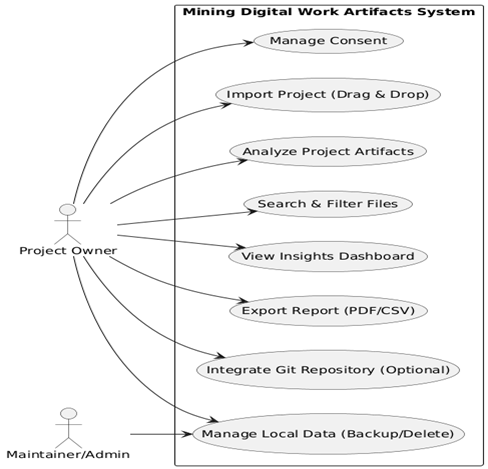

# COSC 499 2025 W1 Capstone Software Engineering Project

### Team 2
Cameron Gillespie 82137761\
Immanuel Wiessler 20803375\
Mahi Gangal 27227875\
Puneet Maan 75790782\
Samantha Maranda 61619334\
Samuel Smith 82723867

# Proposal for Project
## 1) Project Scope and Usage Scenario
This local desktop tool analyzes user selected project folders on Windows, macOS, and Linux to extract metadata and insights about work contributions and productivity for graduating students and early professionals. The primary actor is the Project Owner (student or early career professional) who selects folders to build portfolios or resume, and the secondary actor is a Maintainer/Admin who may manage settings on shared devices. With explicit consent, all processing occurs on device and only within user selected scopes. Supported artifacts include folders, Git repositories, code files (.py, .java, .js, etc.), documents (.docx, .pdf, .md), images (.png, .jpg), and media (.mp4, .mov). Typical scenarios include assembling resume ready summaries from a semester’s work or reflecting on productivity trends across a personal project.

## 2) Proposed Solution
We propose a user-friendly desktop app that enables drag and drop of folders for analysis. The backend in Java performs directory mapping and metadata extraction (creation/modification times, sizes, types), while Python (Pandas, visualization libraries) aggregates data into timelines, distributions, and summaries for an interactive dashboard. All processing is local, and users explicitly control what is analyzed, can revoke consent, and can back up or delete local analysis data. Optional Git integration enriches insights with commit histories, authoring stats, and language breakdowns where repositories are present.

Our value proposition is privacy first efficiency: fast, scoped, and transparent analysis that generates resume and portfolio ready insights without uploading data or crawling entire devices. Special features include modern visualizations, productivity timelines, scoped search and filtering, and exports to PDF, CSV, and PNG. Compared to broader or cloud-based approaches, our design minimizes noise, reduces unnecessary computation, and builds trust by keeping data on device with clear controls.

## 3) Use Cases

### Use Case 1: Manage Consent
* Primary Actor: Project Owner
* Description: Give explicit, revocable consent with a summary of data handling and local storage.
* Preconditions: App installed and storage available.
* Postconditions: Consent saved locally, revocation possible anytime.
* Main Scenario:
1.	Open app and review data overview.
2.	Select consent and folder options.
3.	System enables features with privacy defaults.
    * Extensions:
        1. Revoke later: Disable analysis, clear cache, and confirm.

### Use Case 2: Import Project (Drag & Drop)
* Primary Actor: Project Owner
* Description: Add a project folder via drag and drop or picker, with checks and errors.
* Preconditions: Consent granted and folder accessible.
* Postconditions: Project queued with optional notes.
* Main Scenario:
1.	Open “New Project” and drop folder.
2.	System checks path and limits scope.
3.	Add optional role and summary.
    * Extensions:
        1. Invalid selection: Show error with tips.

### Use Case 3: Analyze Project Artifacts
* Primary Actor: Project Owner
* Description: Scan folders and collect file sizes and timestamps to create distributions and timelines.
* Preconditions: Project queued.
* Postconditions: Metrics saved for dashboard and exports.
* Main Scenario:
1.	Scan directory tree for sizes and timestamps.
2.	Group by type and build time series.
3.	Save data locally.
    * Extensions:
        1. Unreadable files: Add warnings and skip.

### Use Case 4: Search & Filter Files
* Primary Actor: Project Owner
* Description: Filter by type, size, or date to view and pin artifacts.
* Preconditions: Analysis complete.
* Postconditions: Filtered views shown, pins saved for exports.
* Main Scenario:
1.	Enter filters and apply.
2.	System updates lists and user pins items.
    * Extensions:
        1. No matches: Show empty state with reset.

### Use Case 5: View Insights Dashboard
* Primary Actor: Project Owner
* Description: Display file distributions, timelines, and summaries with notes.
* Preconditions: Analysis data available.
* Postconditions: User can navigate and export.
* Main Scenario:
1.	Load charts from saved data.
2.	Toggle views and add notes.
    * Extensions:
        1. No data: Show placeholder.

### Use Case 6: Export Report (PDF/CSV)
* Primary Actor: Project Owner
* Description: Create local PDF or CSV from insights for portfolios.
* Preconditions: Data available and save path writable.
* Postconditions: Files generated locally.
* Main Scenario:
1.	Choose format and items.
2.	System creates and confirms file.
    * Extensions:
        1. Partial data: Use placeholders.

### Use Case 7: Integrate Git Repository (Optional)
* Primary Actor: Project Owner
* Description: Add commit and language details if Git is present and chosen.
* Preconditions: Opt-in and repo access.
* Postconditions: Extra charts added to dashboard.
* Main Scenario:
1.	Detect Git and analyze commits.
2.	Integrate into views.
    * Extensions:
        1. Large repo: Suggest limits.

### Use Case 8: Manage Local Data (Backup/Delete)
* Primary Actor: Project Owner or Maintainer/Admin
* Description: Backup or delete saved data with confirmations.
* Preconditions: Data exists and permissions allow.
* Postconditions: Actions complete with UI updates.
* Main Scenario:
1.	Select backup or delete.
2.	Confirm and perform action.
    * Extensions:
        1. Permission issue: Show error.
## 4) Requirements, Testing, Requirement Verification
### Tech Stack and Tech Framework: 
Frontend: Python with Streamlit, providing a flexible, cross platform UI compatible with Windows, macOS, and Linux.

Backend: Java handles directory mapping and metadata extraction. Python (Pandas) performs data aggregation and visualization.

Testing:
* Java: JUnit 5 ensures correctness and handles exception testing.
* Python: pytest with fixtures enables deterministic analytics and clean teardown of test environments.

Data Interchange: CSV is used as a lightweight, modular format for exchanging data between components.

Continuous Integration: GitHub Actions runs both Java and Python test suites on pull requests, ensuring automated verification and supporting team collaboration.

| Requirement | Description | Test Cases | Who | H/M/E |
| ------- | ------------------ | --------- | ----------- | -------- |
| Manage Consent | Gate features with revocable consent and scope choices. | Positive: Accept >enable features. Negative: Revoke >disable and clear cache. | Cameron | Medium |
| File Import (Drag & Drop) | Register folder with validation and errors. | Positive: Valid folder queued. Negative: Invalid >show error. Negative: Denied path >no crash. | Mahi | Easy |
| Directory Mapping | Recursive scan with handling for links and unreadables. | Positive: Correct counts/paths. Negative: Unreadable >warning. Negative: Link loop >skip. | Immanuel | Medium |
| Metadata Extraction | Collect sizes/timestamps with fallbacks. | Positive: Matches OS. Negative: Missing >mark unknown. Negative: Error >warning. | Puneet | Medium |
| File Categorization | Group by extension for charts. | Positive: Known types correct. Negative: Unknown >to "Other". | Samuel | Easy |
| Search & Filter | Filter and pin by criteria. | Positive: Expected results. Negative: No matches >empty state. Positive: Pins in export. | Samantha | Medium |
| Dashboard Visualization | Render charts and summaries. | Positive: Loads post analysis. Negative: No data >placeholder Positive: Refresh updates. | Cameron, Mahi | Medium |
| Export PDF/CSV | Create files matching dashboard. | Positive: Opens correctly. Negative: No data >blocked. Negative: Partial >placeholders. | Mahi, Immanuel  | Easy |
| Optional Git Enrichment | Mine commits/languages if opted in. | Positive: Charts added. Negative: Large repo >limit prompt. Negative: No Git >hidden. | Puneet | Hard |
| Productivity Tracking | Build timelines from timestamps. | Positive: Filters match. Negative: Sparse data >stable output. | Samuel | Medium |
| Local Data Management | Backup/delete with confirmations. | Positive: Backup works. Negative: Delete confirmed. Negative: Denied >error. | Samantha | Easy |
| Performance Target | 100 files <60s with progress. | Positive: Completes in time. Positive: Cancel >no issues. Negative: Timeout >notify user. | Cameron | Medium |
| Security & Privacy | No uploads, scoped analysis. | Positive: Network blocked. Positive: Limited scope. Manual: Consent/deletion. | Samantha, Puneet | Hard |
| CI and Tests | Run suites on PRs. | Positive: Green build passes. Negative: Failures block | Samuel | Easy |

### Non-Functional Requirements (Verification Approach)
*	Privacy: Local processing only and no external data transmission. Consent gating enforced before any data collection. Revocation clears all cached data. 
Verification: Manual testing and local storage inspection.

*	Performance: Handles 100 files in under 60 seconds on a mid-tier laptop. Progress bar and cancel functionality supported.
Verification: Benchmark tests and UI responsiveness checks.

*	Usability: Simple dashboard with clear empty states and descriptive error messaging. Manual UX checks ensure clarity and accessibility.
Verification: User walkthroughs and heuristic evaluation.

*	Portability: Compatible with Windows, macOS, and Linux. Verified via CI matrix and cross platform smoke tests. 
Verification: Automated CI runs on multiple OS environments.

*	Transparency: In app “What’s analyzed” panel details collected fields and storage locations.
Verification: UI tests and content inspection.

*	Data Security: Least privilege file access with scoped directory paths. Optional encryption for local backups.
Verification: Code review, access control testing, and encryption toggle validation.  
